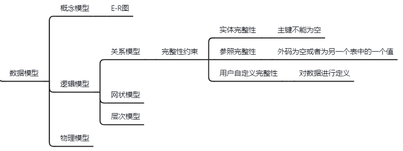
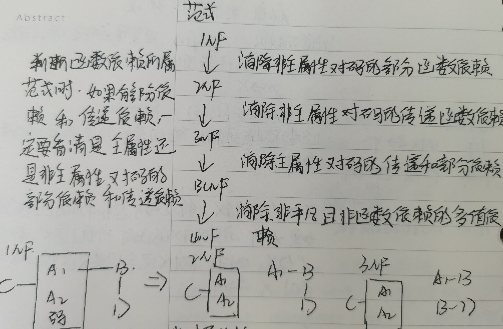
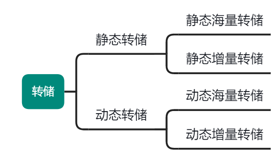
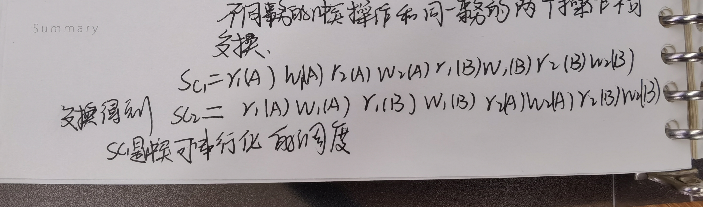

## 一、概论

### 1.什么是数据、数据库、数据库管理系统和数据库系统？

**数据(data)**：描述事物的符号记录称为数据，数据是数据库存储的基本对象

**数据库(database)**：长期储存在计算机内，有组织的、可共享的大量数据的集合。数据库中的数据按一定的数据模型组织、描述和存储，具有较小的冗余度、较高的数据独立性和易扩展性，并可为各种用户共享。

**数据库管理系统(DBMS)**：在数据库建立、运用和维护时，对数据库进行统一控制，以保证数据的完整性和安全性，并在多用户同时使用数据库时进行并发控制，在发生故障时对数据库进行恢复。

**数据库系统(DBS)**：由数据库，数据库管理系统、应用程序和数据库管理员组成的存储、管理、处理和维护数据的系统。

### 2.数据库系统的三级模式和两级映像是什么？

数据库系统的三级模式包括模式、外模式和内模式

**模式**：数据库中全体数据的逻辑结构和特征的描述，是所有用户的公共数据视图

**外模式**：数据库用户能够看见和使用的局部数据的逻辑结构和特征的描述，是数据库用户的数据视图。

**内模式**：数据物理结构和存储方式的描述

数据库系统的三级模式是对数据的三个抽象级别，他把数据的具体组织留给DBMS管理，使用户能逻辑抽象的处理数据而不必关心数据在计算机中的存储与表示。

为了能够在内部实现这三个抽象层次的联系和转换，数据库系统在这三级模式之间提供了两层映像：**外模式/模式映像和模式/内模式映像**，这两层映像保证了数据库系统中的数据能够具有较高的逻辑独立性与物理独立性。

### 3.什么是数据的逻辑独立性和物理独立性？

**数据的逻辑独立性**：当模式改变时，由数据库管理员对各个外模式/模式的映像做相应改变，可以使外模式保持不变，应用程序是依据数据的外模式编写的，从而应用程序不必修改，保证了数据与程序的逻辑独立性。

**数据的物理独立性**：当数据库的存储结构改变时，由数据库管理员对模式/内模式映像做相应改变，可以使模式保持不变，从而应用程序也不必改变，保证了数据与程序的物理独立性。

### 4.数据库系统的特点

- 数据结构化
- 数据的共享性高，冗余度低，易扩充
- 数据独立性高
- 数据由DBMS统一管理和控制

### 5.DBMS主要功能

- 数据定义功能（DDL）
- 数据组织、存储和管理
- 数据操纵功能（DML,增删改查）
- 数据库的事务管理和运行管理（安全性、完整性、并发性、数据库恢复）
- 数据库的建立和维护

### 6.数据模型

数据模型是数据库系统的核心和基础，包括数据结构、数据操作和数据的完整性约束条件

- 数据结构：描述数据库的组成对象以及对象之间的联系，是对系统**静态特性**的描述
- 数据操作：对数据库中各种对象的实例允许执行的操作的集合，包括操作及有关的操作规则
- 数据库的完整性约束条件：一组完整性规则

常用数据模型




## 二、SQL语言

## 三、数据库安全性

### 1.什么是数据库安全性和完整性

数据库安全性：指保护数据库以防止不合法的使用所造成的数据泄露、更改或破坏

数据库完整性：指数据的正确性和相容性

### 2.存取控制

自主存取控制：用户对于不同的数据库对象有不同的存取权限，不同的用户对相同对象也有不同的权限，而且用户还可将其拥有的存取权限转授给其他用户（非常灵活）

强制存取控制：每一个数据库对象被标以一定的密级，每一个用户也被授予某一个级别的准可证，对于任意对象，只有具有合法许可证的用户才可以存取（相对比较严格）

### 3.数据库安全性机制有哪些？

用户身份鉴别

多层存取控制

审计

视图

数据加密


## 四、嵌入式SQL

### 1.数据库工作单元与源程序工作单元之间的通信主要包括哪些？

（1）向主语言传递SQL语句的执行状态信息，使主语言能够据此信息控制程序流程，主要用SQL通信区实现

（2）主语言向SQL提供参数，主要用主变量实现

（3）将SQL语句查询数据库的结果交主语言处理，主要用主变量和游标实现

## 五、关系数据理论

### 1.什么是函数依赖？

**R(U,F)**

y=f(x)自变量x确定之后，相应的函数值y也就唯一确定，X->Y,sname=f(sno),sno->sname

非平凡的函数依赖：X->Y但Y⊊X

完全函数依赖：如果X->Y，并且对于X的任意一个真子集X'，都有X'-/>Y，X-(F)>Y;否则就是部分函数依赖：X-(P)>Y

传递函数依赖：在R(U)中，如果X->Y(Y不包含于X)，Y-/>X,Y->Z,Z⊊Y,则称Z对X传递依赖（Z-(传递)>X）

### 2.什么是候选码？

设k为R<U,F>的属性或属性组合，若U完全依赖于k，则k为R的候选码

候选码可能对于一个，例如：SPJ(S,T,J) (S,J)->T  (S,T)->J  T->J

其中（S,J）(S,T)都是候选码，可选定一个为主码，任何一个候选码中的属性为**主属性**

### 3.范式

第一范式、第二范式、



## 六、数据库设计

### 1.数据库设计的阶段以及要完成的任务

（1）需求分析阶段：准确了解与分析用户需求（包括数据预处理）

（2）概念结构设计阶段：通过对用户需求进行综合、归纳与抽象，形成一个独立于具体数据库管理系统的概念模型，设计E-R图进行完善

（3）逻辑结构设计阶段：将概念结构转换为某个DBMS所支持的数据模型，并对其进行优化（将E-R图转换为数据模型）

（4）物理设计阶段：为逻辑设计模型选取一个最适合应用环境的物理结构

（5）数据库实施阶段：设计人员运用数据库管理系统提供的数据库语言及其宿主语言，根据逻辑设计和物理设计的结果建立数据库，编写与调试应用和程序，组织数据入库，并试运行

（6）数据库运行和维护阶段

数据库应用系统经过试运行后即可投入正式运行，在数据库系统运行过程中必须不断地对其尽心评估，调整与修改


## 七、数据库恢复技术

### 1.什么是事务，事务的特性有哪些（ACID）？

用户定义的一个数据库操作序列，这些操作要么全做，要么全不做，是一个不可分割的工作单位

- 原子性（Atomicity）：事务中包括的操作要么都做，要么都不做
- 一致性（Consistency）:事务执行的结果必须是使数据库从一个一致性状态变到另一个一致性状态
- 隔离性（Isolation）：并发执行的各个事务之间不能相互干扰
- 持续性（Duribility）:一个事务一旦提交，它对数据库中数据的改变就应该是永久的

事务是恢复和并发控制的基本单位，一个程序中一般包含多个事务

### 2.什么是数据库的恢复？

DBMS具有的把数据库从错误状态恢复到某一已知的正确状态的功能

### 3.故障的种类？

（1）事务内部的故障

指事务没有达到预期的终点，数据库可能处于不正确的状态（运算溢出，并发事务发生死锁被选中撤销该事务，违反了某些完整性限制而被终止）

（2）系统故障（软故障）

指造成系统停止运转的任何事件，使得系统要重新启动（CPU故障，操作系统故障，DBMS代码错误，掉电）

（3）介质故障（硬故障）

指外存故障（磁盘损坏，磁头碰撞，瞬时强磁场干扰）

（4）计算机病毒

### 4.恢复的实现技术


如何建立冗余数据

（1）数据转储



**后备副本**：数据库管理员定期的将整个数据库复制到存储介质上保存起来，这些备用的数据称为后备副本

**静态转储**：在系统中无运行事务时进行的转储操作，转储期间不允许对数据库的存取、修改活动

优点：静态转储得到的一定是一个数据一致性的副本

缺点：转储必须等待正在运行的事务结束才能运行，新的事务也必须等待转储完才能运行，降低了数据库的可用性

**动态转储**：在转储期间允许对数据库存取或修改

优点：不用等待正在运行事务的结束，也不用等待转储结束

缺点：后备副本上的数据并不能保证正确有效，需要日志文件

**海量转储**：每次转储全部数据库

**增量转储**：每次只转储上一次转储后更新的数据

（2）登记日志文件

日志文件：用来记录事务对数据库的更新操作的文件

### 5.日志文件的定义和作用

日志文件：用来记录事务对数据库的更新操作的文件

日子文件的作用

（1）事务故障恢复和系统故障恢复必须用日志文件

（2）在动态转储方式中必须建立日志文件，后备副本和日志文件结合起来才能有效恢复数据库

（3）在静态转储方式中也可建立日志文件，当数据库毁坏后可重新装入后援副本把数据库恢复到转储结束时刻的正确状态，然后利用日志文件把已完成的事务进行重做，对故障发生时未完成的事务撤销，不必运行那些已完成的事务，就可恢复到故障发生前某一时刻的正确状态。

### 6.登记日志文件的原则

登记的次序严格按并发事务执行的时间顺序

### 7.为什么必须先写日志文件再写数据库

写日志文件和写数据库是两个不同的操作，有可能在这两个操作之间发生故障，即一个操作没有完成，如果先写数据库，则日志文件中没有记录此次修改，以后没有办法恢复；如果先写日志，没有修改数据库，则按日志文件恢复时仅多执行一次非必要的undo操作，并不会影响数据库的正确性

### 8.恢复策略

事务故障的恢复（由系统自动完成，对用户透明）

（1）反向扫描日志文件，查找该事务的更新操作

（2）对该事务的更新操作执行逆操作，即将日志文件记录中“更新前的值”写入数据库

（3）继续反向扫描日志文件，查找该事务的其他更新操作，并做同样处理

（4）直到读到此事务的开始标记，事务故障恢复完成

系统故障的恢复（在系统重启时自动完成）

（1）正向扫描日志文件，找出故障发生前已经提交的事务，将其事务标识记入重做队列，同时找出故障发生时尚未完成的事务，将其事务标识记入撤销队列

（2）对撤销队列的各个事务进行撤销处理，反向扫描日志文件，对每个撤销事务的更新操作执行逆操作

（3）对重做队列的各个事务进行重做处理，正向扫描日志文件，对每个重做事务重新执行日志文件登记的操作

介质故障的恢复（重装数据库，然后重做已完成事务）

（1）装入最新的数据库副本，使数据库恢复到最近一次转储时的一致性状态

（2）对于动态转储的数据库副本，还需同时装入转储开始时刻的日志文件副本，利用恢复系统故障的方法（redo+undo）才能将数据库恢复到一致性状态

（3）装入相应的日志文件副本，重做已完成的事务，即首先扫描日志文件，将故障发生时已提交的事务标识记入重做队列：然后正向扫描日志文件，对重做队列中的所有事务进行重做处理

### 9.具有检查点的恢复技术

检查点的记录包括：建立检查点的时刻所有正在执行的事务清单，这些事务最近一个日志记录的地址

系统利用检查点方法进行恢复的步骤

（1）从重新开始文件中找到最后一个检查点记录在日志文件中的地址，由该地址在日志文件中找到最后一个检查点记录

（2）由该检查点记录得到检查点建立时刻所有正在运行的事务列表ACTIVE-LIST,建立两个事务队列

undo-list：需要执行undo操作的事务集合

redo-list：需要执行redo操作的事务集合

把ACTIVE-LIST暂时放入undo-list队列，redo-list为空

（3）从检查点开始正向扫描日志文件

- 若有新开始的事务T，把T放入undo-list
- 若有完成的事务T，把T从undo-list移到redo-list，直到日志文件结束

（4）对undo-list里的事务执行undo操作，对redo-list里的事务执行redo操作

## 八、并发控制

### 1.并发操作带来的不一致性有哪些？

#### 1.1 丢失修改

两个事务T1和T2读入同一数据并修改，T2提交的结果破坏了T1提交的结果，导致了T1的修改失效了。飞机订票的例子就属于此类。

#### 1.2 脏读

读"脏"数据是指当事务T1修改某一数据时，事务T2读取同一数据后，T1由于某种原因撤销修改了，这时T1已修改过的数据恢复原值，而T2读到的数据是撤销修改之前的数据，那么此时T2的数据就与数据库中的数据不一致，则T2读到的数据就为"脏"数据，即不正确的数据。

#### 1.3 不可重复读

不可重复读是指事务T1读取数据后，事务T2执行更新操作，使T1无法再现前一次读取结果。具体的，不可重复读包括三种情况：
（1）事务T1读取某一数据后，事务T2对其做了修改，当事务1再次读该数据时，得到与前一次不同的值。例如，T1读取B=100进行运算，T2读取同一数据B，对其进行修改后将B=200写回数据库。T1为了对读取值校对重读B，B已为200，与第一次读取值不一致。
（2）事务T1按一定条件从数据库中读取了某些数据记录后，事务T2删除了其中部分记录，当T1再次按相同条件读取数据时，发现某些记录神密地消失了。
（2）事务T1按一定条件从数据库中读取某些数据记录后，事务T2插入了一些记录，当T1再次按相同条件读取数据时，发现多了一些记录。

### 2.并发控制的主要技术

- 封锁、
- 时间戳
- 乐观控制法
- 多版本并发控制

### 3.封锁协议

封锁：排他锁（X锁）、共享锁（S锁）

一级封锁协议：事务T在修改数据R之前必须先对其加X锁，直到事务结束才释放（防止丢失修改）

二级封锁协议：在一级封锁协议基础上，事务T在读数据R之前先对其加S锁，读完之后释放（防止丢失修改和读脏数据）

三级封锁协议：在一级封锁协议的基础上，事务T在读数据R前先对其加S锁，直到事务完成才释放（防止丢失修改，读脏数据，不可重复读）

### 4.预防死锁的方法

- 一次封锁法：事务必须一次性将所要用到的数据加锁

缺点：降低了系统的并发度，很难确定要封锁的数据对象

- 顺序封锁法：所有事务按一定的封锁顺序对数据对象实行封锁

缺点：数据不断变化，很难确定一个固定顺序，成本极高

### 5.死锁的诊断与解除

- 超时法：一个事务的等待时间超过了规定的时限，就认为发生了死锁

缺点：可能误判死锁，时限若设置太长，不能及时发现死锁

- 等待图法：图中有回路代表发生死锁

死锁处理：选择一个处理代价最小的事务将其撤销，释放其持有的所有锁

### 6.可串行化调度

一个调度S在保证冲突操作的次序不变的情况下，通过交换两个事务不冲突操作的次序得到另一个调度S’，如果S’是串行的，称调度S为**冲突可串行化的调度**。

冲突操作：不同事务对相同数据的读写和写写

不同事务的冲突操作和同一事务的两个操作不可交换



### 7.两段锁协议

**两段锁协议**：事务在第一阶段获得封锁，在第二阶段释放封锁，但不能获得封锁

并发执行的所有事务遵守两段锁协议，则这些事务的任何并发调度策略都是**可串行化的**

遵守两段锁协议的事务可能发生死锁

```
Slock(B)          
R(B)
               Slock(A)
Xlock(A)       R(A)
wait……         Xlock(B)
			   wait……
```

