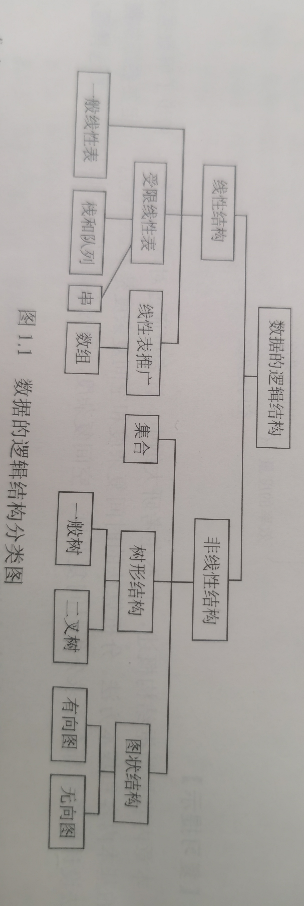
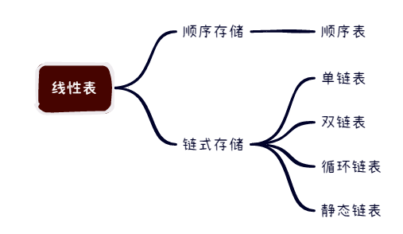
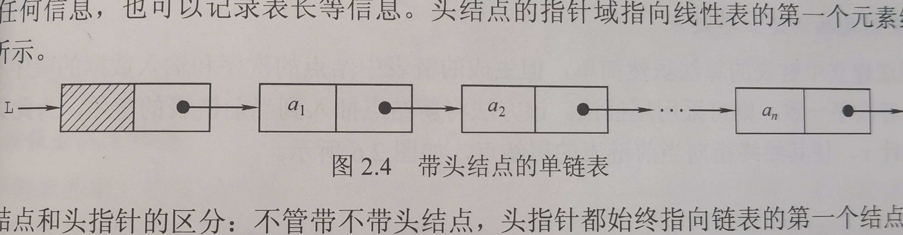
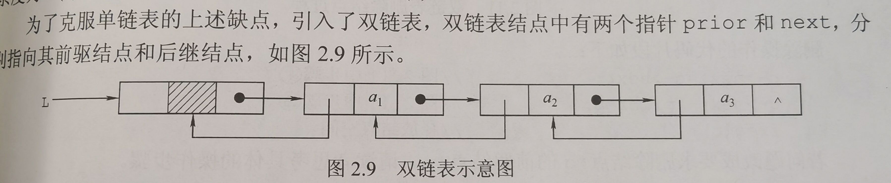
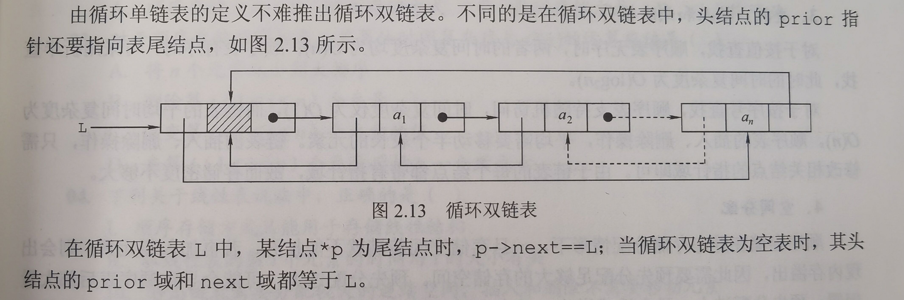

## 一、绪论

### 1.数据、数据元素、数据对象、数据类型和数据结构的定义？

**数据**：信息的载体，是描述客观事物属性的数、字符及所有能输入到计算机中并被计算机程序识别和处理的符号的集合

**数据元素**：数据的基本单位，由若干数据项组成，例如学生记录是一个数据元素，由学号、姓名、性别等数据项组成

**数据对象**：具有相同性质的数据元素的集合，是数据的一个子集，例如整数数据对象是集合N={0,±1,±2……}

**数据类型**：一个值的集合和定义在此集合上的一组操作的总称，包括原子类型（值不可再分的数据类型）、结构类型（值可再分）、抽象数据类型（抽象数据组织及与之相关的操作）

**数据结构**：相互之间存在一种或多种特定关系的数据元素的集合，数据结构包括三方面的内容：逻辑结构、存储结构和数据的运算

### 2.数据结构三要素

（1）数据的逻辑结构：数据元素之间的逻辑关系



（2）数据的存储结构：数据结构在计算机中的表示，主要有顺序存储、链式存储、索引存储和散列存储

（3）数据的运算：包括运算的定义和实现，定义针对逻辑结构、实现针对存储结构

## 二、线性表



**线性表是一种逻辑结构，表示元素之间一对一的相邻关系，顺序表和链表是指存储结构。**

### 1.线性表的定义和基本操作

**线性表**：具有相同的数据类型的n个数据元素的有限序列，一般表示L=(a1,a2,……,an)。

线性表的主要操作如下：

```c++
InitList(&L);//初始化表，构造一个空的线性表
Length(L);//求表长，返回线性表L的长度
LocateElem(L,e);//按值查找操作
GetElem(L,i);//按位查找操作，获取表L中的第i个位置的元素的值
ListInsert(&L,i,e);//插入操作，在表L的第i个位置上插入指定元素e
ListDelete(&L,i,&e);//删除操作，删除表L中第i个位置的元素，并用e返回删除元素的值
PrintList(L);//输出操作，按前后顺序输出线性表L的所有元素值
Empty(L);//判空操作，若L为空表，则返回true,否则返回false
DestroyList(&L);//销毁操作，释放L所占用的内存空间
```

### 2.顺序表的定义即基本操作的实现

**顺序表**：线性表的顺序存储，用一组连续地址的单元依次存储线性表中的数据元素，从而使得逻辑上相邻的两个元素在物理位置上也相邻。

通常用数组来描述线性表的顺序存储结构

**特点**

- 随机访问，通过首地址和元素序号可在时间O(1)内找到特定的元素
- 存储密度高，每个节点只存储数据元素
- 逻辑上相邻的元素物理上也相邻，插入和删除操作需要移动大量元素

**基本操作的实现**

线性表的顺序存储类型描述：

```c++
#define MaxSize 50 //线性表的最大长度
typedef struct{
    ElemType data[MaxSize];
    int length;//顺序表的当前长度
}SqList;
```


- 插入操作(在顺序表L的第i个位置插入元素e)

```c++
bool ListInsert(SqList &L,int i,ElemType e){
    if(i < 1 || i > L.length + 1) return false;//判断i的范围是否有效
    if(L.length >= MaxSize) return false;//当前存储空间已满，不能插入
    for(int j = L.length;j >= i;--j){
        L.data[j] = L.data[j - 1];
    }
    L.data[i - 1] = e;
    L.length++;
    return true;
}
```

- 删除操作(删除顺序表L的第i个元素，用引用变量e返回)

```c++
bool ListDelete(SqList &L,int i,ElemType &e){
	if(i < 1 || i > L.length) return false;
    e = L.data[i - 1];
    for(int j = i;j < L.length;++j){
        L.data[j - 1] = L.data[j];
    }
    L.length--;
    return true;
}
```

- 按值查找操作（在顺序表中查找元素值等于e的元素）

```c++
int LocateElem(SqList L,ElemType e){
    for(int i = 0;i < L.length;++i){
        if(L.data[i] == e) return i + 1;
    }
    return 0;
}
```

### 3.线性表的链式表示

不要求逻辑上相邻的元素在物理上也相邻

#### 3.1单链表的定义及基本操作

单链表的结点结构如下所示

| data | next |
| ---- | ---- |



结点类型的描述如下：

```c++
typedef struct LNode{
	ElemType data;//数据域
	struct LNode *next;//指针域
}LNode,*LinkList;
```

通常用**头指针**来标识一个单链表，如单链表L，头指针为NULL时表示一个空表

**基本操作的实现**

- 采用头插法建立链表

```c++
LinkList ListHeadInsert(LinkList &L){
    LNode *s;
    int x;
    L = (LinkList)malloc(sizeof(LNode));//创建头结点
    L->next = NULL;
    cin>>x;
    while(x != 9999){
        s = (LNode*)malloc(sizeof(LNode)); 
        s->data = x;
        s->next = L->next;
        L->next = s;
        cin>>x;
    }
    return L;
}
```

- 采用尾插法建立单链表

```c++
LinkList ListTailInsert(LinkList &L){
    L = (LinkList)malloc(sizeof(LNode));
    LNode *s;
    int x;
    L->next = NULL;
    LNode *r = L;//注意这里是L，不是L->next
    cin>>x;
    while(x != 9999){
        s = (LNode*)malloc(sizeof(LNode));
        s->data = x;
        r->next = s;
        r = s;//更新尾结点为s
        cin>>x;
    }
    r->next = NULL;//在最后将尾指针的next设置为NULL
    return L;
}
```

- 按序号查找结点值

```c++
LNode *GetElem(LinkList L,int i){//返回的是结点
    int j = 1;
    LNode *p = L->next;
    if(i == 0) return L;//返回头结点
    if(i < 1) return NULL;
    while(p && j < i){//从第一个结点开始查找
        p = p->next;
        ++j;
    }
    return p;//返回第i个节点的指针，如果i大于表长，返回NULL
}
```

- 按值查找表结点

```c++
LNode *LocateElem(LinkList L,ElemType e){
    LNode *p = L->next;
    while(p != NULL && p->data != e){
        p = p->next;
    }
    return p;//找到返回该结点指针，否则返回NULL
}
```

- 插入结点操作（将新节点插入到第i个位置上）

```c++
LNode *p = GetElem(L,i - 1);//查找插入位置的前驱节点，注意是i - 1
s->next = p->next;//必须在下一条指令之前
p->next = s;
```

- 删除结点操作(将第i个结点删除)

```c++
LNode *p =  GetElem(L,i - 1);//查找插入位置的前驱节点，注意是i - 1
q = p->next;
p->next = q->next;
free(q);
```

#### 3.2双链表的定义及基本操作

单链表结点只有一个指向其后继的指针，使得单链表只能从头结点依次顺序的向后遍历



双链表结点类型描述为

```c++
typedef struct DNode{
    ElemType data;
    struct DNode *prior,*next;
}DNode,*DLinkList;
```

**基本操作**

按值查找和按位查找的操作同单链表

- 插入操作(将s结点插入到p结点之后)

```c++
p->next = s;
p->next->prior = s;
s->next = p->next;
s->prior = p;
```

- 删除操作(删除p的后继节点q)

```c++
p->next = q->next;
q->next->prior = p;
free(q);
```

#### 3.2循环链表的定义及基本操作

单链表中只能从表头结点开始往后顺序遍历整个链表，而循环单链表可以从表中的任意一个位置开始遍历链表


插入、删除操作和单链表基本一样，但操作若是在表尾进行，则执行的操作不同



### 4.顺序表和链表的比较

- 顺序表可以顺序存取，也可以随机存取，链表只能从表头顺序存取元素
- 顺序存储时，逻辑上相邻的元素，对应的物理位置也相邻；而采用链式存储时，逻辑上相邻的元素，物理存储位置不一定相邻
- 顺序存储在静态存储分配情形下，一旦存储空间装满就不能扩充，因此需要预先分配足够的存储空间。预先分配过大，可能会导致数据表后部大量闲置，预先分配过小，又会造成溢出；动态存储分配虽然内存可以扩充，但需要移动大量元素，导致操作效率降低，而且若内存中没有足够大的连续存储空间，则会导致分配失败。链式存储的结点空间只在需要时申请分配，操作灵活、高效。

## 三、栈

## 四、队列

## 五、数组

## 六、串

## 七、树和二叉树

## 八、图

## 九、查找

## 十、排序