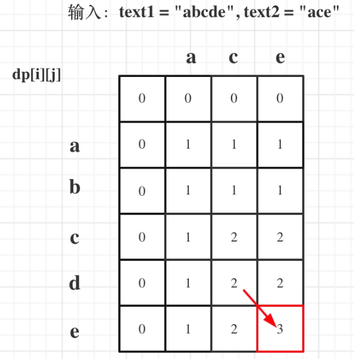

[TOC]


### 0.数据结构

#### 0.1堆

小顶堆和大顶堆，其本质是一颗完全二叉树，不同点在于：除叶子节点外，小顶堆的每个父节点的key都要比其左右两个子节点的key小；大顶堆的每个父节点的key都要比其左右两个子节点的key大。这里说的key暂时理解为节点的取值吧，而index为节点在树中的索引或者位置。小顶堆/大顶堆的特点在于，其根节点一定是整个数中最小或者最大的元素，这个也是其区别于其他数据结构最大的特点

以大顶堆为例，先来说说其最主要的两个操作add和pop是如何实现的：

**add**

1. 在往已有的大顶堆中添加元素时，将新元素作为树的最后的一个节点
2. 比较新节点与其父节点：如果新节点的值大于父节点，那么交换父节点和新节点的位置(其实就是交换两个元素的值)
3. 重复上述步骤，直到新节点比其父节点小，或者当前新节点的位置已经是根节点了，那么停止上述循环即可，此时大顶堆更新完毕


如果新节点的值大于父节点，那么交换父节点和新节点的位置


此时新节点取值11大于父节点10，继续交换

**pop**

从大顶堆中弹出元素，是指弹出堆的根节点，也就是弹出堆中取值最大的元素。弹出根节点之后，需要对堆进行调整，以使得其还是一个大顶堆

1. 将堆的最后一个叶子节点移到根节点的位置
2. 从根节点开始，比较根节点和其左右子节点的元素大小，若根节点不是都比子节点大，那么根节点与其较大的一个子节点进行交换
3. 只要存在子节点，那么继续比较父节点和左右子节点的大小，直到当前节点已经是叶子节点或者它比它的左右子节点取值都大，那么停止循环，最大堆已经更新完毕


因为根节点5小于子节点12，所以根节点与较大的一个子节点进行交换，即5和12交换


5和8交换后，取值为5的节点已经是叶子节点了，循环结束，最大堆更新完毕

小顶堆的实现思路基本跟大顶堆类似，唯一不同的是在更新堆的时候，停止条件由当前节点取值大于左右子节点，变为当前节点取值小于左右子节点时停止更新堆。

#### 0.2栈和队列

##### 0.2.1普通队列

如果不太清楚队列，可以看看我[这篇博客](http://blog.csdn.net/c20182030/article/details/70171231)。

##### 0.2.2优先队列

那么优先队列是什么呢？
说白了，就是一种功能强大的队列。

它的功能强大在哪里呢？
四个字：**自动排序**。一个优先队列声明的基本格式是：
priority_queue<结构类型> 队列名;
比如：

```
priority_queue <int> i;
priority_queue <double> d;
```

不过，我们最为常用的是这几种：

```
priority_queue <node> q;
//node是一个结构体
//结构体里重载了‘<’小于符号
priority_queue <int,vector<int>,greater<int> > q;
//不需要#include<vector>头文件
//注意后面两个“>”不要写在一起，“>>”是右移运算符
priority_queue <int,vector<int>,less<int> >q;
```


我们将在下文来讲讲这几种声明方式的不同。

优先队列的基本操作
与队列的基本操作如出一辙。
如果想要了解请点击这里，看关于队列的介绍。

以一个名为q的优先队列为例。

```
q.size();//返回q里元素个数
q.empty();//返回q是否为空，空则返回1，否则返回0
q.push(k);//在q的末尾插入k
q.pop();//删掉q的第一个元素
q.top();//返回q的第一个元素
```

优先队列的特性
上文已经说过了，自动排序。
怎么个排法呢？
在这里介绍一下：

默认的优先队列（非结构体结构）

```
priority_queue <int> q;
```

这样的优先队列是怎样的？让我们写程序验证一下。

```
#include<cstdio>
#include<queue>
using namespace std;
priority_queue <int> q;
int main()
{
	q.push(10),q.push(8),q.push(12),q.push(14),q.push(6);
	while(!q.empty())
		printf("%d ",q.top()),q.pop();
}
```


程序大意就是在这个优先队列里依次插入10、8、12、14、6，再输出。
结果是什么呢？
14 12 10 8 6
也就是说，它是按从大到小排序的！

默认的优先队列（结构体，重载小于）
先看看这个结构体是什么。

```
struct node
{
	int x,y;
	bool operator < (const node & a) const
	{
		return x<a.x;
	}
};
```


这个node结构体有两个成员，x和y，它的小于规则是x小者小。
再来看看验证程序：

```
#include<cstdio>
#include<queue>
using namespace std;
struct node
{
	int x,y;
	bool operator < (const node & a) const
	{
		return x<a.x;
	}
}k;
priority_queue <node> q;
int main()
{
	k.x=10,k.y=100; q.push(k);
	k.x=12,k.y=60; q.push(k);
	k.x=14,k.y=40; q.push(k);
	k.x=6,k.y=80; q.push(k);
	k.x=8,k.y=20; q.push(k);
	while(!q.empty())
	{
		node m=q.top(); q.pop();
		printf("(%d,%d) ",m.x,m.y);
	}
}
```

程序大意就是插入(10,100),(12,60),(14,40),(6,20),(8,20)这五个node。
再来看看它的输出：
(14,40) (12,60) (10,100) (8,20) (6,80)

它也是按照重载后的小于规则，从大到小排序的。
↑好好康康这句话！（摘眼镜）

less和greater优先队列
还是以int为例，先来声明：

```
priority_queue <int,vector<int>,less<int> > p;
priority_queue <int,vector<int>,greater<int> > q;
```

再次强调：“>”不要两个拼在一起。

话不多说，上程序和结果：

```
#include<cstdio>
#include<queue>
using namespace std;
priority_queue <int,vector<int>,less<int> > p;
priority_queue <int,vector<int>,greater<int> > q;
int a[5]={10,12,14,6,8};
int main()
{
	for(int i=0;i<5;i++)
		p.push(a[i]),q.push(a[i]);
		

printf("less<int>:")；
while(!p.empty())
	printf("%d ",p.top()),p.pop();	
	
printf("\ngreater<int>:")；
while(!q.empty())
	printf("%d ",q.top()),q.pop();

}

结果：
less<int>:14 12 10 8 6 greater<int>:6 8 10 12 14
```

所以，我们可以知道，less是从大到小，greater是从小到大。

作个总结
为了装13方便，在平时，建议大家写：

```
priority_queue<int,vector<int>,less<int> >q;
priority_queue<int,vector<int>,greater<int> >q;
```


平时如果用从大到小不用后面的vector<int>,less<int>，可能到时候要改成从小到大，你反而会搞忘怎么写greater<int>，反而得不偿失。

另一种排序方法
有可能遇到这种情况：心情不好不想用重载小于一个结构体的优先队列，要按照各种不一样的规则排序。

当然，如果不是优先队列而是数组，我们就会多写几个bool函数塞到sort里面来改变它的小于规则，比如：

```
struct node
{
	int fir,sec;
}arr[2030];

bool cmp1(node x,node y)
{
	return x.fir<y.fir;  //当一个node x的fir值小于另一个node y的fir值时，称x<y
}

bool cmp2(node x,node y)
{
	return x.sec<y.sec;  //当一个node x的sec值小于另一个node y的sec值时，称x<y
}

bool cmp3(node x,node y)
{
	return x.fir+x.sec<y.fir+y.sec;  //当一个node x的fri值和sec值的和小于另一个node y的fir值和sec值的和时，称x<y
}

int main()
{
	scanf("%d",&n);
	for(int i=1;i<=n;i++) scanf("%d %d",&arr[i].fir,&arr[i].sec);
	

puts("\n--------------------");
sort(arr+1,arr+1+n,cmp1); for(int i=1;i<=n;i++) printf("%d. {%d %d}\n",i,arr[i].fir,arr[i].sec);

}

puts("\n--------------------");
sort(arr+1,arr+1+n,cmp2); for(int i=1;i<=n;i++) printf("%d. {%d %d}\n",i,arr[i].fir,arr[i].sec);

}

puts("\n--------------------");
sort(arr+1,arr+1+n,cmp3); for(int i=1;i<=n;i++) printf("%d. {%d %d}\n",i,arr[i].fir,arr[i].sec);

}
```

因为不是整体所以就省略了验证环节（也就是说上面那个代码的正确性不保证）

但是优先队列可没有sort那么灵活想用什么作小于规则用什么作小于规则，它只会用一个固定的小于规则。
所以如果想把一个队列按不同的方式优先，就要：

```
#include<queue>
#include<cstdio>
#include<cstring>
#include<iostream>
#include<algorithm>
using namespace std;

int n;
struct node
{
	int fir,sec;
	void Read() {scanf("%d %d",&fir,&sec);}
}input;

struct cmp1
{
	bool operator () (const node &x,const node &y) const
	{
		return x.fir<y.fir;
	}
};//当一个node x的fir值小于另一个node y的fir值时，称x<y

struct cmp2
{
	bool operator () (const node &x,const node &y) const
	{
		return x.sec<y.sec;  
	}
};//当一个node x的sec值小于另一个node y的sec值时，称x<y

struct cmp3
{
	bool operator () (const node &x,const node &y) const
	{
		return x.fir+x.sec<y.fir+y.sec; 
	}
};//当一个node x的fri值和sec值的和小于另一个node y的fir值和sec值的和时，称x<y

priority_queue<node,vector<node>,cmp1> q1;
priority_queue<node,vector<node>,cmp2> q2;
priority_queue<node,vector<node>,cmp3> q3;

int main()
{
	scanf("%d",&n);
	for(int i=1;i<=n;i++) input.Read(),q1.push(input),q2.push(input),q3.push(input);
	

printf("\ncmp1:\n");
while(!q1.empty()) printf("(%d,%d) ",q1.top().fir,q1.top().sec),q1.pop();	
	
printf("\n\ncmp2:\n");
while(!q2.empty()) printf("(%d,%d) ",q2.top().fir,q2.top().sec),q2.pop();	
	
printf("\n\ncmp3:\n");
while(!q3.empty()) printf("(%d,%d) ",q3.top().fir,q3.top().sec),q3.pop();	

}
```

```
读入：
7
1 2
2 1
6 9
9 6
-100 100
-500 20
4000 -3000
```

输出：

```
cmp1:
(4000,-3000) (9,6) (6,9) (2,1) (1,2) (-100,100) (-500,20)

cmp2:
(-100,100) (-500,20) (6,9) (9,6) (1,2) (2,1) (4000,-3000)

cmp3:
(4000,-3000) (6,9) (9,6) (1,2) (2,1) (-100,100) (-500,20)
```


我们可以发现啊，priority_queue <int,vector<int>,less<int> > p;的那个less<int>其实就代表这个优先队列的小于规则，所以把这个换成cmp1就会有上述效果
所以说，所以说啦，一定要记得写全称！

我们可以发现啊，priority_queue <int,vector<int>,less<int> > p;的那个less<int>其实就代表这个优先队列的小于规则，所以把这个换成cmp1就会有上述效果，desu~
所以说，所以说啦，一定要记得写全称！


##### 0.2.3[滑动窗口最大值](https://leetcode.cn/problems/sliding-window-maximum/)

给你一个整数数组 `nums`，有一个大小为 `k` 的滑动窗口从数组的最左侧移动到数组的最右侧。你只可以看到在滑动窗口内的 `k` 个数字。滑动窗口每次只向右移动一位。

返回 *滑动窗口中的最大值* 。

 

**示例 1：**

```
输入：nums = [1,3,-1,-3,5,3,6,7], k = 3
输出：[3,3,5,5,6,7]
解释：
滑动窗口的位置                最大值
---------------               -----
[1  3  -1] -3  5  3  6  7       3
 1 [3  -1  -3] 5  3  6  7       3
 1  3 [-1  -3  5] 3  6  7       5
 1  3  -1 [-3  5  3] 6  7       5
 1  3  -1  -3 [5  3  6] 7       6
 1  3  -1  -3  5 [3  6  7]      7
```

**示例 2：**

```
输入：nums = [1], k = 1
输出：[1]
```

 

**提示：**

- `1 <= nums.length <= 105`
- `-104 <= nums[i] <= 104`
- `1 <= k <= nums.length`

```c++
class Solution {
public:
    vector<int> maxSlidingWindow(vector<int>& nums, int k) {
        int n = nums.size();
        priority_queue<pair<int,int>> q;//优先队列自动排序
        for(int i = 0; i < k; ++i){//初始化
            q.emplace(nums[i],i);
        }
        vector<int> ans;
        ans.push_back(q.top().first);
        for(int i = k; i < n; ++i){
            q.emplace(nums[i],i);
            while(q.top().second <= i - k){//将不在窗口的元素删除
                q.pop();
            }
            ans.push_back(q.top().first);
        }
        return ans;
    }
};
```

##### [232. 用栈实现队列](https://leetcode.cn/problems/implement-queue-using-stacks/)

请你仅使用两个栈实现先入先出队列。队列应当支持一般队列支持的所有操作（`push`、`pop`、`peek`、`empty`）：

实现 `MyQueue` 类：

- `void push(int x)` 将元素 x 推到队列的末尾
- `int pop()` 从队列的开头移除并返回元素
- `int peek()` 返回队列开头的元素
- `boolean empty()` 如果队列为空，返回 `true` ；否则，返回 `false`

**说明：**

- 你 **只能** 使用标准的栈操作 —— 也就是只有 `push to top`, `peek/pop from top`, `size`, 和 `is empty` 操作是合法的。
- 你所使用的语言也许不支持栈。你可以使用 list 或者 deque（双端队列）来模拟一个栈，只要是标准的栈操作即可。

 

**示例 1：**

```
输入：
["MyQueue", "push", "push", "peek", "pop", "empty"]
[[], [1], [2], [], [], []]
输出：
[null, null, null, 1, 1, false]

解释：
MyQueue myQueue = new MyQueue();
myQueue.push(1); // queue is: [1]
myQueue.push(2); // queue is: [1, 2] (leftmost is front of the queue)
myQueue.peek(); // return 1
myQueue.pop(); // return 1, queue is [2]
myQueue.empty(); // return false
```

```c++
class MyQueue {
public:
    stack<int> stkIn;
    stack<int> stkOut;
    MyQueue() {
        
    }
    
    void push(int x) {
        stkIn.push(x);
    }
    
    int pop() {
        int ans;
        if(!stkOut.empty()) {
            ans = stkOut.top();
            stkOut.pop();
        }
        else{
            while(!stkIn.empty()){
                stkOut.push(stkIn.top());
                stkIn.pop();
            }
            ans = stkOut.top();
            stkOut.pop();
        }
        return ans;
    }
    
    int peek() {
        int ans;
        if(!stkOut.empty()) {
            ans = stkOut.top();
        }
        else{
            while(!stkIn.empty()){
                stkOut.push(stkIn.top());
                stkIn.pop();
            }
            ans = stkOut.top();
        }
        return ans;
    }
    
    bool empty() {
        if(stkOut.empty() && stkIn.empty()) return true;
        else return false;
    }
};

/**
 * Your MyQueue object will be instantiated and called as such:
 * MyQueue* obj = new MyQueue();
 * obj->push(x);
 * int param_2 = obj->pop();
 * int param_3 = obj->peek();
 * bool param_4 = obj->empty();
 */
```

[225. 用队列实现栈](https://leetcode.cn/problems/implement-stack-using-queues/)

请你仅使用两个队列实现一个后入先出（LIFO）的栈，并支持普通栈的全部四种操作（`push`、`top`、`pop` 和 `empty`）。

实现 `MyStack` 类：

- `void push(int x)` 将元素 x 压入栈顶。
- `int pop()` 移除并返回栈顶元素。
- `int top()` 返回栈顶元素。
- `boolean empty()` 如果栈是空的，返回 `true` ；否则，返回 `false` 。

 

**注意：**

- 你只能使用队列的基本操作 —— 也就是 `push to back`、`peek/pop from front`、`size` 和 `is empty` 这些操作。
- 你所使用的语言也许不支持队列。 你可以使用 list （列表）或者 deque（双端队列）来模拟一个队列 , 只要是标准的队列操作即可。

 

**示例：**

```
输入：
["MyStack", "push", "push", "top", "pop", "empty"]
[[], [1], [2], [], [], []]
输出：
[null, null, null, 2, 2, false]

解释：
MyStack myStack = new MyStack();
myStack.push(1);
myStack.push(2);
myStack.top(); // 返回 2
myStack.pop(); // 返回 2
myStack.empty(); // 返回 False
```

 

**提示：**

- `1 <= x <= 9`
- 最多调用`100` 次 `push`、`pop`、`top` 和 `empty`
- 每次调用 `pop` 和 `top` 都保证栈不为空

```c++
class MyStack {
public:
    queue<int> que;
    MyStack() {

    }
    
    void push(int x) {
        que.push(x);
    }
    
    int pop() {
        int size = que.size() - 1;
        while(size--){
            que.push(que.front());
            que.pop();
        }
        int res = que.front();
        que.pop();
        return res;
    }
    
    int top() {
        return que.back();
    }
    
    bool empty() {
        return que.empty();
    }
};

/**
 * Your MyStack object will be instantiated and called as such:
 * MyStack* obj = new MyStack();
 * obj->push(x);
 * int param_2 = obj->pop();
 * int param_3 = obj->top();
 * bool param_4 = obj->empty();
 */
```

##### [20. 有效的括号](https://leetcode.cn/problems/valid-parentheses/)

给定一个只包括 `'('`，`')'`，`'{'`，`'}'`，`'['`，`']'` 的字符串 `s` ，判断字符串是否有效。

有效字符串需满足：

1. 左括号必须用相同类型的右括号闭合。
2. 左括号必须以正确的顺序闭合。
3. 每个右括号都有一个对应的相同类型的左括号。

 

**示例 1：**

```
输入：s = "()"
输出：true
```

**示例 2：**

```
输入：s = "()[]{}"
输出：true
```

**示例 3：**

```
输入：s = "(]"
输出：false
```

 

**提示：**

- `1 <= s.length <= 104`
- `s` 仅由括号 `'()[]{}'` 组成

```c++
class Solution {
public:
    bool isValid(string s) {
        stack<char> stk;
        int n = s.size();
       // if(n%2 == 1 || s[0] == ')' || s[0] == '}' || s[0] == ']' ) return false;
        for(int i = 0; i < n; ++i){
            if(s[i] == '(' || s[i] == '{' || s[i] == '[') stk.push(s[i]);
            else {
                if(stk.empty()) return false;//开始是左括号不入栈，栈为空
                char c = stk.top();
                if(s[i] == ')' && c == '(') {
                    stk.pop();
                    continue;  
                }
                if(s[i] == '}' && c == '{' ){
                    stk.pop();
                    continue; 
                }
                if(s[i] == ']' && c == '['){
                    stk.pop();
                    continue; 
                }
                else return false;
            }
        }
        if(!stk.empty()) return false;
        return true;
    }
};
```

##### [1047. 删除字符串中的所有相邻重复项](https://leetcode.cn/problems/remove-all-adjacent-duplicates-in-string/)

给出由小写字母组成的字符串 `S`，**重复项删除操作**会选择两个相邻且相同的字母，并删除它们。

在 S 上反复执行重复项删除操作，直到无法继续删除。

在完成所有重复项删除操作后返回最终的字符串。答案保证唯一。

 

**示例：**

```
输入："abbaca"
输出："ca"
解释：
例如，在 "abbaca" 中，我们可以删除 "bb" 由于两字母相邻且相同，这是此时唯一可以执行删除操作的重复项。之后我们得到字符串 "aaca"，其中又只有 "aa" 可以执行重复项删除操作，所以最后的字符串为 "ca"。
```

 

**提示：**

1. `1 <= S.length <= 20000`
2. `S` 仅由小写英文字母组成。

```c++
class Solution {
public:
    string removeDuplicates(string s) {
        int n = s.size();
        stack<char> stk1;
        string ans;
        for(int i = 0; i < n; ++i){
            if(stk1.empty() || stk1.top() != s[i]) stk1.push(s[i]);
            else stk1.pop();  
        }
        int len = stk1.size();
        for(int i = len - 1; i >= 0; --i){
            ans += stk1.top();
            stk1.pop();
        }
        reverse(ans.begin(),ans.end());
        return ans;
    }
};
```

##### [150. 逆波兰表达式求值](https://leetcode.cn/problems/evaluate-reverse-polish-notation/)

给你一个字符串数组 `tokens` ，表示一个根据 [逆波兰表示法](https://baike.baidu.com/item/逆波兰式/128437) 表示的算术表达式。

请你计算该表达式。返回一个表示表达式值的整数。

**注意：**

- 有效的算符为 `'+'`、`'-'`、`'*'` 和 `'/'` 。
- 每个操作数（运算对象）都可以是一个整数或者另一个表达式。
- 两个整数之间的除法总是 **向零截断** 。
- 表达式中不含除零运算。
- 输入是一个根据逆波兰表示法表示的算术表达式。
- 答案及所有中间计算结果可以用 **32 位** 整数表示。

 

**示例 1：**

```
输入：tokens = ["2","1","+","3","*"]
输出：9
解释：该算式转化为常见的中缀算术表达式为：((2 + 1) * 3) = 9
```

**示例 2：**

```
输入：tokens = ["4","13","5","/","+"]
输出：6
解释：该算式转化为常见的中缀算术表达式为：(4 + (13 / 5)) = 6
```

**示例 3：**

```
输入：tokens = ["10","6","9","3","+","-11","*","/","*","17","+","5","+"]
输出：22
解释：该算式转化为常见的中缀算术表达式为：
  ((10 * (6 / ((9 + 3) * -11))) + 17) + 5
= ((10 * (6 / (12 * -11))) + 17) + 5
= ((10 * (6 / -132)) + 17) + 5
= ((10 * 0) + 17) + 5
= (0 + 17) + 5
= 17 + 5
= 22
```

 

**提示：**

- `1 <= tokens.length <= 104`
- `tokens[i]` 是一个算符（`"+"`、`"-"`、`"*"` 或 `"/"`），或是在范围 `[-200, 200]` 内的一个整数

 

**逆波兰表达式：**

逆波兰表达式是一种后缀表达式，所谓后缀就是指算符写在后面。

- 平常使用的算式则是一种中缀表达式，如 `( 1 + 2 ) * ( 3 + 4 )` 。
- 该算式的逆波兰表达式写法为 `( ( 1 2 + ) ( 3 4 + ) * )` 。

逆波兰表达式主要有以下两个优点：

- 去掉括号后表达式无歧义，上式即便写成 `1 2 + 3 4 + * `也可以依据次序计算出正确结果。
- 适合用栈操作运算：遇到数字则入栈；遇到算符则取出栈顶两个数字进行计算，并将结果压入栈中

```c++
class Solution {
public:
    int evalRPN(vector<string>& tokens) {
        stack<long long> stk;
        long long op1,op2,tmp;
        for(string s : tokens){
            if(s == "+" || s == "-" || s == "*" || s == "/" ){
                op1 = stk.top();
                stk.pop();
                op2 = stk.top();
                stk.pop();
                if(s == "+")  stk.push(op2 + op1);
                else if (s == "-") stk.push(op2 - op1);
                else if (s == "*") stk.push(op2 * op1);
                else if (s == "/") stk.push(op2 / op1);   
            }
            else stk.push(stoll(s));
        }
        int ans = stk.top();
        stk.pop();
        return ans;
    }
};
```


#### 0.3链表

##### 移除链表元素（203）

给你一个链表的头节点 `head` 和一个整数 `val` ，请你删除链表中所有满足 `Node.val == val` 的节点，并返回 **新的头节点** 。

 

**示例 1：**


```
输入：head = [1,2,6,3,4,5,6], val = 6
输出：[1,2,3,4,5]
```

**示例 2：**

```
输入：head = [], val = 1
输出：[]
```

**示例 3：**

```
输入：head = [7,7,7,7], val = 7
输出：[]
```

```c++
/**
 * Definition for singly-linked list.
 * struct ListNode {
 *     int val;
 *     ListNode *next;
 *     ListNode() : val(0), next(nullptr) {}
 *     ListNode(int x) : val(x), next(nullptr) {}
 *     ListNode(int x, ListNode *next) : val(x), next(next) {}
 * };
 */
class Solution {
public:
    ListNode* removeElements(ListNode* head, int val) {
        ListNode* p = head,*front = head;//front记录前驱节点，便于删除结点
        while(head != nullptr && head->val == val)//如果上来就一样，头结点往后移
            head = head->next;
        while(p != nullptr){
            //cout<<p->val<<endl;
            if(p->val == val) {//如果相等，把这个节点删除
                p = p->next;
                front->next = p;
                // free(p);//会报错，既然结点成功删除了，干脆就不释放内存空间了
            }
            else{
                front = p;//更新下一个节点的前驱节点
                p = p->next;  
            }
            //p = p->next
        }
        return head;
    }
};
```

##### [707. 设计链表](https://leetcode.cn/problems/design-linked-list/)

你可以选择使用单链表或者双链表，设计并实现自己的链表。

单链表中的节点应该具备两个属性：`val` 和 `next` 。`val` 是当前节点的值，`next` 是指向下一个节点的指针/引用。

如果是双向链表，则还需要属性 `prev` 以指示链表中的上一个节点。假设链表中的所有节点下标从 **0** 开始。

实现 `MyLinkedList` 类：

- `MyLinkedList()` 初始化 `MyLinkedList` 对象。
- `int get(int index)` 获取链表中下标为 `index` 的节点的值。如果下标无效，则返回 `-1` 。
- `void addAtHead(int val)` 将一个值为 `val` 的节点插入到链表中第一个元素之前。在插入完成后，新节点会成为链表的第一个节点。
- `void addAtTail(int val)` 将一个值为 `val` 的节点追加到链表中作为链表的最后一个元素。
- `void addAtIndex(int index, int val)` 将一个值为 `val` 的节点插入到链表中下标为 `index` 的节点之前。如果 `index` 等于链表的长度，那么该节点会被追加到链表的末尾。如果 `index` 比长度更大，该节点将 **不会插入** 到链表中。
- `void deleteAtIndex(int index)` 如果下标有效，则删除链表中下标为 `index` 的节点。

 

**示例：**

```
输入
["MyLinkedList", "addAtHead", "addAtTail", "addAtIndex", "get", "deleteAtIndex", "get"]
[[], [1], [3], [1, 2], [1], [1], [1]]
输出
[null, null, null, null, 2, null, 3]

解释
MyLinkedList myLinkedList = new MyLinkedList();
myLinkedList.addAtHead(1);
myLinkedList.addAtTail(3);
myLinkedList.addAtIndex(1, 2);    // 链表变为 1->2->3
myLinkedList.get(1);              // 返回 2
myLinkedList.deleteAtIndex(1);    // 现在，链表变为 1->3
myLinkedList.get(1);              // 返回 3
```

 

**提示：**

- `0 <= index, val <= 1000`
- 请不要使用内置的 LinkedList 库。
- 调用 `get`、`addAtHead`、`addAtTail`、`addAtIndex` 和 `deleteAtIndex` 的次数不超过 `2000` 。

```c++
class MyLinkedList {
public:
    MyLinkedList() {
        this->head = new ListNode(0);
        this->len = 0;
    }
    
    int get(int index) {
        if(index >= this->len) {//index大于链表的长度
            return -1;
        }
        ListNode* cur = head -> next;
        for(int i = 0; i < index; ++i){
            if(cur == nullptr) return -1;
            else cur = cur->next;
        }
        return cur->val;
    }
    
    void addAtHead(int val) {
        ListNode* headNext = head->next;
        ListNode* newNode = new ListNode(val);
        newNode->next = headNext;
        head->next = newNode;
        this->len++;
        //output();
    }
    
    void addAtTail(int val) {
        ListNode* newNode = new ListNode(val);
        ListNode* cur = head;
        while(cur->next != nullptr){
            cur = cur->next;
        }
        cur->next = newNode;
        newNode->next = nullptr;
        this->len++;
        //output();
    }
    
    void addAtIndex(int index, int val) {
        if(index > this->len) {//index大于链表的长度
            return;
        }
        ListNode* cur = head;
        int i;
        for(i = 0; i < index; ++i){
            if(cur == nullptr) return;
            else cur = cur->next;
        }
        ListNode* newNode = new ListNode(val);
        newNode->next = cur->next;
        cur->next = newNode;
        this->len++;
        //output();
    }
    
    void deleteAtIndex(int index) {
        if(index >= this->len || index < 0) {//index不合法
            return;
        }
        ListNode* cur = head;
        int i;
        for(i = 0; i < index; ++i){
            if(cur == nullptr) return;
            else cur = cur->next;
        }
        ListNode* tmp = cur->next;
        cur->next = tmp -> next;
        delete(tmp);
        this->len--;
        //output();
    }

    void output(){
        ListNode* cur = head -> next ;
        while(cur != nullptr){
            cout<<cur->val<<" ";
            cur = cur->next;
        }
        cout<<endl;
    }
    private:
        ListNode* head;
        int len;
};

/**
 * Your MyLinkedList object will be instantiated and called as such:
 * MyLinkedList* obj = new MyLinkedList();
 * int param_1 = obj->get(index);
 * obj->addAtHead(val);
 * obj->addAtTail(val);
 * obj->addAtIndex(index,val);
 * obj->deleteAtIndex(index);
 */
```

##### [206. 反转链表](https://leetcode.cn/problems/reverse-linked-list/)

给你单链表的头节点 `head` ，请你反转链表，并返回反转后的链表。

 

**示例 1：**


```
输入：head = [1,2,3,4,5]
输出：[5,4,3,2,1]
```

**示例 2：**


```
输入：head = [1,2]
输出：[2,1]
```

**示例 3：**

```
输入：head = []
输出：[]
```

 

**提示：**

- 链表中节点的数目范围是 `[0, 5000]`
- `-5000 <= Node.val <= 5000`

```c++
/**
 * Definition for singly-linked list.
 * struct ListNode {
 *     int val;
 *     ListNode *next;
 *     ListNode() : val(0), next(nullptr) {}
 *     ListNode(int x) : val(x), next(nullptr) {}
 *     ListNode(int x, ListNode *next) : val(x), next(next) {}
 * };
 */
class Solution {
public:
    ListNode* reverseList(ListNode* head) {
        ListNode* cur = head;
        ListNode* pre = nullptr;
        while(cur != nullptr){
            ListNode* t = cur->next;
            cur->next = pre;
            pre = cur;
            cur = t;  
        }
        return pre;
    }
};
```

##### [24. 两两交换链表中的节点](https://leetcode.cn/problems/swap-nodes-in-pairs/)

给你一个链表，两两交换其中相邻的节点，并返回交换后链表的头节点。你必须在不修改节点内部的值的情况下完成本题（即，只能进行节点交换）。

 

**示例 1：**


```
输入：head = [1,2,3,4]
输出：[2,1,4,3]
```

**示例 2：**

```
输入：head = []
输出：[]
```

**示例 3：**

```
输入：head = [1]
输出：[1]
```

 

**提示：**

- 链表中节点的数目在范围 `[0, 100]` 内
- `0 <= Node.val <= 100`

```c++
/**
 * Definition for singly-linked list.
 * struct ListNode {
 *     int val;
 *     ListNode *next;
 *     ListNode() : val(0), next(nullptr) {}
 *     ListNode(int x) : val(x), next(nullptr) {}
 *     ListNode(int x, ListNode *next) : val(x), next(next) {}
 * };
 */
class Solution {
public:
    ListNode* swapPairs(ListNode* head) {
        ListNode* newHead = new ListNode();
        newHead->next = head;
        ListNode* cur = newHead;
        while(cur != nullptr && cur->next != nullptr &&cur->next->next != nullptr){
            ListNode* tmp = cur->next;
            cur->next = tmp->next;
            ListNode* tmp1 = cur->next->next;
            cur->next->next = tmp;
            tmp->next = tmp1;
            cur = cur->next->next;
        }
        return newHead->next;
    }
};
```

##### [19. 删除链表的倒数第 N 个结点](https://leetcode.cn/problems/remove-nth-node-from-end-of-list/)

给你一个链表，删除链表的倒数第 `n` 个结点，并且返回链表的头结点。

 

**示例 1：**


```
输入：head = [1,2,3,4,5], n = 2
输出：[1,2,3,5]
```

**示例 2：**

```
输入：head = [1], n = 1
输出：[]
```

**示例 3：**

```
输入：head = [1,2], n = 1
输出：[1]
```

 

**提示：**

- 链表中结点的数目为 `sz`
- `1 <= sz <= 30`
- `0 <= Node.val <= 100`
- `1 <= n <= sz`

```c++
/**
 * Definition for singly-linked list.
 * struct ListNode {
 *     int val;
 *     ListNode *next;
 *     ListNode() : val(0), next(nullptr) {}
 *     ListNode(int x) : val(x), next(nullptr) {}
 *     ListNode(int x, ListNode *next) : val(x), next(next) {}
 * };
 */
class Solution {
public:
    ListNode* removeNthFromEnd(ListNode* head, int n) {
        ListNode* cur = head;
        ListNode* newHead = new ListNode();
        newHead->next = head;
        ListNode* cur1 = newHead;
        int len = 0;
        while(cur != nullptr){
            len++;
            cur = cur->next;
        }
        for(int i  = 0; i < len - n; ++i){
            cur1 = cur1->next;
        }
        cout<<cur1->val<<endl;
        ListNode* tmp = cur1->next;
        if(tmp != nullptr ){
            cur1->next = tmp->next;
            delete(tmp);
        }   
        else {
            cur1->next = nullptr;
        }
        return newHead->next;
    }
};
```

##### [160. 相交链表](https://leetcode.cn/problems/intersection-of-two-linked-lists/)

给你两个单链表的头节点 `headA` 和 `headB` ，请你找出并返回两个单链表相交的起始节点。如果两个链表不存在相交节点，返回 `null` 。

图示两个链表在节点 `c1` 开始相交**：**

[](https://assets.leetcode-cn.com/aliyun-lc-upload/uploads/2018/12/14/160_statement.png)

题目数据 **保证** 整个链式结构中不存在环。

**注意**，函数返回结果后，链表必须 **保持其原始结构** 。

**自定义评测：**

**评测系统** 的输入如下（你设计的程序 **不适用** 此输入）：

- `intersectVal` - 相交的起始节点的值。如果不存在相交节点，这一值为 `0`
- `listA` - 第一个链表
- `listB` - 第二个链表
- `skipA` - 在 `listA` 中（从头节点开始）跳到交叉节点的节点数
- `skipB` - 在 `listB` 中（从头节点开始）跳到交叉节点的节点数

评测系统将根据这些输入创建链式数据结构，并将两个头节点 `headA` 和 `headB` 传递给你的程序。如果程序能够正确返回相交节点，那么你的解决方案将被 **视作正确答案** 。

 

**示例 1：**

[](https://assets.leetcode.com/uploads/2018/12/13/160_example_1.png)

```
输入：intersectVal = 8, listA = [4,1,8,4,5], listB = [5,6,1,8,4,5], skipA = 2, skipB = 3
输出：Intersected at '8'
解释：相交节点的值为 8 （注意，如果两个链表相交则不能为 0）。
从各自的表头开始算起，链表 A 为 [4,1,8,4,5]，链表 B 为 [5,6,1,8,4,5]。
在 A 中，相交节点前有 2 个节点；在 B 中，相交节点前有 3 个节点。
— 请注意相交节点的值不为 1，因为在链表 A 和链表 B 之中值为 1 的节点 (A 中第二个节点和 B 中第三个节点) 是不同的节点。换句话说，它们在内存中指向两个不同的位置，而链表 A 和链表 B 中值为 8 的节点 (A 中第三个节点，B 中第四个节点) 在内存中指向相同的位置。
```

 

**示例 2：**

[](https://assets.leetcode.com/uploads/2018/12/13/160_example_2.png)

```
输入：intersectVal = 2, listA = [1,9,1,2,4], listB = [3,2,4], skipA = 3, skipB = 1
输出：Intersected at '2'
解释：相交节点的值为 2 （注意，如果两个链表相交则不能为 0）。
从各自的表头开始算起，链表 A 为 [1,9,1,2,4]，链表 B 为 [3,2,4]。
在 A 中，相交节点前有 3 个节点；在 B 中，相交节点前有 1 个节点。
```

**示例 3：**

[](https://assets.leetcode.com/uploads/2018/12/13/160_example_3.png)

```
输入：intersectVal = 0, listA = [2,6,4], listB = [1,5], skipA = 3, skipB = 2
输出：null
解释：从各自的表头开始算起，链表 A 为 [2,6,4]，链表 B 为 [1,5]。
由于这两个链表不相交，所以 intersectVal 必须为 0，而 skipA 和 skipB 可以是任意值。
这两个链表不相交，因此返回 null 。
```

 

**提示：**

- `listA` 中节点数目为 `m`
- `listB` 中节点数目为 `n`
- `1 <= m, n <= 3 * 104`
- `1 <= Node.val <= 105`
- `0 <= skipA <= m`
- `0 <= skipB <= n`
- 如果 `listA` 和 `listB` 没有交点，`intersectVal` 为 `0`
- 如果 `listA` 和 `listB` 有交点，`intersectVal == listA[skipA] == listB[skipB]`

```c++
/**
 * Definition for singly-linked list.
 * struct ListNode {
 *     int val;
 *     ListNode *next;
 *     ListNode(int x) : val(x), next(NULL) {}
 * };
 */
class Solution {
public:
    ListNode *getIntersectionNode(ListNode *headA, ListNode *headB) {
        ListNode* cur1 = headA;
        ListNode* cur2 = headB;
        ListNode* ans = nullptr;
        int len1 = 0, len2 = 0;
        while(cur1 != nullptr){
            cur1 = cur1->next;
            len1++;
        }
        while(cur2 != nullptr){
            cur2 = cur2->next;
            len2++;
        }
        if(len1 < len2){
            cur1 = headA;
            cur2 = headB;
            for(int i = 0; i < len2 - len1; ++i){
                cur2 = cur2->next;
            }
            for(int i = len2 - len1; i < len2; ++i){
                if(cur2 == cur1) ans = cur1;
                else {
                    cur1 = cur1->next;
                    cur2 = cur2->next;
                }
            }
        }
        else{
            cur1 = headA;
            cur2 = headB;
            for(int i = 0; i < len1 - len2; ++i){
                cur1 = cur1->next;
            }
            for(int i = len1 - len2; i < len1; ++i){
                if(cur2 == cur1) ans = cur1;
                else {
                    cur1 = cur1->next;
                    cur2 = cur2->next;
                }
            } 
        }
        return ans;
    }
};
```

##### [142. 环形链表 II](https://leetcode.cn/problems/linked-list-cycle-ii/)

给定一个链表的头节点  `head` ，返回链表开始入环的第一个节点。 *如果链表无环，则返回 `null`。*

如果链表中有某个节点，可以通过连续跟踪 `next` 指针再次到达，则链表中存在环。 为了表示给定链表中的环，评测系统内部使用整数 `pos` 来表示链表尾连接到链表中的位置（**索引从 0 开始**）。如果 `pos` 是 `-1`，则在该链表中没有环。**注意：`pos` 不作为参数进行传递**，仅仅是为了标识链表的实际情况。

**不允许修改** 链表。


 

**示例 1：**


```
输入：head = [3,2,0,-4], pos = 1
输出：返回索引为 1 的链表节点
解释：链表中有一个环，其尾部连接到第二个节点。
```

**示例 2：**


```
输入：head = [1,2], pos = 0
输出：返回索引为 0 的链表节点
解释：链表中有一个环，其尾部连接到第一个节点。
```

**示例 3：**


```
输入：head = [1], pos = -1
输出：返回 null
解释：链表中没有环。
```

 

**提示：**

- 链表中节点的数目范围在范围 `[0, 104]` 内
- `-105 <= Node.val <= 105`
- `pos` 的值为 `-1` 或者链表中的一个有效索引

```c++
/**
 * Definition for singly-linked list.
 * struct ListNode {
 *     int val;
 *     ListNode *next;
 *     ListNode(int x) : val(x), next(NULL) {}
 * };
 */
class Solution {
public:
    ListNode *detectCycle(ListNode *head) {
        ListNode* slow = head;
        ListNode* fast = head;
        while(fast != nullptr && fast->next != nullptr){
            slow = slow->next;
            fast = fast->next->next;
            if(slow == fast){
                ListNode* index1 = head;
                ListNode* index2 = slow;
                while(index1 != index2){
                    index1 = index1->next;
                    index2 = index2->next;
                }
                return index1;
            }
        }
        return nullptr;
    }
};
```

#### 0.4哈希表

##### [242. 有效的字母异位词](https://leetcode.cn/problems/valid-anagram/)

给定两个字符串 `*s*` 和 `*t*` ，编写一个函数来判断 `*t*` 是否是 `*s*` 的字母异位词。

**注意：**若 `*s*` 和 `*t*` 中每个字符出现的次数都相同，则称 `*s*` 和 `*t*` 互为字母异位词。

 

**示例 1:**

```
输入: s = "anagram", t = "nagaram"
输出: true
```

**示例 2:**

```
输入: s = "rat", t = "car"
输出: false
```

 

**提示:**

- `1 <= s.length, t.length <= 5 * 104`
- `s` 和 `t` 仅包含小写字母

```c++
class Solution {
public:
    bool isAnagram(string s, string t) {
        int a[26] = {0} ,b[26] = {0};
        int m = s.size(), n = t.size();
        for(int i = 0; i < m; ++i){
            a[s[i] - 'a']++;
        }
        for(int i = 0; i < n; ++i){
            b[t[i] - 'a']++;
        }
        for(int i = 0; i < 26; ++i){
            if(a[i] != b[i]) return false;
        }
        return true;
    }
};
```

##### [349. 两个数组的交集](https://leetcode.cn/problems/intersection-of-two-arrays/)

给定两个数组 `nums1` 和 `nums2` ，返回 *它们的交集* 。输出结果中的每个元素一定是 **唯一** 的。我们可以 **不考虑输出结果的顺序** 。

 

**示例 1：**

```
输入：nums1 = [1,2,2,1], nums2 = [2,2]
输出：[2]
```

**示例 2：**

```
输入：nums1 = [4,9,5], nums2 = [9,4,9,8,4]
输出：[9,4]
解释：[4,9] 也是可通过的
```

 

**提示：**

- `1 <= nums1.length, nums2.length <= 1000`
- `0 <= nums1[i], nums2[i] <= 1000`

```c++
class Solution {
public:
    vector<int> intersection(vector<int>& nums1, vector<int>& nums2) {
        unordered_set<int> ans;
        unordered_set<int> nums(nums1.begin(),nums1.end());
        for(int num : nums2){
            if(nums.find(num) != nums.end()){
                ans.insert(num);
            }
        }
        return vector<int>(ans.begin(),ans.end());
    }
};
```


##### [383. 赎金信](https://leetcode.cn/problems/ransom-note/)

给你两个字符串：`ransomNote` 和 `magazine` ，判断 `ransomNote` 能不能由 `magazine` 里面的字符构成。

如果可以，返回 `true` ；否则返回 `false` 。

`magazine` 中的每个字符只能在 `ransomNote` 中使用一次。

 

**示例 1：**

```
输入：ransomNote = "a", magazine = "b"
输出：false
```

**示例 2：**

```
输入：ransomNote = "aa", magazine = "ab"
输出：false
```

**示例 3：**

```
输入：ransomNote = "aa", magazine = "aab"
输出：true
```

 

**提示：**

- `1 <= ransomNote.length, magazine.length <= 105`
- `ransomNote` 和 `magazine` 由小写英文字母组成

```c++
class Solution {
public:
    bool canConstruct(string ransomNote, string magazine) {
        int a[26] = {0},b[26] = {0};
        for(char c : ransomNote){
            a[c - 'a']++;
        }
        for(char c : magazine){
            b[c - 'a']++;
        }
        for(int i = 0; i < 26; ++i){
            if(a[i] > b[i]) return false;
        }
        return true;
    }
};
```

##### [350. 两个数组的交集 II](https://leetcode.cn/problems/intersection-of-two-arrays-ii/)

给你两个整数数组 `nums1` 和 `nums2` ，请你以数组形式返回两数组的交集。返回结果中每个元素出现的次数，应与元素在两个数组中都出现的次数一致（如果出现次数不一致，则考虑取较小值）。可以不考虑输出结果的顺序。

 

**示例 1：**

```
输入：nums1 = [1,2,2,1], nums2 = [2,2]
输出：[2,2]
```

**示例 2:**

```
输入：nums1 = [4,9,5], nums2 = [9,4,9,8,4]
输出：[4,9]
```

 

**提示：**

- `1 <= nums1.length, nums2.length <= 1000`
- `0 <= nums1[i], nums2[i] <= 1000`

```c++
class Solution {
public:
    vector<int> intersect(vector<int>& nums1, vector<int>& nums2) {
        vector<int> ans;
        int a[1001] = {0}, b[1001] = {0};
        for(int num : nums1){
            a[num]++;
        }
        for(int num : nums2){
            b[num]++;
        }
        for(int i = 0; i < 1001; ++i){
            if(a[i]!=0 && b[i] !=0){
                int min = a[i] < b[i] ? a[i] : b[i];
                while(min--)
                    ans.push_back(i);
            }
        }
        return ans;
    }
};
```

##### [202. 快乐数](https://leetcode.cn/problems/happy-number/)

编写一个算法来判断一个数 `n` 是不是快乐数。

**「快乐数」** 定义为：

- 对于一个正整数，每一次将该数替换为它每个位置上的数字的平方和。
- 然后重复这个过程直到这个数变为 1，也可能是 **无限循环** 但始终变不到 1。
- 如果这个过程 **结果为** 1，那么这个数就是快乐数。

如果 `n` 是 *快乐数* 就返回 `true` ；不是，则返回 `false` 。

 

**示例 1：**

```
输入：n = 19
输出：true
解释：
12 + 92 = 82
82 + 22 = 68
62 + 82 = 100
12 + 02 + 02 = 1
```

**示例 2：**

```
输入：n = 2
输出：false
```

 

**提示：**

- `1 <= n <= 231 - 1`

```c++
class Solution {
public:
    int getSum(int n){
        int sum = 0;
        while(n > 0){
            int tmp = n % 10;
            sum += tmp * tmp;
            n = n / 10;
        }
        return sum;
    }
    bool isHappy(int n) {
        unordered_set<int> set;
        while(1){
            int sum = getSum(n);
            if(sum == 1) return true;
            if(set.find(sum) != set.end()) return false;//出现循环，说明到不了1
            set.insert(sum);
            n = sum;
        }
    }
};
```

##### [1. 两数之和](https://leetcode.cn/problems/two-sum/)

给定一个整数数组 `nums` 和一个整数目标值 `target`，请你在该数组中找出 **和为目标值** *`target`* 的那 **两个** 整数，并返回它们的数组下标。

你可以假设每种输入只会对应一个答案。但是，数组中同一个元素在答案里不能重复出现。

你可以按任意顺序返回答案。

 

**示例 1：**

```
输入：nums = [2,7,11,15], target = 9
输出：[0,1]
解释：因为 nums[0] + nums[1] == 9 ，返回 [0, 1] 。
```

**示例 2：**

```
输入：nums = [3,2,4], target = 6
输出：[1,2]
```

**示例 3：**

```
输入：nums = [3,3], target = 6
输出：[0,1]
```

 

**提示：**

- `2 <= nums.length <= 104`
- `-109 <= nums[i] <= 109`
- `-109 <= target <= 109`
- **只会存在一个有效答案**

```c++
class Solution {
public:
    vector<int> twoSum(vector<int>& nums, int target) {
        vector<int> ans;
        unordered_map<int,int> map;//map key存储数值，value存储下标
        int n = nums.size();
        for(int i = 0; i < n; ++i){
            auto iter = map.find(target - nums[i]);
            if(iter != map.end()){
                ans.push_back(i);
                ans.push_back(iter->second);
                break;
            }
            else map.insert(pair<int,int>(nums[i],i));
        }

        return ans;
    }
};
```

##### [454. 四数相加 II](https://leetcode.cn/problems/4sum-ii/)

给你四个整数数组 `nums1`、`nums2`、`nums3` 和 `nums4` ，数组长度都是 `n` ，请你计算有多少个元组 `(i, j, k, l)` 能满足：

- `0 <= i, j, k, l < n`
- `nums1[i] + nums2[j] + nums3[k] + nums4[l] == 0`

 

**示例 1：**

```
输入：nums1 = [1,2], nums2 = [-2,-1], nums3 = [-1,2], nums4 = [0,2]
输出：2
解释：
两个元组如下：
1. (0, 0, 0, 1) -> nums1[0] + nums2[0] + nums3[0] + nums4[1] = 1 + (-2) + (-1) + 2 = 0
2. (1, 1, 0, 0) -> nums1[1] + nums2[1] + nums3[0] + nums4[0] = 2 + (-1) + (-1) + 0 = 0
```

**示例 2：**

```
输入：nums1 = [0], nums2 = [0], nums3 = [0], nums4 = [0]
输出：1
```

 

 **提示：**

- `n == nums1.length`
- `n == nums2.length`
- `n == nums3.length`
- `n == nums4.length`
- `1 <= n <= 200`
- `-228 <= nums1[i], nums2[i], nums3[i], nums4[i] <= 228`

```c++
class Solution {
public:
    int fourSumCount(vector<int>& nums1, vector<int>& nums2, vector<int>& nums3, vector<int>& nums4) {
        int count = 0;
        unordered_map<int,int> map;//key存储和,value存储和出现的次数
        int n = nums1.size();
        for(int i = 0; i < n; ++i){
            for(int j = 0; j < n; ++j){
                auto iter = map.find(nums1[i] + nums2[j]);
                if(iter != map.end()) iter->second++;
                else map.insert(pair<int,int>(nums1[i] + nums2[j],1));
            }
        } 
        for(int i = 0; i < n; ++i){
            for(int j = 0; j < n; ++j){
                auto iter = map.find(0 - (nums3[i] + nums4[j]));
                if(iter != map.end()) count = count + iter->second; 
            }
        } 
        return count;
    }
};
```

#### 0.5串

##### [541. 反转字符串 II](https://leetcode.cn/problems/reverse-string-ii/)

给定一个字符串 `s` 和一个整数 `k`，从字符串开头算起，每计数至 `2k` 个字符，就反转这 `2k` 字符中的前 `k` 个字符。

- 如果剩余字符少于 `k` 个，则将剩余字符全部反转。
- 如果剩余字符小于 `2k` 但大于或等于 `k` 个，则反转前 `k` 个字符，其余字符保持原样。

 

**示例 1：**

```
输入：s = "abcdefg", k = 2
输出："bacdfeg"
```

**示例 2：**

```
输入：s = "abcd", k = 2
输出："bacd"
```

 

**提示：**

- `1 <= s.length <= 104`
- `s` 仅由小写英文组成
- `1 <= k <= 104`

```c++
class Solution {
public:
    string reverseS(string s,int start,int k){
        int n = s.size();
        int i = start, j = start + k - 1;
        while(i < j){
            char tmp = s[i];
            s[i] = s[j];
            s[j] = tmp;
            i++;
            j--;
        }
        return s;
    }
    string reverseStr(string s, int k) {
        int n = s.size();
        //cout<<n<<endl;
        int i = 0;
        for(i = 0; i + 2*k < n; i += 2*k){
            s = reverseS(s,i,k);
        }
        //cout<<i<<endl;
        if(n - i >= k){
            s = reverseS(s,i,k);//如果剩余字符小于 2k 但大于或等于 k 个，则反转前 k 个字符，其余字符保持原样
        }else if(n - i < k ){
            s = reverseS(s,i,n - i);//如果剩余字符少于 k 个，则将剩余字符全部反转
        }
        return s;
    }
};
```

#### 0.6二叉树

##### [144. 二叉树的前序遍历](https://leetcode.cn/problems/binary-tree-preorder-traversal/)

给你二叉树的根节点 `root` ，返回它节点值的 **前序** 遍历。

 

**示例 1：**


```
输入：root = [1,null,2,3]
输出：[1,2,3]
```

**示例 2：**

```
输入：root = []
输出：[]
```

**示例 3：**

```
输入：root = [1]
输出：[1]
```

**示例 4：**


```
输入：root = [1,2]
输出：[1,2]
```

**示例 5：**


```
输入：root = [1,null,2]
输出：[1,2]
```

 

**提示：**

- 树中节点数目在范围 `[0, 100]` 内
- `-100 <= Node.val <= 100`

```c++
/**
 * Definition for a binary tree node.
 * struct TreeNode {
 *     int val;
 *     TreeNode *left;
 *     TreeNode *right;
 *     TreeNode() : val(0), left(nullptr), right(nullptr) {}
 *     TreeNode(int x) : val(x), left(nullptr), right(nullptr) {}
 *     TreeNode(int x, TreeNode *left, TreeNode *right) : val(x), left(left), right(right) {}
 * };
 */

class Solution {
public:
    void traversal(TreeNode *root, vector<int>& ans){
        if(root == nullptr) return;
        ans.push_back(root->val);
        traversal(root->left,ans);
        traversal(root->right,ans);
    }
    vector<int> preorderTraversal(TreeNode* root) {
        vector<int> ans;
        traversal(root,ans);
        return ans;
    }
};


/**
 * Definition for a binary tree node.
 * struct TreeNode {
 *     int val;
 *     TreeNode *left;
 *     TreeNode *right;
 *     TreeNode() : val(0), left(nullptr), right(nullptr) {}
 *     TreeNode(int x) : val(x), left(nullptr), right(nullptr) {}
 *     TreeNode(int x, TreeNode *left, TreeNode *right) : val(x), left(left), right(right) {}
 * };
 */
 #include<vector>
class Solution {
public:
    vector<int> preorderTraversal(TreeNode* root) {
        stack<TreeNode*> stk;
        if(root != NULL) stk.push(root);//判断树是否为空
        TreeNode* node;
        vector<int> ans;
        while(!stk.empty()){
            node = stk.top();
            if(node != NULL){
                stk.pop();
                if(node->right) stk.push(node->right);//右节点先进
                if(node->left) stk.push(node->left);
                stk.push(node);//前序遍历根节点最后放栈里，这样先遍历
                stk.push(NULL);
            }else{
                stk.pop();
                node = stk.top();
                ans.push_back(node->val);
                stk.pop();
            }
            
        }
        return ans;
    }
};
```

##### [145. 二叉树的后序遍历](https://leetcode.cn/problems/binary-tree-postorder-traversal/)

给你一棵二叉树的根节点 `root` ，返回其节点值的 **后序遍历** 。

 

**示例 1：**


```
输入：root = [1,null,2,3]
输出：[3,2,1]
```

**示例 2：**

```
输入：root = []
输出：[]
```

**示例 3：**

```
输入：root = [1]
输出：[1]
```

 

**提示：**

- 树中节点的数目在范围 `[0, 100]` 内
- `-100 <= Node.val <= 100`

```c++
/**
 * Definition for a binary tree node.
 * struct TreeNode {
 *     int val;
 *     TreeNode *left;
 *     TreeNode *right;
 *     TreeNode() : val(0), left(nullptr), right(nullptr) {}
 *     TreeNode(int x) : val(x), left(nullptr), right(nullptr) {}
 *     TreeNode(int x, TreeNode *left, TreeNode *right) : val(x), left(left), right(right) {}
 * };
 */
class Solution {
public:
    void traversal(TreeNode *root, vector<int>& ans){
        if(root == nullptr) return;
        traversal(root->left,ans);
        traversal(root->right,ans);
        ans.push_back(root->val);
    }
    vector<int> postorderTraversal(TreeNode* root) {
        vector<int> res;
        traversal(root,res);
        return res;
    }
};


/**
 * Definition for a binary tree node.
 * struct TreeNode {
 *     int val;
 *     TreeNode *left;
 *     TreeNode *right;
 *     TreeNode() : val(0), left(nullptr), right(nullptr) {}
 *     TreeNode(int x) : val(x), left(nullptr), right(nullptr) {}
 *     TreeNode(int x, TreeNode *left, TreeNode *right) : val(x), left(left), right(right) {}
 * };
 */
class Solution {
public:
    vector<int> postorderTraversal(TreeNode* root) {
        stack<TreeNode*> stk;
        vector<int> ans;
        if(root != nullptr) stk.push(root);
        TreeNode* node;
        while(!stk.empty()){
            node = stk.top();
            if(node != nullptr){
                stk.pop();
                stk.push(node);//后序遍历在栈中要先把根节点放进去，这样最后出来
                stk.push(nullptr);//空节点标记着还没有被访问，else使用
                if(node->right) stk.push(node->right);
                if(node->left) stk.push(node->left);
            }
            else{//遇到空节点，就输出
                stk.pop();
                node = stk.top();
                ans.push_back(node->val);
                stk.pop();
            }
            
        }
        return ans;
    }
};
```

##### [94. 二叉树的中序遍历](https://leetcode.cn/problems/binary-tree-inorder-traversal/)

给定一个二叉树的根节点 `root` ，返回 *它的 **中序** 遍历* 。

 

**示例 1：**


```
输入：root = [1,null,2,3]
输出：[1,3,2]
```

**示例 2：**

```
输入：root = []
输出：[]
```

**示例 3：**

```
输入：root = [1]
输出：[1]
```

 

**提示：**

- 树中节点数目在范围 `[0, 100]` 内
- `-100 <= Node.val <= 100`

```c++
/**
 * Definition for a binary tree node.
 * struct TreeNode {
 *     int val;
 *     TreeNode *left;
 *     TreeNode *right;
 *     TreeNode() : val(0), left(nullptr), right(nullptr) {}
 *     TreeNode(int x) : val(x), left(nullptr), right(nullptr) {}
 *     TreeNode(int x, TreeNode *left, TreeNode *right) : val(x), left(left), right(right) {}
 * };
 */
class Solution {
public:
    vector<int> inorderTraversal(TreeNode* root) {
        stack<TreeNode*> stk;
        if(root != nullptr) stk.push(root);
        vector<int> ans;
        TreeNode* node;
        while(!stk.empty()){
            node = stk.top();
            if(node != nullptr){
                stk.pop();
                if(node->right) stk.push(node->right);
                stk.push(node);
                stk.push(nullptr);
                if(node->left) stk.push(node->left);
            }
            else{
                stk.pop();
                node = stk.top();
                ans.push_back(node->val);
                stk.pop();
            }
        }
        return ans;
    }
};
```

##### [102. 二叉树的层序遍历](https://leetcode.cn/problems/binary-tree-level-order-traversal/)

给你二叉树的根节点 `root` ，返回其节点值的 **层序遍历** 。 （即逐层地，从左到右访问所有节点）。

 

**示例 1：**


```
输入：root = [3,9,20,null,null,15,7]
输出：[[3],[9,20],[15,7]]
```

**示例 2：**

```
输入：root = [1]
输出：[[1]]
```

**示例 3：**

```
输入：root = []
输出：[]
```

 

**提示：**

- 树中节点数目在范围 `[0, 2000]` 内
- `-1000 <= Node.val <= 1000`

```c++
/**
 * Definition for a binary tree node.
 * struct TreeNode {
 *     int val;
 *     TreeNode *left;
 *     TreeNode *right;
 *     TreeNode() : val(0), left(nullptr), right(nullptr) {}
 *     TreeNode(int x) : val(x), left(nullptr), right(nullptr) {}
 *     TreeNode(int x, TreeNode *left, TreeNode *right) : val(x), left(left), right(right) {}
 * };
 */
class Solution {
public:
    vector<vector<int>> levelOrder(TreeNode* root) {
        queue<TreeNode*> que;
        vector<vector<int>> ans;
        if(root != nullptr) que.push(root);
        TreeNode* node;
        while(!que.empty()){
            int size = que.size();
            vector<int> vec;
            for(int i = 0; i < size; ++i){
                node = que.front();
                vec.push_back(node->val);
                que.pop();
                if(node->left) que.push(node->left);
                if(node->right) que.push(node->right);
            }
            ans.push_back(vec);
        }
        return ans;
    }
};
```

##### [107. 二叉树的层序遍历 II](https://leetcode.cn/problems/binary-tree-level-order-traversal-ii/)

给你二叉树的根节点 `root` ，返回其节点值 **自底向上的层序遍历** 。 （即按从叶子节点所在层到根节点所在的层，逐层从左向右遍历）

 

**示例 1：**


```
输入：root = [3,9,20,null,null,15,7]
输出：[[15,7],[9,20],[3]]
```

**示例 2：**

```
输入：root = [1]
输出：[[1]]
```

**示例 3：**

```
输入：root = []
输出：[]
```

 

**提示：**

- 树中节点数目在范围 `[0, 2000]` 内
- `-1000 <= Node.val <= 1000`

```c++
/**
 * Definition for a binary tree node.
 * struct TreeNode {
 *     int val;
 *     TreeNode *left;
 *     TreeNode *right;
 *     TreeNode() : val(0), left(nullptr), right(nullptr) {}
 *     TreeNode(int x) : val(x), left(nullptr), right(nullptr) {}
 *     TreeNode(int x, TreeNode *left, TreeNode *right) : val(x), left(left), right(right) {}
 * };
 */
class Solution {
public:
    vector<vector<int>> levelOrderBottom(TreeNode* root) {
        vector<vector<int>> ans;
        queue<TreeNode*> que;
        if(root != NULL) que.push(root);
        TreeNode* node;
        while(!que.empty()){
            vector<int> vec;
            int size = que.size();
            for(int i = 0; i < size; ++i){
                node = que.front();
                vec.push_back(node->val);
                if(node->left) que.push(node->left);
                if(node->right) que.push(node->right);
                que.pop();
            }
            ans.push_back(vec);
        }
        reverse(ans.begin(),ans.end());
        return ans;
    }
};
```

##### [199. 二叉树的右视图](https://leetcode.cn/problems/binary-tree-right-side-view/)

给定一个二叉树的 **根节点** `root`，想象自己站在它的右侧，按照从顶部到底部的顺序，返回从右侧所能看到的节点值。

 

**示例 1:**


```
输入: [1,2,3,null,5,null,4]
输出: [1,3,4]
```

**示例 2:**

```
输入: [1,null,3]
输出: [1,3]
```

**示例 3:**

```
输入: []
输出: []
```

 

**提示:**

- 二叉树的节点个数的范围是 `[0,100]`
- `-100 <= Node.val <= 100` 

```c++
/**
 * Definition for a binary tree node.
 * struct TreeNode {
 *     int val;
 *     TreeNode *left;
 *     TreeNode *right;
 *     TreeNode() : val(0), left(nullptr), right(nullptr) {}
 *     TreeNode(int x) : val(x), left(nullptr), right(nullptr) {}
 *     TreeNode(int x, TreeNode *left, TreeNode *right) : val(x), left(left), right(right) {}
 * };
 */
class Solution {
public:
    vector<int> rightSideView(TreeNode* root) {
        queue<TreeNode*> que;
        vector<int> ans;
        if(root != NULL) que.push(root);
        TreeNode* node;
        while(!que.empty()){
            int size = que.size();
            for(int i = 0; i < size; ++i){
                node = que.front();
                if(node->left) que.push(node->left);
                if(node->right) que.push(node->right);
                que.pop();
            }
            ans.push_back(node->val);
        }
        return ans;
    }
};
```

##### [637. 二叉树的层平均值](https://leetcode.cn/problems/average-of-levels-in-binary-tree/)

给定一个非空二叉树的根节点 `root` , 以数组的形式返回每一层节点的平均值。与实际答案相差 `10-5` 以内的答案可以被接受。

 

**示例 1：**


```
输入：root = [3,9,20,null,null,15,7]
输出：[3.00000,14.50000,11.00000]
解释：第 0 层的平均值为 3,第 1 层的平均值为 14.5,第 2 层的平均值为 11 。
因此返回 [3, 14.5, 11] 。
```

**示例 2:**


```
输入：root = [3,9,20,15,7]
输出：[3.00000,14.50000,11.00000]
```

 

**提示：**


- 树中节点数量在 `[1, 104]` 范围内
- `-231 <= Node.val <= 231 - 1`

```c++
/**
 * Definition for a binary tree node.
 * struct TreeNode {
 *     int val;
 *     TreeNode *left;
 *     TreeNode *right;
 *     TreeNode() : val(0), left(nullptr), right(nullptr) {}
 *     TreeNode(int x) : val(x), left(nullptr), right(nullptr) {}
 *     TreeNode(int x, TreeNode *left, TreeNode *right) : val(x), left(left), right(right) {}
 * };
 */
class Solution {
public:
    vector<double> averageOfLevels(TreeNode* root) {
        vector<double> ans;
        queue<TreeNode*> que;
        TreeNode* node;
        if(root != NULL) que.push(root);
        while(!que.empty()){
            int size = que.size();
            double sum = 0;
            for(int i = 0; i < size; ++i){
                node = que.front();
                sum += node->val;
                if(node->left) que.push(node->left);
                if(node->right) que.push(node->right);
                que.pop();
            }
            ans.push_back(sum/size);
        }
        return ans;
    }
};
```

##### [116. 填充每个节点的下一个右侧节点指针](https://leetcode.cn/problems/populating-next-right-pointers-in-each-node/)

给定一个 **完美二叉树** ，其所有叶子节点都在同一层，每个父节点都有两个子节点。二叉树定义如下：

```
struct Node {
  int val;
  Node *left;
  Node *right;
  Node *next;
}
```

填充它的每个 next 指针，让这个指针指向其下一个右侧节点。如果找不到下一个右侧节点，则将 next 指针设置为 `NULL`。

初始状态下，所有 next 指针都被设置为 `NULL`。

 

**示例 1：**


```
输入：root = [1,2,3,4,5,6,7]
输出：[1,#,2,3,#,4,5,6,7,#]
解释：给定二叉树如图 A 所示，你的函数应该填充它的每个 next 指针，以指向其下一个右侧节点，如图 B 所示。序列化的输出按层序遍历排列，同一层节点由 next 指针连接，'#' 标志着每一层的结束。
```


**示例 2:**

```
输入：root = []
输出：[]
```

 

**提示：**

- 树中节点的数量在 `[0, 212 - 1]` 范围内
- `-1000 <= node.val <= 1000`

```c++
/*
// Definition for a Node.
class Node {
public:
    int val;
    Node* left;
    Node* right;
    Node* next;

    Node() : val(0), left(NULL), right(NULL), next(NULL) {}

    Node(int _val) : val(_val), left(NULL), right(NULL), next(NULL) {}

    Node(int _val, Node* _left, Node* _right, Node* _next)
        : val(_val), left(_left), right(_right), next(_next) {}
};
*/

class Solution {
public:
    Node* connect(Node* root) {
        queue<Node*> que;
        if(root != NULL) que.push(root);
        Node* node;
        while(!que.empty()){
            int size = que.size();
            for(int i = 0; i < size; ++i){
                node = que.front();
                que.pop();
                if(i == size - 1) node->next = NULL;
                else node->next = que.front(); 
                if(node->left) que.push(node->left);
                if(node->right) que.push(node->right);
            }
        }
        return root;
    }
};
```

##### [104. 二叉树的最大深度](https://leetcode.cn/problems/maximum-depth-of-binary-tree/)

给定一个二叉树 `root` ，返回其最大深度。

二叉树的 **最大深度** 是指从根节点到最远叶子节点的最长路径上的节点数。

 

**示例 1：**


 

```
输入：root = [3,9,20,null,null,15,7]
输出：3
```

**示例 2：**

```
输入：root = [1,null,2]
输出：2
```

 

**提示：**

- 树中节点的数量在 `[0, 104]` 区间内。
- `-100 <= Node.val <= 100`

```c++
/**
 * Definition for a binary tree node.
 * struct TreeNode {
 *     int val;
 *     TreeNode *left;
 *     TreeNode *right;
 *     TreeNode() : val(0), left(nullptr), right(nullptr) {}
 *     TreeNode(int x) : val(x), left(nullptr), right(nullptr) {}
 *     TreeNode(int x, TreeNode *left, TreeNode *right) : val(x), left(left), right(right) {}
 * };
 */
class Solution {
public:
    int maxDepth(TreeNode* root) {
        queue<TreeNode*> que;
        int ans = 0;
        TreeNode* node;
        if(root != NULL) que.push(root);
        while(!que.empty()){
            int size = que.size();
            for(int i = 0; i < size; ++i){
                node = que.front();
                if(node->left) que.push(node->left);
                if(node->right) que.push(node->right);
                que.pop();
            }
            ans++;
        }
        return ans;
    }
};
```

##### [111. 二叉树的最小深度](https://leetcode.cn/problems/minimum-depth-of-binary-tree/)

给定一个二叉树，找出其最小深度。

最小深度是从根节点到最近叶子节点的最短路径上的节点数量。

**说明：**叶子节点是指没有子节点的节点。

 

**示例 1：**


```
输入：root = [3,9,20,null,null,15,7]
输出：2
```

**示例 2：**

```
输入：root = [2,null,3,null,4,null,5,null,6]
输出：5
```

 

**提示：**

- 树中节点数的范围在 `[0, 105]` 内
- `-1000 <= Node.val <= 1000`

```c++
/**
 * Definition for a binary tree node.
 * struct TreeNode {
 *     int val;
 *     TreeNode *left;
 *     TreeNode *right;
 *     TreeNode() : val(0), left(nullptr), right(nullptr) {}
 *     TreeNode(int x) : val(x), left(nullptr), right(nullptr) {}
 *     TreeNode(int x, TreeNode *left, TreeNode *right) : val(x), left(left), right(right) {}
 * };
 */
class Solution {
public:
    int minDepth(TreeNode* root) {
        queue<TreeNode*> que;
        int ans = 0;
        if(root != NULL) que.push(root);
        TreeNode* node;
        while(!que.empty()){
            int size = que.size();
            ans++;
            for(int i = 0; i < size; ++i){
                node = que.front();
                if(node->left) que.push(node->left);
                if(node->right) que.push(node->right);
                if(node->left == NULL && node->right == NULL) return ans;
                que.pop();
            }
        }
        return ans;
    }
};
```


### 1.二分法

#### 1.1找数

```c++
int divide(int a[],int target){
    int len=a.length();
    int left=0,right=len-1;
    int mid=left+(right-left)/2;
    while(left<=right){
        if(a[mid]==target){
            return mid;
        }
        else if(a[mid]<target){
            left=mid+1;
        }
        else right=mid+1;
        mid=left+(right-left)/2;
    }
}
```

其中 mid=left+(right-left)/2;的目的是为了防止right+left溢出。

#### 1.2在排序数组中查找元素的第一个和最后一个位置

给你一个按照非递减顺序排列的整数数组 `nums`，和一个目标值 `target`。请你找出给定目标值在数组中的开始位置和结束位置。

如果数组中不存在目标值 `target`，返回 `[-1, -1]`。

你必须设计并实现时间复杂度为 `O(log n)` 的算法解决此问题。

```
输入：nums = [5,7,7,8,8,10], target = 8
输出：[3,4]
```

```c++
class Solution {
public:
    int lower(vector<int>& nums, int target){//找第一个>=target的下标
        int l=0,r=nums.size();
        int mid;
        while(l<r){
            mid=l+(r-l)/2;
            if(nums[mid]>=target){
                r=mid;
            }
            else l=mid+1;
        }
        return l;
    }
    int upper(vector<int>& nums, int target){//找第一个>target的下标
        int l=0,r=nums.size();
        int mid;
        while(l<r){
            mid=l+(r-l)/2;
            if(nums[mid]>target){
                r=mid;
            }
            else l=mid+1;
        }
        return l;
    }
    vector<int> searchRange(vector<int>& nums, int target) {
        int low=lower(nums,target);
        int high=upper(nums,target)-1;
        if(low== nums.size() || nums[low]!=target) return vector<int>{-1,-1};//没有第一个大于等于target的元素或者第一个找到的元素就大于target说明数组中没有等于target的元素
        else return vector<int>{low,high};
    }
};
```

#### 1.3 有序数组中的单一元素（540）

给你一个仅由整数组成的有序数组，其中每个元素都会出现两次，唯有一个数只会出现一次。

请你找出并返回只出现一次的那个数。

你设计的解决方案必须满足 `O(log n)` 时间复杂度和 `O(1)` 空间复杂度。

```
输入: nums = [1,1,2,3,3,4,4,8,8]
输出: 2
```

单个出现的元素前后均有偶数个元素，在单个元素之前满足nums[i]和nums[i+1]相等，在单个元素之后满足nums[i]和nums[i-1]相等。

如果mid是偶数，那么应该满足nums[mid]=nums[mid+1]，单个元素在右边的区间，更新l=mid+1；否则单个元素在左边的区间，更新r=mid（为什么r=mid-1会漏掉答案）。

如果mid是奇数，那么应该满足nums[mid]=nums[mid-1]，单个元素在右边的区间，更新l=mid+1；否则单个元素在左边的区间，更新r=mid。

```c++
class Solution {
public:
    int singleNonDuplicate(vector<int>& nums) {
        int l=0,r=nums.size()-1;
        int mid;
        while(l<r){
            mid=l+(r-l)/2;
            if(mid%2==0){//
                if(mid+1<nums.size()&&nums[mid]!=nums[mid+1]) r=mid;
                else l=mid+1;
            }
            else{
                if(mid-1>=0&&nums[mid]!=nums[mid-1])r=mid;
                else l=mid+1;
            }
        }
        return nums[r];//为什么返回nums[r]?????????????
    }
};
```


### 2.贪心算法

#### 2.1会议室问题

给定一个区间的集合 `intervals` ，其中 `intervals[i] = [starti, endi]` 。返回 *需要移除区间的最小数量，使剩余区间互不重叠* 。

思路：将所有的会议时间按结束时间从小到大排序，最早结束的一定可以分到会议室，然后以此判断各个会议的开始时间是否大于等于上一次会议的结束时间。

```c++
class Solution {
public:
    int eraseOverlapIntervals(vector<vector<int>>& intervals) {
        sort(intervals.begin(),intervals.end(), [](const auto& u, const auto& v) {
            return u[1] < v[1];
        });
        int right=intervals[0][1];
        int len=intervals.size(),ans=1;
        for(int i=0;i<len;++i){
            if(intervals[i][0]>=right){
                ans++;
                right=intervals[i][1];
            }
        }
        return len-ans;
    }
};
```

#### 2.2合并区间问题

以数组 `intervals` 表示若干个区间的集合，其中单个区间为 `intervals[i] = [starti, endi]` 。请你合并所有重叠的区间，并返回 *一个不重叠的区间数组，该数组需恰好覆盖输入中的所有区间* 。

```
输入：intervals = [[1,3],[2,6],[8,10],[15,18]]
输出：[[1,6],[8,10],[15,18]]
解释：区间 [1,3] 和 [2,6] 重叠, 将它们合并为 [1,6].
```

```c++
class Solution {
public:
    vector<vector<int>> merge(vector<vector<int>>& intervals) {
        vector<vector<int>> ans;
        vector<int> tmp;
        sort(intervals.begin(),intervals.end(),[](const vector<int>& u,const vector<int>& v){
            return u[0]<v[0];
        });
        int len=intervals.size();
        int right=intervals[0][1];
        tmp.push_back(intervals[0][0]);
        for(int i=1;i<len;++i){
            if(intervals[i][0]>right){//区间不相交，找到每个区间的右端点
                tmp.push_back(right);
                ans.push_back(tmp);
                right=intervals[i][1];//更新right
                tmp.clear();
                tmp.push_back(intervals[i][0]);
            }
            else if(intervals[i][1]>right)right=intervals[i][1];//区间相交，更新right
        }
        if(right>intervals[len-1][1])//确定最后一个区间的右端点
            tmp.push_back(right);
        else
            tmp.push_back(intervals[len-1][1]);
        ans.push_back(tmp);
        return ans;
    }
};
```

#### 最大子数组和(53)

给你一个整数数组 `nums` ，请你找出一个具有最大和的连续子数组（子数组最少包含一个元素），返回其最大和。

**子数组** 是数组中的一个连续部分。

 

**示例 1：**

```
输入：nums = [-2,1,-3,4,-1,2,1,-5,4]
输出：6
解释：连续子数组 [4,-1,2,1] 的和最大，为 6 。
```

**示例 2：**

```
输入：nums = [1]
输出：1
```

**示例 3：**

```
输入：nums = [5,4,-1,7,8]
输出：23
```

 

```c++
class Solution {
public:
    int maxSubArray(vector<int>& nums) {
        int n = nums.size();
        int sum = INT_MIN,result = nums[0];
        for(int i = 0;i < n;++i){
            sum += nums[i];
            if(sum > result) result = sum;
            if(sum < 0) sum =0;//如果目前的和小于0，那么对于之后的过程就没贡献了
        }
        return result;
    }
};
```


### 3.双指针

#### 3.1求和（167）

给你一个下标从 **1** 开始的整数数组 `numbers` ，该数组已按 **非递减顺序排列** ，请你从数组中找出满足相加之和等于目标数 `target` 的两个数。如果设这两个数分别是 `numbers[index1]` 和 `numbers[index2]` ，则 `1 <= index1 < index2 <= numbers.length` 。

以长度为 2 的整数数组 `[index1, index2]` 的形式返回这两个整数的下标 `index1` 和 `index2`。

你可以假设每个输入 **只对应唯一的答案** ，而且你 **不可以** 重复使用相同的元素。

你所设计的解决方案必须只使用常量级的额外空间

```
输入：numbers = [2,7,11,15], target = 9
输出：[1,2]
解释：2 与 7 之和等于目标数 9 。因此 index1 = 1, index2 = 2 。返回 [1, 2] 。
```

```c++
class Solution {
public:
    vector<int> twoSum(vector<int>& numbers, int target) {
        int left=0,right=numbers.size()-1;
        int sum;
        while(left<right){
            sum=numbers[left]+numbers[right];
            if(sum==target) break;
            else if(sum>target){
                right--;
            }
            else left++;
        }
        return vector<int>{left+1,right+1};
    }
};
```

#### 3.2合并数组

给你两个按 **非递减顺序** 排列的整数数组 `nums1` 和 `nums2`，另有两个整数 `m` 和 `n` ，分别表示 `nums1` 和 `nums2` 中的元素数目。

请你 **合并** `nums2` 到 `nums1` 中，使合并后的数组同样按 **非递减顺序** 排列。

**注意：**最终，合并后数组不应由函数返回，而是存储在数组 `nums1` 中。为了应对这种情况，`nums1` 的初始长度为 `m + n`，其中前 `m` 个元素表示应合并的元素，后 `n` 个元素为 `0` ，应忽略。`nums2` 的长度为 `n` 。

```
输入：nums1 = [1,2,3,0,0,0], m = 3, nums2 = [2,5,6], n = 3
输出：[1,2,2,3,5,6]
解释：需要合并 [1,2,3] 和 [2,5,6] 。
合并结果是 [1,2,2,3,5,6] ，其中斜体加粗标注的为 nums1 中的元素。
```

```c++
//解法一：从前往后
class Solution {
public:
    void merge(vector<int>& nums1, int m, vector<int>& nums2, int n) {
        int l=0,r=0;
        while(l<=m&&r<n){
            if(l==m){//左边的数组遍历至最后一个元素了，直接将第二个数组中的元素插入即可
                for(int i=r;i<n;++i){
                    nums1.insert(nums1.begin()+l,nums2[i]);
                    m++;
                    l++;
                    nums1.pop_back();
                }
                break;
            }
            if(nums1[l]<=nums2[r]){
                l++;
            }
            else {
                nums1.insert(nums1.begin()+l,nums2[r]);
                m++;//插入要更新数组一中的元素个数
                nums1.pop_back();
                l++;
                r++;
            }
        }
    }
};
//解法二：从后往前
class Solution {
public:
    void merge(vector<int>& nums1, int m, vector<int>& nums2, int n) {
        int pos=m+n-1;
        m=m-1;
        n=n-1;
        while(m>=0&&n>=0){
            if(nums1[m]>nums2[n]){
                nums1[pos]=nums1[m];
                pos--;
                m--;
            }
            else{
                nums1[pos]=nums2[n];
                pos--;
                n--;
            }
        }
        while(n>=0){
            nums1[n]=nums2[n];
            n--;
        }
    }
};
```

#### 3.3快慢指针

给定一个链表的头节点  `head` ，返回链表开始入环的第一个节点。 *如果链表无环，则返回 `null`。*

如果链表中有某个节点，可以通过连续跟踪 `next` 指针再次到达，则链表中存在环。 为了表示给定链表中的环，评测系统内部使用整数 `pos` 来表示链表尾连接到链表中的位置（**索引从 0 开始**）。如果 `pos` 是 `-1`，则在该链表中没有环。**注意：`pos` 不作为参数进行传递**，仅仅是为了标识链表的实际情况。

**不允许修改** 链表。


```
输入：head = [3,2,0,-4], pos = 1
输出：返回索引为 1 的链表节点
解释：链表中有一个环，其尾部连接到第二个节点。
```

```c++
对于链表找环路的问题，有一个通用的解法——快慢指针（Floyd 判圈法）。给定两个指针，
分别命名为 slow 和 fast，起始位置在链表的开头。每次 fast 前进两步，slow 前进一步。如果 fast
可以走到尽头，那么说明没有环路；如果 fast 可以无限走下去，那么说明一定有环路，且一定存
在一个时刻 slow 和 fast 相遇。当 slow 和 fast 第一次相遇时，我们将 fast 重新移动到链表开头，并
让 slow 和 fast 每次都前进一步。当 slow 和 fast 第二次相遇时，相遇的节点即为环路的开始点。
/**
 * Definition for singly-linked list.
 * struct ListNode {
 *     int val;
 *     ListNode *next;
 *     ListNode(int x) : val(x), next(NULL) {}
 * };
 */
class Solution {
public:
    ListNode *detectCycle(ListNode *head) {
        ListNode *fast=head,*slow=head;
        do{
            if(fast==NULL||fast->next==NULL) return NULL;
            fast=fast->next->next;
            slow=slow->next;
        }while(fast!=slow);
        fast=head;
        while(fast!=slow){
            fast=fast->next;
            slow=slow->next;
        }
        return fast;
    }
};
```

##### 判断子序列(392)

给定字符串 **s** 和 **t** ，判断 **s** 是否为 **t** 的子序列。

字符串的一个子序列是原始字符串删除一些（也可以不删除）字符而不改变剩余字符相对位置形成的新字符串。（例如，`"ace"`是`"abcde"`的一个子序列，而`"aec"`不是）。

**进阶：**

如果有大量输入的 S，称作 S1, S2, ... , Sk 其中 k >= 10亿，你需要依次检查它们是否为 T 的子序列。在这种情况下，你会怎样改变代码？

**致谢：**

特别感谢 [@pbrother ](https://leetcode.com/pbrother/)添加此问题并且创建所有测试用例。

 

**示例 1：**

```
输入：s = "abc", t = "ahbgdc"
输出：true
```

**示例 2：**

```
输入：s = "axc", t = "ahbgdc"
输出：false
```

 

**提示：**

- `0 <= s.length <= 100`
- `0 <= t.length <= 10^4`
- 两个字符串都只由小写字符组成

```c++
class Solution {
public:
    bool isSubsequence(string s, string t) {
        int m = s.size(),n = t.size();
        int pos1 = 0,pos2 = 0;
        while(pos1 < m && pos2 < n){
            if(s[pos1] == t[pos2]){
                pos1++;
                pos2++;
            }
            else pos2++;
        }
        if(pos1 == m) return true;
        return false;
    }
};
```

#### 3.4[移除元素](https://leetcode.cn/problems/remove-element/)

给你一个数组 `nums` 和一个值 `val`，你需要 **[原地](https://baike.baidu.com/item/原地算法)** 移除所有数值等于 `val` 的元素，并返回移除后数组的新长度。

不要使用额外的数组空间，你必须仅使用 `O(1)` 额外空间并 **[原地 ](https://baike.baidu.com/item/原地算法)修改输入数组**。

元素的顺序可以改变。你不需要考虑数组中超出新长度后面的元素。

 

**说明:**

为什么返回数值是整数，但输出的答案是数组呢?

请注意，输入数组是以**「引用」**方式传递的，这意味着在函数里修改输入数组对于调用者是可见的。

你可以想象内部操作如下:

```
// nums 是以“引用”方式传递的。也就是说，不对实参作任何拷贝
int len = removeElement(nums, val);

// 在函数里修改输入数组对于调用者是可见的。
// 根据你的函数返回的长度, 它会打印出数组中 该长度范围内 的所有元素。
for (int i = 0; i < len; i++) {
    print(nums[i]);
}
```

 

**示例 1：**

```
输入：nums = [3,2,2,3], val = 3
输出：2, nums = [2,2]
解释：函数应该返回新的长度 2, 并且 nums 中的前两个元素均为 2。你不需要考虑数组中超出新长度后面的元素。例如，函数返回的新长度为 2 ，而 nums = [2,2,3,3] 或 nums = [2,2,0,0]，也会被视作正确答案。
```

**示例 2：**

```
输入：nums = [0,1,2,2,3,0,4,2], val = 2
输出：5, nums = [0,1,4,0,3]
解释：函数应该返回新的长度 5, 并且 nums 中的前五个元素为 0, 1, 3, 0, 4。注意这五个元素可为任意顺序。你不需要考虑数组中超出新长度后面的元素。
```

 

```c++
class Solution {
public:
    int removeElement(vector<int>& nums, int val) {
        int left = 0,n = nums.size();//left表示下一个元素应该放的位置
        for(int right = 0; right < n; ++i){
            if(nums[right] != val){//right表示当前判断的元素
                nums[left] = nums[right];
                left++;
            }
            return left;
        }
    }
};
```

#### 3.5[删除有序数组中的重复项](https://leetcode.cn/problems/remove-duplicates-from-sorted-array/)

给你一个 **升序排列** 的数组 `nums` ，请你**[ 原地](http://baike.baidu.com/item/原地算法)** 删除重复出现的元素，使每个元素 **只出现一次** ，返回删除后数组的新长度。元素的 **相对顺序** 应该保持 **一致** 。然后返回 `nums` 中唯一元素的个数。

考虑 `nums` 的唯一元素的数量为 `k` ，你需要做以下事情确保你的题解可以被通过：

- 更改数组 `nums` ，使 `nums` 的前 `k` 个元素包含唯一元素，并按照它们最初在 `nums` 中出现的顺序排列。`nums` 的其余元素与 `nums` 的大小不重要。
- 返回 `k` 。

**判题标准:**

系统会用下面的代码来测试你的题解:

```
int[] nums = [...]; // 输入数组
int[] expectedNums = [...]; // 长度正确的期望答案

int k = removeDuplicates(nums); // 调用

assert k == expectedNums.length;
for (int i = 0; i < k; i++) {
    assert nums[i] == expectedNums[i];
}
```

如果所有断言都通过，那么您的题解将被 **通过**。

 

**示例 1：**

```
输入：nums = [1,1,2]
输出：2, nums = [1,2,_]
解释：函数应该返回新的长度 2 ，并且原数组 nums 的前两个元素被修改为 1, 2 。不需要考虑数组中超出新长度后面的元素。
```

**示例 2：**

```
输入：nums = [0,0,1,1,1,2,2,3,3,4]
输出：5, nums = [0,1,2,3,4]
解释：函数应该返回新的长度 5 ， 并且原数组 nums 的前五个元素被修改为 0, 1, 2, 3, 4 。不需要考虑数组中超出新长度后面的元素。
```

 

**提示：**

- `1 <= nums.length <= 3 * 104`
- `-104 <= nums[i] <= 104`
- `nums` 已按 **升序** 排列

```c++
class Solution {
public:
    int removeDuplicates(vector<int>& nums) {
        int n = nums.size();
        int left = 1, tmp = nums[0];
        for(int right = 0; right < n; ++right){
            if(nums[right] != tmp){
                tmp = nums[right];
                nums[left] = nums[right];
                left++;
            }
        }
        return left;
    }
};
```

#### 3.6[ 移动零](https://leetcode.cn/problems/move-zeroes/)

给定一个数组 `nums`，编写一个函数将所有 `0` 移动到数组的末尾，同时保持非零元素的相对顺序。

**请注意** ，必须在不复制数组的情况下原地对数组进行操作。

 

**示例 1:**

```
输入: nums = [0,1,0,3,12]
输出: [1,3,12,0,0]
```

**示例 2:**

```
输入: nums = [0]
输出: [0]
```

 

**提示**:

- `1 <= nums.length <= 104`
- `-231 <= nums[i] <= 231 - 1`

```c++
class Solution {
public:
    void moveZeroes(vector<int>& nums) {
        int n = nums.size();
        int left = 0;
        for(int right = 0; right < n; ++right){
            if(nums[right] != 0){
                nums[left] = nums[right];
                left++;
            }
        }
        for(int i = left; i < n; ++i){
            nums[i] = 0;
        }
    }
};
```

#### 3.7[ 比较含退格的字符串](https://leetcode.cn/problems/backspace-string-compare/)

给定 `s` 和 `t` 两个字符串，当它们分别被输入到空白的文本编辑器后，如果两者相等，返回 `true` 。`#` 代表退格字符。

**注意：**如果对空文本输入退格字符，文本继续为空。

 

**示例 1：**

```
输入：s = "ab#c", t = "ad#c"
输出：true
解释：s 和 t 都会变成 "ac"。
```

**示例 2：**

```
输入：s = "ab##", t = "c#d#"
输出：true
解释：s 和 t 都会变成 ""。
```

**示例 3：**

```
输入：s = "a#c", t = "b"
输出：false
解释：s 会变成 "c"，但 t 仍然是 "b"。
```

 

**提示：**

- `1 <= s.length, t.length <= 200`
- `s` 和 `t` 只含有小写字母以及字符 `'#'`

```c++
class Solution {
public:
    string deal(string s){
        int n = s.size();
        int left = 0;
        for(int right = 0; right < n; ++right){
            if(s[right] == '#'){
                if(left != 0)  left -- ;//删除键在开头时不用移动left（下一个元素的位置）
            }
            else{
                s[left] = s[right];
                left++;
            }
        }
        cout<<s.substr(0,left)<<endl;
        return s.substr(0,left);

    }
    bool backspaceCompare(string s, string t) {
        if(deal(s) == deal(t)) return true;
        else return false;
    }
};
```

#### 3.8[ 有序数组的平方](https://leetcode.cn/problems/squares-of-a-sorted-array/)

给你一个按 **非递减顺序** 排序的整数数组 `nums`，返回 **每个数字的平方** 组成的新数组，要求也按 **非递减顺序** 排序。

**示例 1：**

```
输入：nums = [-4,-1,0,3,10]
输出：[0,1,9,16,100]
解释：平方后，数组变为 [16,1,0,9,100]
排序后，数组变为 [0,1,9,16,100]
```

**示例 2：**

```
输入：nums = [-7,-3,2,3,11]
输出：[4,9,9,49,121]
```

 

**提示：**

- `1 <= nums.length <= 104`
- `-104 <= nums[i] <= 104`
- `nums` 已按 **非递减顺序** 排序

```c++
class Solution {
public:
    vector<int> sortedSquares(vector<int>& nums) {
        int n = nums.size();
        vector<int> ans;
        int left = 0, right = 0;
        for(int i = 0; i < n; ++i){
            if(nums[i] >= 0) {
                left = i - 1;
                right = i;
                break; 
            }
        }
        if(left == right){//全是负数
            while(n--){
                ans.push_back(nums[n] * nums[n]); 
            }
            return ans;
        }
        while(left >= 0 && right < n){
            if(nums[left] * nums[left] >= nums[right] * nums[right]){
                ans.push_back(nums[right] * nums[right]);
                right++;
            }
            else{
                ans.push_back(nums[left] * nums[left]);
                left--; 
            }
        }
        
        if(left == -1){
            while(right < n){
                ans.push_back(nums[right] * nums[right]);
                right++;
            }
        }
        else if(right == n){
            while(left >= 0){
                ans.push_back(nums[left] * nums[left]);
                left--; 
            }
        }
        
        
        return ans;
    }
};
```


### 4.解方程

#### 4.1牛顿迭代法

*x*n+1 = *x*n − *f* (*x*n)/ *f* ′ (*x*n)。

*f* (*x*) = *x* 2− *a* = 0，这里的迭代公式为 x*n+1 = (*x*n + *a*/*x*n)/2，其代码如下。

 **注意** 这里为了防止 int 超上界，我们使用 long 来存储乘法结果。

```c++
int mySqrt(int a) {
    long x = a;
    while (x * x > a) {
    	x = (x + a / x) / 2;
    }
    return x;
}
```

### 5.排序

#### 5.1冒泡排序

```c++
void bubble_sort(vector<int> &nums){
    int n=nums.size();
    bool swaped;
    for(int i=0;i<n-1;++i){
        swaped=false;
        for(int j=0;j<n-1-i;++j){
            if(nums[j]<nums[j+1]){
                temp=nums[j];
                nums[j]=nums[j+1];
                nums[j+1]=temp;
                swaped=true;
            }
        }
        if(swaped==false) break;
    }
}
```


#### 5.2快速排序

```c++
void quick_sort(vector<int> & nums,int l,int r){
    if(l+1>=r) return;
    int first=l,last=r-1,key=nums[first];
    while(first<last){
        while(first<last&&nums[last]>=key)  last--;
        nums[first]=nums[last];
        while(first<last&&nums[first<=key]) first++;
        nums[last]=nums[first];
    }
    nums[first]=key;
    quick_sort(nums,l,first);
    quick_sort(nums,first+1,r);
}
```

##### 5.2.1快速选择

给定整数数组 `nums` 和整数 `k`，请返回数组中第 `**k**` 个最大的元素。

请注意，你需要找的是数组排序后的第 `k` 个最大的元素，而不是第 `k` 个不同的元素。

你必须设计并实现时间复杂度为 `O(n)` 的算法解决此问题。

```
输入: [3,2,1,5,6,4], k = 2
输出: 5
```

快速选择一般用于求解 k-th Element 问题，可以在 *O*(*n*) 时间复杂度，*O*(1) 空间复杂度完成求

解工作。快速选择的实现和快速排序相似，不过只需要找到第 *k* 大的枢（pivot）即可，不需要对

其左右再进行排序。与快速排序一样，快速选择一般需要先打乱数组，否则最坏情况下时间复杂

度为 *O*(*n* 2 )，我们这里为了方便省略掉了打乱的步骤。

```c++
class Solution {
public:
    int findKthLargest(vector<int>& nums, int k) {
        int target=nums.size()-k,l=0,r=nums.size()-1;
        while(l<r){
            int mid=quickSelection(nums,l,r);
            if(mid==target){
                return nums[mid];
            }
            if(mid<target){
                l=mid+1;
            }
            else r=mid-1;
        }
        return nums[l];
    }
    int quickSelection(vector<int>& nums,int l,int r){
        int i=l+1,j=r;
        while(true){
            while(nums[i]<=nums[l]&&i<r) i++;
            while(nums[j]>=nums[l]&&l<j) j--;
            if(i>=j) break;
            swap(&nums[i],&nums[j]);
        }
        swap(&nums[l],&nums[j]);
        return j;
    }
    
    void swap(int* a,int* b){
        int temp=*a;
        *a=*b;
        *b=temp;
    }
};
```

#### 5.3堆排序

##### 5.3.1前k个高频元素（347）

```c++
// 时间复杂度：O(nlogk)
// 空间复杂度：O(n)
class Solution {
public:
    vector<int> topKFrequent(vector<int>& nums, int k) {
        unordered_map<int,int> map;//无序map
        for(int i=0;i<nums.size();++i){
            map[nums[i]]++;
        }
        struct cmp{//优先队列自定义排序方式
            bool operator()(pair<int,int>& p1,pair<int,int>& p2){
                return p1.second>p2.second;//小根堆是大于号
            }
        };
        priority_queue<pair<int,int>,vector<pair<int,int>>,cmp> p;//优先队列中的元素为有序
        for(auto& a:map){
            p.push(a);
            if(p.size()>k){//根元素一定是最小的次数，删除
                p.pop();
            }
        }
        vector<int> ans;
        //for(int i=0;i<k;++i){
        while(!p.empty()){
            ans.push_back(p.top().first);
            p.pop();
        }
        return ans;
    }
};
```

#### 5.4桶排序

##### 5.4.1前k个高频元素（347）

```c++

vector<int> topKFrequent(vector<int>& nums, int k) {
	unordered_map<int, int> counts;
	int max_count = 0;
    for (const int & num : nums) {//map赋值并找出数字出现次数的最大值
    	max_count = max(max_count, ++counts[num]);
    }
    vector<vector<int>> buckets(max_count + 1);//桶  为什么这里需要定义二维数组，而定义一个一维数组会报错，下面一题就只能定义一个一维数组
    for (const auto & p : counts) {
    	buckets[p.second].push_back(p.first);//桶记录次数对应的数字
    }
    vector<int> ans;
    for (int i = max_count; i >= 0 && ans.size() < k; --i) {//出现的次数从小到大遍历桶
        for (const int & num : buckets[i]) {
            ans.push_back(num);//将目前出现次数最多的数字放入答案数组中
            if (ans.size() == k) {
                break;
            }
        }
    }
	return ans;
}
```

#### 

##### 5.4.2根据字符出现频率排序（451）

给定一个字符串 `s` ，根据字符出现的 **频率** 对其进行 **降序排序** 。一个字符出现的 **频率** 是它出现在字符串中的次数。

返回 *已排序的字符串* 。如果有多个答案，返回其中任何一个。

**示例 1:**

```
输入: s = "tree"
输出: "eert"
解释: 'e'出现两次，'r'和't'都只出现一次。
因此'e'必须出现在'r'和't'之前。此外，"eetr"也是一个有效的答案。
```

```c++
class Solution {
public:
    string frequencySort(string s) {
        string ans;
        unordered_map <char,int> counts;
        int max_count=0;
        for(int i=0;i<s.size();++i){
            max_count=max(max_count,++counts[s[i]]);//++必须在前
        }
        vector<string> buckets(max_count+1);//？？为什么二维数组会报错
        for(const auto & ch:counts){
            buckets[ch.second].push_back(ch.first);
        }
        for(int i=max_count;i>0;--i){
            for(const char & ch:buckets[i]){
                for(int j=0;j<counts[ch];++j){
                    ans+=ch;
                }
                
            }
        }
        return ans;
    }
};
```

### 6.搜索

#### 6.1深度优先搜索

##### 6.1.1岛屿的最大面积（695）

给你一个大小为 `m x n` 的二进制矩阵 `grid` 。

**岛屿** 是由一些相邻的 `1` (代表土地) 构成的组合，这里的「相邻」要求两个 `1` 必须在 **水平或者竖直的四个方向上** 相邻。你可以假设 `grid` 的四个边缘都被 `0`（代表水）包围着。

岛屿的面积是岛上值为 `1` 的单元格的数目。

计算并返回 `grid` 中最大的岛屿面积。如果没有岛屿，则返回面积为 `0` 。

 

**示例 1：**


```
输入：grid = [[0,0,1,0,0,0,0,1,0,0,0,0,0],[0,0,0,0,0,0,0,1,1,1,0,0,0],[0,1,1,0,1,0,0,0,0,0,0,0,0],[0,1,0,0,1,1,0,0,1,0,1,0,0],[0,1,0,0,1,1,0,0,1,1,1,0,0],[0,0,0,0,0,0,0,0,0,0,1,0,0],[0,0,0,0,0,0,0,1,1,1,0,0,0],[0,0,0,0,0,0,0,1,1,0,0,0,0]]
输出：6
解释：答案不应该是 11 ，因为岛屿只能包含水平或垂直这四个方向上的 1
```

```c++
//递归写法
class Solution {
public:
    vector<int> direction={-1,0,1,0,-1};
    int dfs(vector<vector<int>>& grid,int r,int c){
        if(grid[r][c]==0) return 0;
        grid[r][c]=0;
        int area=1;
        for(int k=0;k<4;++k){//四个方向搜索
            int x=r+direction[k];
            int y=c+direction[k+1];
            if(x>=0&&x<grid.size()&&y>=0&&y<grid[0].size())//判断是否在边界内
                area+=dfs(grid,x,y);
        }
        return area;
    }
    int maxAreaOfIsland(vector<vector<int>>& grid) {
        if(grid.size()==0||grid[0].size()==0) return 0;
        int max_area=0;
        for(int i=0;i<grid.size();++i){//遍历数组，改变深搜起点
            for(int j=0;j<grid[0].size();++j){
                if(grid[i][j]==1)
                    max_area=max(max_area,dfs(grid,i,j));
            }
        }
        return max_area;
    }
};
//递归写法用visited数组
class Solution {
public:
    int direction[5]={-1,0,1,0,-1};
    int maxAreaOfIsland(vector<vector<int>>& grid) {
        if(grid.size()==0||grid[0].size()==0){
            return 0;
        } 
        vector<vector<bool>> visited(grid.size(),vector<bool>(grid[0].size(),false));
        int maxArea=0;
        for(int i=0;i<grid.size();++i){
            for(int j=0;j<grid[0].size();++j){
                if(!visited[i][j]&&grid[i][j]==1)//没有被访问过且为1进行深搜
                    maxArea=max(maxArea,dfs(grid,i,j,visited));
            }
        }
        return maxArea;
    }
    int dfs(vector<vector<int>>& grid,int r,int c,vector<vector<bool>>& visited){
        visited[r][c]=true;//置访问位为true
        if(grid[r][c]==0) return 0;
        int area=1;
        for(int i=0;i<4;++i){
            int x=r+direction[i],y=c+direction[i+1];
            if(x>=0&&x<grid.size()&&y>=0&&y<grid[0].size()){
                if(!visited[x][y]&&grid[x][y]==1){
                    area+=dfs(grid,x,y,visited);
                } 
            }
        }
        return area;
    }
};
```

```c++
//栈写法
class Solution {
public:
    int maxAreaOfIsland(vector<vector<int>>& grid) {
        int direction[5]={-1,0,1,0,-1};
        int m=grid.size(),n=grid[0].size(),max_area=0;
        stack<pair<int,int>> stck;
        for(int i=0;i<m;++i){
            for(int j=0;j<n;++j){
                int area=0;
                if(grid[i][j]==1){
                    stck.push({i,j});
                    grid[i][j]=0;
                    ++area;
                    while(!stck.empty()){//直到栈里没有元素为止
                        auto [r,c]=stck.top();
                        stck.pop();
                        for(int i=0;i<4;++i){
                            int x=r+direction[i];
                            int y=c+direction[i+1];
                            if(x>=0&&x<m&&y>=0&&y<n){
                                if(grid[x][y]==1){
                                    grid[x][y]=0;
                                    stck.push({x,y});
                                    ++area;
                                }
                            }
                        }
                    }
                    max_area=max(area,max_area);
                }
            }
        }
        return max_area;
    }
};
```

##### 6.1.2省份数量（547）

有 `n` 个城市，其中一些彼此相连，另一些没有相连。如果城市 `a` 与城市 `b` 直接相连，且城市 `b` 与城市 `c` 直接相连，那么城市 `a` 与城市 `c` 间接相连。

**省份** 是一组直接或间接相连的城市，组内不含其他没有相连的城市。

给你一个 `n x n` 的矩阵 `isConnected` ，其中 `isConnected[i][j] = 1` 表示第 `i` 个城市和第 `j` 个城市直接相连，而 `isConnected[i][j] = 0` 表示二者不直接相连。

返回矩阵中 **省份** 的数量。

**示例 1：**


```
输入：isConnected = [[1,1,0],[1,1,0],[0,0,1]]
输出：2
```

**示例 2：**


```
输入：isConnected = [[1,0,0],[0,1,0],[0,0,1]]
输出：3
```

##### 6.1.3朋友圈数量（547）

**题目描述**

给定一个二维的 0-1 矩阵，如果第 (i, j) 位置是 1，则表示第 i 个人和第 j 个人是朋友。已知

朋友关系是可以传递的，即如果 *a* 是 *b* 的朋友，*b* 是 *c* 的朋友，那么 *a* 和 *c* 也是朋友，换言之这

三个人处于同一个朋友圈之内。求一共有多少个朋友圈。

**输入输出样例**

输入是一个二维数组，输出是一个整数，表示朋友圈数量。因为朋友关系具有对称性，该二

维数组为对称矩阵。同时，因为自己是自己的朋友，对角线上的值全部为 1。

```
Input:

[[1,1,0],

[1,1,0],

[0,0,1]]

Output: 2
```

在这个样例中，[1,2] 处于一个朋友圈，[3] 处于一个朋友圈


```c++
class Solution {//结合图来想一下，每次从一个结点开始，判断与其相邻的所有节点
public:
    int findCircleNum(vector<vector<int>>& isConnected) {
        vector<bool> visited(isConnected.size(),false);
        int province=0;
        for(int i=0;i<isConnected.size();++i){//每一行（列）表示一个节点，它的每列（行）表示是否存在一个相邻节点。
            if(!visited[i]){//判断一个节点所有的相连节点并置访问位为1，后续就不会再次判断
                dfs(isConnected,i,visited);
                province++;
            } 
        }
        return province;
    }
    void dfs(vector<vector<int>>& isConnected,int i,vector<bool>& visited){
        visited[i]=true;
        for(int j=0;j<isConnected.size();++j){
            if(isConnected[i][j]==1&&!visited[j]){
                dfs(isConnected,j,visited);
            }
        }
    }
};
```

##### 6.1.4 太平洋大西洋水流问题(417)

有一个 `m × n` 的矩形岛屿，与 **太平洋** 和 **大西洋** 相邻。 **“太平洋”** 处于大陆的左边界和上边界，而 **“大西洋”** 处于大陆的右边界和下边界。

这个岛被分割成一个由若干方形单元格组成的网格。给定一个 `m x n` 的整数矩阵 `heights` ， `heights[r][c]` 表示坐标 `(r, c)` 上单元格 **高于海平面的高度** 。

岛上雨水较多，如果相邻单元格的高度 **小于或等于** 当前单元格的高度，雨水可以直接向北、南、东、西流向相邻单元格。水可以从海洋附近的任何单元格流入海洋。

返回网格坐标 `result` 的 **2D 列表** ，其中 `result[i] = [ri, ci]` 表示雨水从单元格 `(ri, ci)` 流动 **既可流向太平洋也可流向大西洋** 。

 

**示例 1：**


```
输入: heights = [[1,2,2,3,5],[3,2,3,4,4],[2,4,5,3,1],[6,7,1,4,5],[5,1,1,2,4]]
输出: [[0,4],[1,3],[1,4],[2,2],[3,0],[3,1],[4,0]]
```

**示例 2：**

```
输入: heights = [[2,1],[1,2]]
输出: [[0,0],[0,1],[1,0],[1,1]]
```

那么一个比较直白的想法，其实就是 遍历每个点，然后看这个点 能不能同时到达太平洋和大西洋。

至于遍历方式，可以用dfs，也可以用bfs，以下用dfs来举例。

那么这种思路的实现代码如下：

```cpp
class Solution {
private:
    int dir[4][2] = {-1, 0, 0, -1, 1, 0, 0, 1};
    void dfs(vector<vector<int>>& heights, vector<vector<bool>>& visited, int x, int y) {
        if (visited[x][y]) return;

        visited[x][y] = true;

        for (int i = 0; i < 4; i++) {
            int nextx = x + dir[i][0];
            int nexty = y + dir[i][1];
            if (nextx < 0 || nextx >= heights.size() || nexty < 0 || nexty >= heights[0].size()) continue;
            if (heights[x][y] < heights[nextx][nexty]) continue; // 高度不合适

            dfs (heights, visited, nextx, nexty);
        }
        return;
    }
    bool isResult(vector<vector<int>>& heights, int x, int y) {
        vector<vector<bool>> visited = vector<vector<bool>>(heights.size(), vector<bool>(heights[0].size(), false));

        // 深搜，将x,y出发 能到的节点都标记上。 
        dfs(heights, visited, x, y);
        bool isPacific = false;
        bool isAtlantic = false;

        // 以下就是判断x，y出发，是否到达太平洋和大西洋 
        for (int j = 0; j < heights[0].size(); j++) {
            if (visited[0][j]) {
                isPacific = true;
                break;
            }
        }
        for (int i = 0; i < heights.size(); i++) {
            if (visited[i][0]) {
                isPacific = true;
                break;
            }
        }
        for (int j = 0; j < heights[0].size(); j++) {
            if (visited[heights.size() - 1][j]) {
                isAtlantic = true;
                break;
            }
        }
        for (int i = 0; i < heights.size(); i++) {
            if (visited[i][heights[0].size() - 1]) {
                isAtlantic = true;
                break;
            }
        }
        if (isAtlantic && isPacific) return true;
        return false;
    }
public:

    vector<vector<int>> pacificAtlantic(vector<vector<int>>& heights) {
        vector<vector<int>> result;
        // 遍历每一个点，看是否能同时到达太平洋和大西洋 
        for (int i = 0; i < heights.size(); i++) {
            for (int j = 0; j < heights[0].size(); j++) {
                if (isResult(heights, i, j)) result.push_back({i, j});
            }
        }
        return result;
    }
};
```

这种思路很直白，但很明显，以上代码超时了。 来看看时间复杂度。

遍历每一个节点，是 m * n，遍历每一个节点的时候，都要做深搜，深搜的时间复杂度是： m * n

那么整体时间复杂度 就是 O(m^2 * n^2) ，这是一个四次方的时间复杂度。

**优化**

那么我们可以 反过来想，从太平洋边上的节点 逆流而上，将遍历过的节点都标记上。 从大西洋的边上节点 逆流而长，讲遍历过的节点也标记上。

从太平洋边上节点出发，如图：


从大西洋边上节点出发，如图：


按照这样的逻辑，就可以写出如下遍历代码：（详细注释）

```c++
class Solution {//从边界开始深搜，设置两个标记数组，最后两个标记数组都为真的交集即为答案
public:
    int direction[5]={-1,0,1,0,-1};
    vector<vector<int>> pacificAtlantic(vector<vector<int>>& heights) {
        vector<vector<int>> ans;
        int m=heights.size(),n=heights[0].size();
        vector<vector<bool>> pacific(m,vector(n,false));
        vector<vector<bool>> atlantic(m,vector(n,false));
        //更新visited数组，用于最后判断从哪个结点出发可以汇入两海
        for(int j=0;j<n;++j){
            dfs(heights,pacific,0,j);////上边界与太平洋邻接
            dfs(heights,atlantic,m-1,j);//下边界与大西洋邻接
        }
        for(int i=0;i<m;++i){
            dfs(heights,pacific,i,0);//左边界和太平洋
            dfs(heights,atlantic,i,n-1);//右边界和大西洋
        }
        for(int i=0;i<m;++i){
            for(int j=0;j<n;++j){
                if(atlantic[i][j]&&pacific[i][j]) ans.push_back({i,j});//寻找交集
            }
        }
        return ans;
    }
    void dfs(vector<vector<int>>& heights,vector<vector<bool>>& visited,int r,int c){
        int m=heights.size(),n=heights[0].size();
        if(visited[r][c]) return;
        visited[r][c]=true;
        for(int i=0;i<4;++i){
            int x=r+direction[i];
            int y=c+direction[i+1];
            if(x>=0&&x<m&&y>=0&&y<n){
                if(heights[x][y]<heights[r][c]) continue;
                dfs(heights,visited,x,y);
            }
        }
    }
};
```

##### 6.1.5被围绕的区域（130）

给你一个 `m x n` 的矩阵 `board` ，由若干字符 `'X'` 和 `'O'` ，找到所有被 `'X'` 围绕的区域，并将这些区域里所有的 `'O'` 用 `'X'` 填充。

 

**示例 1：**


```
输入：board = [["X","X","X","X"],["X","O","O","X"],["X","X","O","X"],["X","O","X","X"]]
输出：[["X","X","X","X"],["X","X","X","X"],["X","X","X","X"],["X","O","X","X"]]
解释：被围绕的区间不会存在于边界上，换句话说，任何边界上的 'O' 都不会被填充为 'X'。 任何不在边界上，或不与边界上的 'O' 相连的 'O' 最终都会被填充为 'X'。如果两个元素在水平或垂直方向相邻，则称它们是“相连”的。
```

**示例 2：**

```
输入：board = [["X"]]
输出：[["X"]]
```

 

```c++
class Solution {
public:
    int direction[5]={-1,0,1,0,-1};
    void solve(vector<vector<char>>& board) {
        int m=board.size(),n=board[0].size();
        vector<vector<char>> ans(m,vector<char>(n,'X'));
        vector<vector<bool>> visited(m,vector<bool>(n,false));
        //从四条边开始深搜，将所有与边上'O'相连的元素标记起来
        for(int i=0;i<n;++i){
            if(board[0][i] == 'O' && !visited[0][i]){
                dfs(board,visited,0,i);
            } 
        }
        for(int i=0;i<n;++i){
            if(board[m-1][i] == 'O' && !visited[m-1][i]){
                dfs(board,visited,m-1,i);
            } 
        }
        for(int i=1;i<m-1;++i){
            if(board[i][0] == 'O' && !visited[i][0]){
                dfs(board,visited,i,0);
            } 
        }
        for(int i=1;i<m-1;++i){
            if(board[i][n-1] == 'O' && !visited[i][n-1]){
                dfs(board,visited,i,n-1);
            } 
        }
        for(int i = 0;i < m;++i){//将标记起来的元素置为'O',其余元素均为'X'
            for(int j = 0;j < n;++j){
                if(visited[i][j]){
                    ans[i][j]='O';
                }
            }
        }
        board=ans;
    }
    void dfs(vector<vector<char>>& board,vector<vector<bool>>& visited,int r,int c){
        int m=board.size(),n=board[0].size();
        if(board[r][c] == 'O') visited[r][c] = true;
        else return;
        for(int i=0;i<4;++i){
            int x = r + direction[i];
            int y = c + direction[i+1];
            if(x >= 0 && x < m && y >= 0 && y < n && !visited[x][y]){//一定不要忽略没有被访问过这个条件，被访问过就不用深搜了，否则会无限递归（因为中间没有改'O',所以旁边一直可以找到'O'，比如）[["O","O"],["O","O"]]
            
                dfs(board,visited,x,y);
            }
        }
    }
};
```


#### 6.2回溯法


##### 6.2.1全排列（46）

给定一个不含重复数字的数组 `nums` ，返回其 *所有可能的全排列* 。你可以 **按任意顺序** 返回答案。

**示例 1：**

```
输入：nums = [1,2,3]
输出：[[1,2,3],[1,3,2],[2,1,3],[2,3,1],[3,1,2],[3,2,1]]
```

**示例 2：**

```
输入：nums = [0,1]
输出：[[0,1],[1,0]]
```

**示例 3：**

```
输入：nums = [1]
输出：[[1]]
```

```c++
class Solution {
public:
    vector<vector<int>> permute(vector<int>& nums) {
        vector<vector<int>> ans;
        cal(nums,0,ans);
        return ans;
    }
    void cal(vector<int>& nums,int num,vector<vector<int>>& ans){
        if(num==nums.size()-1){
            ans.push_back(nums);
            return;
        }
        else{
            for(int i=num;i<nums.size();++i){
                swap(nums[i],nums[num]);
                cal(nums,num+1,ans);//递归
                swap(nums[i],nums[num]);//恢复原数组，回溯
            }
        }
    }
};
//解法二
class Solution {
public:
    vector<vector<int>> permute(vector<int>& nums) {
        vector<vector<int>> ans;
        vector<int> result;
        vector<bool> used(nums.size(),false);
        backtracking(nums,ans,result,0,used);
        return ans;
    }
    void backtracking(vector<int>& nums,vector<vector<int>>& ans,vector<int>& result,int index,vector<bool>& used){
        if(result.size() == nums.size()){
            ans.push_back(result);
            return;
        }
        for(int i = 0;i < nums.size();++i){
            if (used[i]) continue;//树枝去重
            result.push_back(nums[i]);
            used[i] = true;
            backtracking(nums,ans,result,i+1,used);
            result.pop_back();
            used[i] = false;
        }
    }
};
```

##### 6.2.2全排列 II（47）

给定一个可包含重复数字的序列 `nums` ，***按任意顺序*** 返回所有不重复的全排列。

 

**示例 1：**

```
输入：nums = [1,1,2]
输出：
[[1,1,2],
 [1,2,1],
 [2,1,1]]
```

**示例 2：**

```
输入：nums = [1,2,3]
输出：[[1,2,3],[1,3,2],[2,1,3],[2,3,1],[3,1,2],[3,2,1]]
```

```c++
#include <algorithm>
class Solution {
public:
    vector<vector<int>> permuteUnique(vector<int>& nums) {
        vector<vector<int>> ans;
        backtracking(nums,0,ans);
        sort(ans.begin(),ans.end());
        vector<vector<int>>::iterator pos = unique(ans.begin(),ans.end());
        vector<vector<int>> uniqueans;
        for(vector<vector<int>>::iterator i=ans.begin();i<pos;++i){
            uniqueans.push_back(*i);
        }
        return uniqueans;
    }
    void backtracking(vector<int>& nums,int count,vector<vector<int>>& ans){
        if(count == nums.size()-1){
            ans.push_back(nums);
            return;
        }
        for(int i = count;i < nums.size();++i){
            swap(nums[i],nums[count]);
            backtracking(nums,count+1,ans);
            swap(nums[i],nums[count]);
        }
    }
};

//解法二
#include <algorithm>
class Solution {
public:
    vector<vector<int>> permuteUnique(vector<int>& nums) {
        vector<vector<int>> ans;
        vector<int> result;
        sort(nums.begin(),nums.end());
        vector<bool> used(nums.size(),false);
        backtracking(nums,ans,result,used);
        return ans;
    }
    void backtracking(vector<int>& nums,vector<vector<int>>& ans,vector<int>& result,vector<bool>& used){
        if(result.size() == nums.size()){
            ans.push_back(result);
            return;
        }
        for(int i = 0;i < nums.size();++i){
            if(used[i] == true || (i > 0 && used[i-1] == false && nums[i] == nums[i-1])) continue;//树枝上去重为了集合中的某个元素不会一直出现；树层去重为了不出现重复的答案数组
            result.push_back(nums[i]);
            used[i] = true;
            backtracking(nums,ans,result,used);
            result.pop_back();
            used[i] = false;
        }
    }
};
```


##### 6.2.3组合（77）

给定两个整数 `n` 和 `k`，返回范围 `[1, n]` 中所有可能的 `k` 个数的组合。

你可以按 **任何顺序** 返回答案。

**示例 1：**

```
输入：n = 4, k = 2
输出：
[
  [2,4],
  [3,4],
  [2,3],
  [1,2],
  [1,3],
  [1,4],
]
```

**示例 2：**

```
输入：n = 1, k = 1
输出：[[1]]
```

```c++
class Solution {
public:
    vector<vector<int>> combine(int n, int k) {
        vector<vector<int>> ans;
        vector<int> comb(k,0);
        int count=0,pos=1;//count是comb数组的下标，pos是从中选择的数开始的位置
        backtrack(comb,ans,n,k,count,pos);
        return ans;
    }
    void backtrack(vector<int>& comb,vector<vector<int>>& ans,int n,int k,int count,int pos){
        if(count==k){
            ans.push_back(comb);
            return;
        }
        for(int i=pos;i<=n;++i){//i的范围要从pos到n闭区间
            comb[count++]=i;
            backtrack(comb,ans,n,k,count,i+1);
            count--;//回溯
        }
    }
};
```

##### 6.2.4单词搜索（79）

给定一个 `m x n` 二维字符网格 `board` 和一个字符串单词 `word` 。如果 `word` 存在于网格中，返回 `true` ；否则，返回 `false` 。

单词必须按照字母顺序，通过相邻的单元格内的字母构成，其中“相邻”单元格是那些水平相邻或垂直相邻的单元格。同一个单元格内的字母不允许被重复使用。

 

**示例 1：**


```
输入：board = [["A","B","C","E"],["S","F","C","S"],["A","D","E","E"]], word = "ABCCED"
输出：true
```

**示例 2：**


```
输入：board = [["A","B","C","E"],["S","F","C","S"],["A","D","E","E"]], word = "SEE"
输出：true
```

**示例 3：**


```
输入：board = [["A","B","C","E"],["S","F","C","S"],["A","D","E","E"]], word = "ABCB"
输出：false
```

```c++
class Solution {
public:
    int direction[5]={-1,0,1,0,-1};
    bool exist(vector<vector<char>>& board, string word) {
        int m=board.size(),n=board[0].size();
        vector<vector<bool>> visited(m,vector<bool>(n,false));
        bool find=false;
        for(int i=0;i<m;++i){
            for(int j=0;j<n;++j){
                dfs(i,j,board,visited,find,word,0);
            }
        }
        return find;
    }
    void dfs(int r,int c,vector<vector<char>>& board,vector<vector<bool>>& visited,bool& find,string& word,int pos){//find会改变，前面一定要加&
        int m=board.size(),n=board[0].size();
        if(board[r][c] != word[pos] || find){
            return;
        }
        if(pos == word.size()-1) {
            find = true;
            return;
        }
        visited[r][c]=true;
        for(int i=0;i<4;++i){
            int x=r+direction[i],y=c+direction[i+1];
            if(x>=0&&x<m&&y>=0&&y<n&&!visited[x][y]){
                dfs(x,y,board,visited,find,word,pos+1);
            }
        }
        visited[r][c]=false;//回溯
    }
};
```

##### 6.2.5N 皇后（51）

按照国际象棋的规则，皇后可以攻击与之处在同一行或同一列或同一斜线上的棋子。

**n 皇后问题** 研究的是如何将 `n` 个皇后放置在 `n×n` 的棋盘上，并且使皇后彼此之间不能相互攻击。

给你一个整数 `n` ，返回所有不同的 **n 皇后问题** 的解决方案。

每一种解法包含一个不同的 **n 皇后问题** 的棋子放置方案，该方案中 `'Q'` 和 `'.'` 分别代表了皇后和空位。

 

**示例 1：**


```
输入：n = 4
输出：[[".Q..","...Q","Q...","..Q."],["..Q.","Q...","...Q",".Q.."]]
解释：如上图所示，4 皇后问题存在两个不同的解法。
```

**示例 2：**

```
输入：n = 1
输出：[["Q"]]
```

```c++
class Solution {
public:
    vector<vector<string>> solveNQueens(int n) {
        vector<vector<string>> ans;
        vector<string> board(n,string(n,'.'));
        int row=0;
        backtracking(n,ans,board,row);
        return ans;
    }
    void backtracking(int n,vector<vector<string>>& ans,vector<string>& board,int row){
        if(row==n){
            ans.push_back(board);
            return;
        }
        for(int i = 0;i < n;++i){
            if(check(row,i,board,n)){//同行列和对角没有皇后
                board[row][i] = 'Q';
                backtracking(n,ans,board,row+1);
                board[row][i] = '.';//回溯
            }
        }
    }
    bool check(int row,int col,vector<string>& board,int n){
        for(int i=0;i<row;++i){
            if(board[i][col]=='Q') return false;//判断同列上有无皇后
        }
        for(int i=row-1,j=col-1;i>=0&&j>=0;--i,--j){//判断左斜上角有无皇后
            if(board[i][j]=='Q') return false;
        }
        for(int i=row-1,j=col+1;i>=0&&j<n;--i,++j){//判断右斜上角有无皇后
            if(board[i][j]=='Q') return false;
        }
        return true;//均没有，返回true
    }
};
```

##### 6.2.6 组合总和（39）

给你一个 **无重复元素** 的整数数组 `candidates` 和一个目标整数 `target` ，找出 `candidates` 中可以使数字和为目标数 `target` 的 所有 **不同组合** ，并以列表形式返回。你可以按 **任意顺序** 返回这些组合。

`candidates` 中的 **同一个** 数字可以 **无限制重复被选取** 。如果至少一个数字的被选数量不同，则两种组合是不同的。 

对于给定的输入，保证和为 `target` 的不同组合数少于 `150` 个。

**示例 1：**

```
输入：candidates = [2,3,6,7], target = 7
输出：[[2,2,3],[7]]
解释：
2 和 3 可以形成一组候选，2 + 2 + 3 = 7 。注意 2 可以使用多次。
7 也是一个候选， 7 = 7 。
仅有这两种组合。
```

**示例 2：**

```
输入: candidates = [2,3,5], target = 8
输出: [[2,2,2,2],[2,3,3],[3,5]]
```

**示例 3：**

```
输入: candidates = [2], target = 1
输出: []
```

```c++
class Solution {
public:
    vector<vector<int>> combinationSum(vector<int>& candidates, int target) {
        vector<vector<int>> answer;
        vector<int> ans;
        backtracking(candidates,target,answer,ans,0,0);
        return answer;
    }
    void backtracking(vector<int>& candidates, int target,vector<vector<int>>& answer,vector<int>& ans,int sum,int count){
        if(sum == target){
            answer.push_back(ans);
            // ans.clear();//会自动回溯，不用手动清零
            // sum=0;
            return;
        }
        if(sum > target) return;
        for(int i = count;i < candidates.size();++i){
            sum += candidates[i];
            ans.push_back(candidates[i]);
            backtracking(candidates,target,answer,ans,sum,i);//不重复的话就要从i+1开始递归
            ans.pop_back();
            sum -= candidates[i];
        }
    }
};
```

##### 6.2.7组合总和 II（40）

给定一个候选人编号的集合 `candidates` 和一个目标数 `target` ，找出 `candidates` 中所有可以使数字和为 `target` 的组合。

`candidates` 中的每个数字在每个组合中只能使用 **一次** 。

**注意：**解集不能包含重复的组合。 

 

**示例 1:**

```
输入: candidates = [10,1,2,7,6,1,5], target = 8,
输出:
[
[1,1,6],
[1,2,5],
[1,7],
[2,6]
]
```

**示例 2:**

```
输入: candidates = [2,5,2,1,2], target = 5,
输出:
[
[1,2,2],
[5]
]
```

```c++
class Solution {
public:
    vector<vector<int>> combinationSum2(vector<int>& candidates, int target) {
        vector<vector<int>> ans;
        vector<int> result;
        vector<bool> used(candidates.size(),false);
        sort(candidates.begin(),candidates.end());
        backtracking(candidates,target,ans,result,0,0,used);
        return ans;
    }
    void backtracking(vector<int>& candidates,int target,vector<vector<int>>& ans,vector<int>& result,int index,int sum,vector<bool>& used){
        if(sum > target) return;
        if(sum == target){
            ans.push_back(result);
            return;
        }
        for(int i = index;i < candidates.size();++i){
            if(i>0 && candidates[i] == candidates[i-1] && used[i-1] == false){
                continue;
            }//树层去重
            result.push_back(candidates[i]);
            sum += candidates[i];
            used[i] = true;
            backtracking(candidates,target,ans,result,i+1,sum,used);
            result.pop_back();
            sum -= candidates[i];
            used[i] = false;
        }
    }
    
};
```


##### 6.2.8组合总和 III（216）

相关企业

找出所有相加之和为 `n` 的 `k` 个数的组合，且满足下列条件：

- 只使用数字1到9
- 每个数字 **最多使用一次** 

返回 *所有可能的有效组合的列表* 。该列表不能包含相同的组合两次，组合可以以任何顺序返回。

 

**示例 1:**

```
输入: k = 3, n = 7
输出: [[1,2,4]]
解释:
1 + 2 + 4 = 7
没有其他符合的组合了。
```

**示例 2:**

```
输入: k = 3, n = 9
输出: [[1,2,6], [1,3,5], [2,3,4]]
解释:
1 + 2 + 6 = 9
1 + 3 + 5 = 9
2 + 3 + 4 = 9
没有其他符合的组合了。
```

**示例 3:**

```
输入: k = 4, n = 1
输出: []
解释: 不存在有效的组合。
在[1,9]范围内使用4个不同的数字，我们可以得到的最小和是1+2+3+4 = 10，因为10 > 1，没有有效的组合。
```

```c++
class Solution {
public:
    vector<vector<int>> combinationSum3(int k, int n) {
        vector<vector<int>> ans;
        vector<int> result;
        backtracking(ans,result,k,n,1);
        return ans;
    }
    void backtracking(vector<vector<int>>& ans,vector<int>& result,int k,int n,int index){
            if(result.size() == k && n == 0){
                ans.push_back(result);
                return;
            }
            if(n<0) return;
            for(int i=index;i<=9;++i){
                result.push_back(i);
                backtracking(ans,result,k,n-i,i+1);
                result.pop_back();
            }
        }
};
```

##### 6.2.9电话号码的字母组合(17)

给定一个仅包含数字 `2-9` 的字符串，返回所有它能表示的字母组合。答案可以按 **任意顺序** 返回。

给出数字到字母的映射如下（与电话按键相同）。注意 1 不对应任何字母。


 

**示例 1：**

```
输入：digits = "23"
输出：["ad","ae","af","bd","be","bf","cd","ce","cf"]
```

**示例 2：**

```
输入：digits = ""
输出：[]
```

**示例 3：**

```
输入：digits = "2"
输出：["a","b","c"]
```

```c++
class Solution {
public:
    string table[10]={"abc","def","ghi","jkl","mno","pqrs","tuv","wxyz"};
    vector<string> letterCombinations(string digits) {
        vector<string> ans;
        string s = "";
        if(digits.size() == 0) return ans;//不写这个答案可能为空字符串，不是[]
        backtraking(digits,ans,0,s);
        return ans;
    }
    void backtraking(string digits,vector<string>& ans,int index,string& s){
        if(s.size() == digits.size()){
            ans.push_back(s);
            return;
        }
        int n = digits[index]-'0';
        string str = table[n-2];
        for(int i = 0;i < str.size();++i){
            s.push_back(str[i]);
            backtraking(digits,ans,index+1,s);//index+1代表要递归下一个按键了
            s.pop_back();
        }
    }
};
```

##### 6.2.10 子集(78)

给你一个整数数组 `nums` ，数组中的元素 **互不相同** 。返回该数组所有可能的子集（幂集）。

解集 **不能** 包含重复的子集。你可以按 **任意顺序** 返回解集。

 

**示例 1：**

```
输入：nums = [1,2,3]
输出：[[],[1],[2],[1,2],[3],[1,3],[2,3],[1,2,3]]
```

**示例 2：**

```
输入：nums = [0]
输出：[[],[0]]
```

```c++
class Solution {
public:
    vector<vector<int>> subsets(vector<int>& nums) {
        vector<vector<int>> ans;
        vector<int> result;
        backtracking(nums,ans,result,0);
        return ans;
    }
    void backtracking(vector<int>& nums,vector<vector<int>>& ans, vector<int>& result,int index){
        ans.push_back(result);//与组合问题的差别就是不用判断数组的长度，只要小于Nums.size()就可以放入答案
        if(index > nums.size()-1){//退出条件
            return;
        }
        for(int i = index;i < nums.size();++i ){
            result.push_back(nums[i]);
            backtracking(nums,ans,result,i+1);
            result.pop_back();
        }
    }
};
```

##### 6.2.11 子集 II(90)

给你一个整数数组 `nums` ，其中可能包含重复元素，请你返回该数组所有可能的子集（幂集）。

解集 **不能** 包含重复的子集。返回的解集中，子集可以按 **任意顺序** 排列。

 

**示例 1：**

```
输入：nums = [1,2,2]
输出：[[],[1],[1,2],[1,2,2],[2],[2,2]]
```

**示例 2：**

```
输入：nums = [0]
输出：[[],[0]]
```

```c++
class Solution {
public:
    vector<vector<int>> subsetsWithDup(vector<int>& nums) {
        vector<vector<int>> ans;
        vector<int> result;
        vector<bool> used(nums.size(),false);
        sort(nums.begin(),nums.end());//树层去重需要排序
        backtracking(nums,ans,result,0,used);
        return ans;
    }
    void backtracking(vector<int>& nums,vector<vector<int>>& ans,vector<int>& result,int index,vector<bool>& used){
        ans.push_back(result);
        if(index > nums.size()){
            return;
        }
        for(int i = index;i < nums.size();++i){
            if(i > 0 && used[i-1] == false && nums[i] == nums[i-1]) continue;
            result.push_back(nums[i]);
            used[i] = true;
            backtracking(nums,ans,result,i+1,used);
            result.pop_back();
            used[i] = false;
        }
    }
};
```

##### 6.2.12分割回文串（131）

给你一个字符串 `s`，请你将 `s` 分割成一些子串，使每个子串都是 **回文串** 。返回 `s` 所有可能的分割方案。

**回文串** 是正着读和反着读都一样的字符串。

 

**示例 1：**

```
输入：s = "aab"
输出：[["a","a","b"],["aa","b"]]
```

**示例 2：**

```
输入：s = "a"
输出：[["a"]]
```

```c++
class Solution {
public:
    vector<vector<string>> partition(string s) {
        vector<vector<string>> ans;
        vector<string> result;
        backtracking(s,ans,result,0);
        return ans;
    }
    void backtracking(string s,vector<vector<string>>& ans,vector<string>& result,int index){
        if(index == s.size()){
            ans.push_back(result);
            return;
        }
        for(int i = index;i < s.size();++i){
            if(ishuiwenchuan(s,index,i)){//判断子串是否是回文子串
                result.push_back(s.substr(index,i - index + 1));
            }else continue;
            backtracking(s,ans,result,i+1);
            result.pop_back();
        }
    }
    bool ishuiwenchuan(string s,int start,int end){//判断是否是回文串，双指针
        for(int i = start,j = end;i <= j ;i++,j--){
            if(s[i] != s[j] ) return false;
        }
        return true;
    }
};
```

##### 6.2.13复原 IP 地址(93)

**有效 IP 地址** 正好由四个整数（每个整数位于 `0` 到 `255` 之间组成，且不能含有前导 `0`），整数之间用 `'.'` 分隔。

- 例如：`"0.1.2.201"` 和` "192.168.1.1"` 是 **有效** IP 地址，但是 `"0.011.255.245"`、`"192.168.1.312"` 和 `"192.168@1.1"` 是 **无效** IP 地址。

给定一个只包含数字的字符串 `s` ，用以表示一个 IP 地址，返回所有可能的**有效 IP 地址**，这些地址可以通过在 `s` 中插入 `'.'` 来形成。你 **不能** 重新排序或删除 `s` 中的任何数字。你可以按 **任何** 顺序返回答案。

 

**示例 1：**

```
输入：s = "25525511135"
输出：["255.255.11.135","255.255.111.35"]
```

**示例 2：**

```
输入：s = "0000"
输出：["0.0.0.0"]
```

**示例 3：**

```
输入：s = "101023"
输出：["1.0.10.23","1.0.102.3","10.1.0.23","10.10.2.3","101.0.2.3"]
```

```c++
class Solution {
public:
    vector<string> restoreIpAddresses(string s) {
        vector<string> ans;
        string result;
        backtracking(s,ans,result,0,0);
        return ans;
    }
    void backtracking(string s,vector<string>& ans,string result,int index,int count){
        if(index == s.size()&& count == 4){
            ans.push_back(result);
            return;
        }
        for(int i = index;i < s.size();++i){
            string str = s.substr(index,i - index + 1);
            if(isvalid(s,index,i)){ 
                for(int j = 0;j < str.size();++j){
                    result.push_back(str[j]);
                }
                if(count != 3){
                   result.push_back('.'); 
                }
                count++;
            }else continue;
            backtracking(s,ans,result,i+1,count);
            for(int j = 0;j < str.size();++j){
                result.pop_back();
            }
            if(count != 4){//这里是count!=4而不是3,因为前面加了一次
                result.pop_back();
            }
            count--;
        }
    }
    bool isvalid(string s,int start,int end){
        string str = s.substr(start,end - start + 1);
        if(str != "0" && str[0] == '0') return false;
        if(str.size() == 0 || str.size() > 3) return false;
        if(str.size() == 3 && (str[0]-'0' >= 3 ) ) return false;
        if(str.size() == 3 && str[0] == '2' && str[1] - '0' >5) return false;
        if(str.size() == 3 && str[0] == '2' && str[1] - '0' ==5 && str[2] - '0' > 5) return false;//判断条件要正确，刚开始写错了
        return true; 
    }
};
```

##### 6.2.14递增子序列（491）

给你一个整数数组 `nums` ，找出并返回所有该数组中不同的递增子序列，递增子序列中 **至少有两个元素** 。你可以按 **任意顺序** 返回答案。

数组中可能含有重复元素，如出现两个整数相等，也可以视作递增序列的一种特殊情况。

 

**示例 1：**

```
输入：nums = [4,6,7,7]
输出：[[4,6],[4,6,7],[4,6,7,7],[4,7],[4,7,7],[6,7],[6,7,7],[7,7]]
```

**示例 2：**

```
输入：nums = [4,4,3,2,1]
输出：[[4,4]]
```

```c++
class Solution {
public:
    vector<vector<int>> findSubsequences(vector<int>& nums) {
        vector<vector<int>> ans;
        vector<int> result;
        backtracking(nums,ans,result,0);
        return ans;
    }
    void backtracking(vector<int>& nums,vector<vector<int>>& ans,vector<int>& result,int index){
        if(result.size() >= 2){
            ans.push_back(result);
        }
        //if(index == nums.size()) return;
        unordered_map<int,bool> used;//去重
        for(int i = index;i < nums.size();++i){
            if((!result.empty() && nums[i] < result.back()) || used[nums[i]]){
                continue;//与中间结果的最后一个元素比较，不要相邻两个元素比较
            }
            result.push_back(nums[i]);
            used[nums[i]] = true;
            backtracking(nums,ans,result,i+1);
            result.pop_back();
        }
    }
};
```

##### 6.2.15解数独(37)

编写一个程序，通过填充空格来解决数独问题。

数独的解法需 **遵循如下规则**：

1. 数字 `1-9` 在每一行只能出现一次。
2. 数字 `1-9` 在每一列只能出现一次。
3. 数字 `1-9` 在每一个以粗实线分隔的 `3x3` 宫内只能出现一次。（请参考示例图）

数独部分空格内已填入了数字，空白格用 `'.'` 表示。

 

**示例 1：**


```
输入：board = [["5","3",".",".","7",".",".",".","."],["6",".",".","1","9","5",".",".","."],[".","9","8",".",".",".",".","6","."],["8",".",".",".","6",".",".",".","3"],["4",".",".","8",".","3",".",".","1"],["7",".",".",".","2",".",".",".","6"],[".","6",".",".",".",".","2","8","."],[".",".",".","4","1","9",".",".","5"],[".",".",".",".","8",".",".","7","9"]]
输出：[["5","3","4","6","7","8","9","1","2"],["6","7","2","1","9","5","3","4","8"],["1","9","8","3","4","2","5","6","7"],["8","5","9","7","6","1","4","2","3"],["4","2","6","8","5","3","7","9","1"],["7","1","3","9","2","4","8","5","6"],["9","6","1","5","3","7","2","8","4"],["2","8","7","4","1","9","6","3","5"],["3","4","5","2","8","6","1","7","9"]]
解释：输入的数独如上图所示，唯一有效的解决方案如下所示：
```

```c++
class Solution {
public:
    void solveSudoku(vector<vector<char>>& board) {
        backtracking(board);
    }
    bool backtracking(vector<vector<char>>& board){
        for(int i = 0;i < board.size();++i){
            for(int j = 0;j < board[0].size();++j){
                if(board[i][j] != '.') continue;
                for(char k = '1';k <= '9';++k){
                    if(isvalid(board,i,j,k)){
                       board[i][j] = k;
                       if(backtracking(board) == true) return true;
                       board[i][j] = '.';
                    } 
                }
                return false;//九个数都试完了，都不行
            }
        }
        return true;
    }
    bool isvalid(vector<vector<char>>& board,int row,int col,char k){
        for(int i = 0;i < 9;++i){
            if(board[i][col] == k) return false;//判断同列
        }
        for(int j = 0;j < 9;++j){
            if(board[row][j] == k) return false;//判断同行
        }
        int startRow = (row/3)*3;//起始行和列
        int startCol = (col/3)*3;
        for(int i = startRow;i < startRow + 3;++i){//判断同九宫格
            for(int j = startCol;j < startCol + 3;++j){
                if(board[i][j] == k) return false;
            }
        }
        return true;
    }
};
```


#### 6.3广度优先搜索

##### 6.3.1最短的桥(934)

给你一个大小为 `n x n` 的二元矩阵 `grid` ，其中 `1` 表示陆地，`0` 表示水域。

**岛** 是由四面相连的 `1` 形成的一个最大组，即不会与非组内的任何其他 `1` 相连。`grid` 中 **恰好存在两座岛** 。

你可以将任意数量的 `0` 变为 `1` ，以使两座岛连接起来，变成 **一座岛** 。

返回必须翻转的 `0` 的最小数目。

 

**示例 1：**

```
输入：grid = [[0,1],[1,0]]
输出：1
```

**示例 2：**

```
输入：grid = [[0,1,0],[0,0,0],[0,0,1]]
输出：2
```

**示例 3：**

```
输入：grid = [[1,1,1,1,1],[1,0,0,0,1],[1,0,1,0,1],[1,0,0,0,1],[1,1,1,1,1]]
输出：1
```

```c++
//深搜找到第一个岛所占全部陆地将节点全部改为2，然后逐层往外扩充，将0改为2，直至找到了值为1的节点，查找的层数即为答案
class Solution {
public:
    int direction[5]={-1,0,1,0,-1};
    int shortestBridge(vector<vector<int>>& grid) {
        int ans;
        bool flag=false;
        int m=grid.size(),n=grid[0].size();
        queue<pair<int,int>> points;
        for(int i=0;i<m;++i){
            if(flag) break;
            for(int j=0;j<n;++j){
                if(grid[i][j]==1){
                    dfs(grid,points,i,j);
                    flag=true;
                    break;
                } 
            }
        }
        ans=0;
        while(!points.empty()){
            ans++;
            int len=points.size();//之前一直用的n和长度冲突了，找了一上午……
            cout<<len<<endl;//标准输出可以参考
            while(len--){
                auto [r,c]=points.front();//队列先进先出
                points.pop();
                for(int i=0;i<4;++i){
                    int x = r + direction[i],y = c + direction[i+1];
                    if(x >= 0 && x < m && y >= 0 && y <n){
                        cout<<x<<" "<<y<<endl;
                        if(grid[x][y] == 1) return ans;//只要水域旁边有陆地，就找到了答案
                        else if(grid[x][y] == 0){ 
                            grid[x][y]=2;
                            points.push({x,y});
                        }
                        else continue;    
                    }
                }
            }
        }
        return ans;
    }
    void dfs(vector<vector<int>>& grid,queue<pair<int,int>>& points,int r,int c){//只在找第一个岛屿时深搜
        int m=grid.size(),n=grid[0].size();
        if(grid[r][c]==1) grid[r][c]=2;
        else if(grid[r][c]==0){
            grid[r][c]=2;
            points.push({r,c});
            return;
        }
        else return;//grid[r][c]==2
        for(int i=0;i<4;++i){
            int x=r+direction[i],y=c+direction[i+1];
            if(x>=0&&x<m&&y >= 0 && y <n){
                dfs(grid,points,x,y);
            }
        }
        
    }
};
```

### 7.动态规划

#### 7.1背包问题

#####  分割等和子集(416)

给你一个 **只包含正整数** 的 **非空** 数组 `nums` 。请你判断是否可以将这个数组分割成两个子集，使得两个子集的元素和相等。

 

**示例 1：**

```
输入：nums = [1,5,11,5]
输出：true
解释：数组可以分割成 [1, 5, 5] 和 [11] 。
```

**示例 2：**

```
输入：nums = [1,2,3,5]
输出：false
解释：数组不能分割成两个元素和相等的子集。
```

```c++
class Solution {
public:
    bool canPartition(vector<int>& nums) {
        vector<int> dp(10001,0);
        int sum = 0;
        for(int i = 0;i < nums.size();++i ){
            sum += nums[i];
        }
        if(sum % 2 == 1) return false;
        int target = sum/2;
        for(int i = 0;i < nums.size();++i){//从0开始遍历
            for(int j = target;j >= nums[i];--j){
                dp[j] = max(dp[j],dp[j - nums[i]] + nums[i]);
            }
        }
        if(dp[target] == target) return true;
        return false;
    }
};
```


##### 最后一块石头的重量 II（1049）

相关企业

有一堆石头，用整数数组 `stones` 表示。其中 `stones[i]` 表示第 `i` 块石头的重量。

每一回合，从中选出**任意两块石头**，然后将它们一起粉碎。假设石头的重量分别为 `x` 和 `y`，且 `x <= y`。那么粉碎的可能结果如下：

- 如果 `x == y`，那么两块石头都会被完全粉碎；
- 如果 `x != y`，那么重量为 `x` 的石头将会完全粉碎，而重量为 `y` 的石头新重量为 `y-x`。

最后，**最多只会剩下一块** 石头。返回此石头 **最小的可能重量** 。如果没有石头剩下，就返回 `0`。

 

**示例 1：**

```
输入：stones = [2,7,4,1,8,1]
输出：1
解释：
组合 2 和 4，得到 2，所以数组转化为 [2,7,1,8,1]，
组合 7 和 8，得到 1，所以数组转化为 [2,1,1,1]，
组合 2 和 1，得到 1，所以数组转化为 [1,1,1]，
组合 1 和 1，得到 0，所以数组转化为 [1]，这就是最优值。
```

**示例 2：**

```
输入：stones = [31,26,33,21,40]
输出：5
```

```c++
class Solution {
public:
    int lastStoneWeightII(vector<int>& stones) {//将石堆分成相近的两部分
        vector<int> dp(1501,0);
        int sum = 0;
        for(int i = 0;i < stones.size();++i){
            sum += stones[i];
        }
        int target = sum/2;
        for(int i = 0;i < stones.size();++i){//要从0开始遍历
            for(int j = target;j >= stones[i]; --j){
                dp[j] = max(dp[j],dp[j-stones[i]]+stones[i]);
            }
        }
        return sum - dp[target] - dp[target];//dp[target]是两部分中小的一部分，sum - dp[target]是大的一部分
    }
};
```

##### 目标和（494）

给你一个整数数组 `nums` 和一个整数 `target` 。

向数组中的每个整数前添加 `'+'` 或 `'-'` ，然后串联起所有整数，可以构造一个 **表达式** ：

- 例如，`nums = [2, 1]` ，可以在 `2` 之前添加 `'+'` ，在 `1` 之前添加 `'-'` ，然后串联起来得到表达式 `"+2-1"` 。

返回可以通过上述方法构造的、运算结果等于 `target` 的不同 **表达式** 的数目。

 

**示例 1：**

```
输入：nums = [1,1,1,1,1], target = 3
输出：5
解释：一共有 5 种方法让最终目标和为 3 。
-1 + 1 + 1 + 1 + 1 = 3
+1 - 1 + 1 + 1 + 1 = 3
+1 + 1 - 1 + 1 + 1 = 3
+1 + 1 + 1 - 1 + 1 = 3
+1 + 1 + 1 + 1 - 1 = 3
```

**示例 2：**

```
输入：nums = [1], target = 1
输出：1
```

```c++
class Solution {
public:
    int findTargetSumWays(vector<int>& nums, int target) {
        int sum = 0;
        for(int i = 0;i < nums.size();++i){
            sum += nums[i];
        }
        if(abs(target) > sum) return 0;
        if((target + sum) % 2 == 1) return 0;
        int bagsize = (target + sum)/2;
        vector<int> dp(bagsize + 1,0);
        dp[0] = 1;
        for(int i = 0;i < nums.size();++i){
            for(int j = bagsize;j >= nums[i];--j){
                dp[j] += dp[j - nums[i]];
            }
        }
        return dp[bagsize];
    }
};
```

##### 一和零（474）

给你一个二进制字符串数组 `strs` 和两个整数 `m` 和 `n` 。

请你找出并返回 `strs` 的最大子集的长度，该子集中 **最多** 有 `m` 个 `0` 和 `n` 个 `1` 。

如果 `x` 的所有元素也是 `y` 的元素，集合 `x` 是集合 `y` 的 **子集** 。

 

**示例 1：**

```
输入：strs = ["10", "0001", "111001", "1", "0"], m = 5, n = 3
输出：4
解释：最多有 5 个 0 和 3 个 1 的最大子集是 {"10","0001","1","0"} ，因此答案是 4 。
其他满足题意但较小的子集包括 {"0001","1"} 和 {"10","1","0"} 。{"111001"} 不满足题意，因为它含 4 个 1 ，大于 n 的值 3 。
```

**示例 2：**

```
输入：strs = ["10", "0", "1"], m = 1, n = 1
输出：2
解释：最大的子集是 {"0", "1"} ，所以答案是 2 。
```

```c++
class Solution {
public:
    int findMaxForm(vector<string>& strs, int m, int n) {
        //dp[i][j]表示能容纳i个0和j个1的背包的大小（子集的长度）
        vector<vector<int>> dp(m + 1,vector<int>(n + 1,0));
        for(int i = 0;i< strs.size();++i){//遍历物品
            int x = 0,y = 0;
            for(int j = 0;j < strs[i].size();++j){
                if(strs[i][j] == '0') x++;
                else y++;
            }
            for(int j = m;j >= x;--j){//遍历容量，双层循环可以颠倒
                for(int k = n; k >= y;--k){
                    dp[j][k] = max(dp[j - x][k - y] + 1,dp[j][k]);
                    //cout<<"dp["<<j<<","<<k<<"]"<<dp[j][k]<<endl;
                }
            }
        }
        return dp[m][n];
    }
};
```

##### 零钱兑换 II（518）

给你一个整数数组 `coins` 表示不同面额的硬币，另给一个整数 `amount` 表示总金额。

请你计算并返回可以凑成总金额的硬币组合数。如果任何硬币组合都无法凑出总金额，返回 `0` 。

假设每一种面额的硬币有无限个。 

题目数据保证结果符合 32 位带符号整数。


**示例 1：**

```
输入：amount = 5, coins = [1, 2, 5]
输出：4
解释：有四种方式可以凑成总金额：
5=5
5=2+2+1
5=2+1+1+1
5=1+1+1+1+1
```

**示例 2：**

```
输入：amount = 3, coins = [2]
输出：0
解释：只用面额 2 的硬币不能凑成总金额 3 。
```

**示例 3：**

```
输入：amount = 10, coins = [10] 
输出：1
```

```c++
class Solution {
public:
    int change(int amount, vector<int>& coins) {
        vector<int> dp(amount + 1,0);
        dp[0] = 1;
        for(int i = 0;i < coins.size(); ++i){//先遍历物品再遍历容量，求的是组合问题
            for(int j = coins[i];j <= amount;++j){//先遍历容量再遍历物品，求的是排列问题
                dp[j] += dp[j - coins[i]];
            }
        }
        return dp[amount];
    }
};
```

#####  组合总和 Ⅳ（377）

给你一个由 **不同** 整数组成的数组 `nums` ，和一个目标整数 `target` 。请你从 `nums` 中找出并返回总和为 `target` 的元素组合的个数。

题目数据保证答案符合 32 位整数范围。

 

**示例 1：**

```
输入：nums = [1,2,3], target = 4
输出：7
解释：
所有可能的组合为：
(1, 1, 1, 1)
(1, 1, 2)
(1, 2, 1)
(1, 3)
(2, 1, 1)
(2, 2)
(3, 1)
请注意，顺序不同的序列被视作不同的组合。
```

**示例 2：**

```
输入：nums = [9], target = 3
输出：0
```

```c++
class Solution {
public:
    int combinationSum4(vector<int>& nums, int target) {
        vector<int> dp(target + 1,0);
        dp[0] = 1; 
        for(int i = 0;i <= target;++i){//先遍历容量再遍历物品，求的是排列问题
            for(int j = 0;j < nums.size();++j){
                if(i - nums[j] >= 0 && dp[i] < INT_MAX - dp[i - nums[j]]){
                    dp[i] += dp[i - nums[j]];
                    //cout<<"dp["<<i<<"]="<<dp[i]<<endl; 
                }
            }
        }
        return dp[target];
    }
};
//输出：
dp[1]=1
dp[2]=1
dp[2]=2
dp[3]=2
dp[3]=3
dp[3]=4
dp[4]=4
dp[4]=6
dp[4]=7
```

#####  零钱兑换（322）

给你一个整数数组 `coins` ，表示不同面额的硬币；以及一个整数 `amount` ，表示总金额。

计算并返回可以凑成总金额所需的 **最少的硬币个数** 。如果没有任何一种硬币组合能组成总金额，返回 `-1` 。

你可以认为每种硬币的数量是无限的。

 

**示例 1：**

```
输入：coins = [1, 2, 5], amount = 11
输出：3 
解释：11 = 5 + 5 + 1
```

**示例 2：**

```
输入：coins = [2], amount = 3
输出：-1
```

**示例 3：**

```
输入：coins = [1], amount = 0
输出：0
```

```c++
class Solution {
public:
    int coinChange(vector<int>& coins, int amount) {
        vector<int> dp(amount + 1,INT_MAX);//要初始化为最大值，不能初始化为0
        dp[0] = 0;
        for(int i = 0;i < coins.size();++i){
            for(int j = coins[i];j <= amount;++j){
                if(dp[j - coins[i]] != INT_MAX) {//否则会溢出
                    dp[j] = min(dp[j],dp[j - coins[i]] + 1);
                    //cout<<"dp["<<j<<"]="<<dp[j]<<endl;
                }
            }
        }
        if(dp[amount] == INT_MAX) return -1;
        return dp[amount];
    }
};
```

##### 完全平方数(279)

给你一个整数 `n` ，返回 *和为 `n` 的完全平方数的最少数量* 。

**完全平方数** 是一个整数，其值等于另一个整数的平方；换句话说，其值等于一个整数自乘的积。例如，`1`、`4`、`9` 和 `16` 都是完全平方数，而 `3` 和 `11` 不是。

**示例 1：**

```
输入：n = 12
输出：3 
解释：12 = 4 + 4 + 4
```

**示例 2：**

```
输入：n = 13
输出：2
解释：13 = 4 + 9
```

```c++
class Solution {
public:
    int numSquares(int n) {
        vector<int> dp(n + 1,INT_MAX);
        dp[0] = 0;
        for(int i = 0;i <= 100;++i){//物品
            for(int j = i * i;j <= n;++j){
                if(dp[j - i*i] != INT_MAX){
                    dp[j] = min(dp[j],dp[j - i * i] + 1);
                }
            }
        }
        return dp[n];
    }
};
```

##### 单词拆分(139)

给你一个字符串 `s` 和一个字符串列表 `wordDict` 作为字典。请你判断是否可以利用字典中出现的单词拼接出 `s` 。

**注意：**不要求字典中出现的单词全部都使用，并且字典中的单词可以重复使用。

 

**示例 1：**

```
输入: s = "leetcode", wordDict = ["leet", "code"]
输出: true
解释: 返回 true 因为 "leetcode" 可以由 "leet" 和 "code" 拼接成。
```

**示例 2：**

```
输入: s = "applepenapple", wordDict = ["apple", "pen"]
输出: true
解释: 返回 true 因为 "applepenapple" 可以由 "apple" "pen" "apple" 拼接成。
     注意，你可以重复使用字典中的单词。
```

**示例 3：**

```
输入: s = "catsandog", wordDict = ["cats", "dog", "sand", "and", "cat"]
输出: false
```

```c++
class Solution {
public:
    bool wordBreak(string s, vector<string>& wordDict) {
        unordered_map<string,int> dict;
        for(int i = 0;i < wordDict.size();++i){
            dict[wordDict[i]] = i;
        }
        vector<bool> dp(s.size() + 1,false);
        dp[0] = true;
        for(int i = 1;i <= s.size();++i){//遍历顺序要从1开始，不是0
            for(int j = 0;j < i;++j){
                if(dict.find(s.substr(j,i - j)) != dict.end() && dp[j]){//判断s[j到i]子串是否在字典中，如果s[0到j]之前拆分成功且s[j到i]在字典中，那s[0,i]就拆分成功
                    dp[i] = true;  
                }  
            }
            
        }
        return dp[s.size()];
    }
};
```

##### 背包问题总结

（1）01背包理论递推公式

```c++
//二维 
for(int i = 0;i < nums.size();++i){
    for(int j = bagSize;j >= nums[i];--j){
        if(j < weight[i]) dp[i][j] = dp[i - 1][j];
		else dp[i][j] = max(dp[i][j],dp[i][j - weight[i]] + value[i]);
    }
}

//一维
for(int i = 0;i < nums.size();++i){
    for(int j = bagSize;j >= nums[i];--j){//倒序遍历背包容量，保证一个物品只使用一次
        dp[j] = dp[j - weight[i]] + value[i];
    }
}

```

(2)完全背包(一个物品可以使用多次)

```c++
for(int i = 0;i < nums.size();++i){//遍历物品
	for(int j = nums[i];j <= bagSize;++j){//正序遍历背包容量
        dp[j] = max(dp[j],dp[j - weight[i]] + value[i]);
    }
}
//如果求组合数就是外层for循环遍历物品，内层for遍历背包。（518）
//如果求排列数就是外层for遍历背包，内层for循环遍历物品（377）

```

```c++
//求能否装满背包
dp[j] = max(dp[j],dp[j - weight[i]] + value[i])  //416,1049
//求装满背包的方法
dp[j] += dp[j - nums[i]];  //518,494,377
//求最小数
dp[j] = min(dp[j - coins[i]] + 1,dp[j]);//322,279
//装满背包的最大价值
dp[j] = dp[j - weight[i]] + value[i];//474
```

### 7.2其他问题

##### 打家劫舍（198）

你是一个专业的小偷，计划偷窃沿街的房屋。每间房内都藏有一定的现金，影响你偷窃的唯一制约因素就是相邻的房屋装有相互连通的防盗系统，**如果两间相邻的房屋在同一晚上被小偷闯入，系统会自动报警**。

给定一个代表每个房屋存放金额的非负整数数组，计算你 **不触动警报装置的情况下** ，一夜之内能够偷窃到的最高金额。

 

**示例 1：**

```
输入：[1,2,3,1]
输出：4
解释：偷窃 1 号房屋 (金额 = 1) ，然后偷窃 3 号房屋 (金额 = 3)。
     偷窃到的最高金额 = 1 + 3 = 4 。
```

**示例 2：**

```
输入：[2,7,9,3,1]
输出：12
解释：偷窃 1 号房屋 (金额 = 2), 偷窃 3 号房屋 (金额 = 9)，接着偷窃 5 号房屋 (金额 = 1)。
     偷窃到的最高金额 = 2 + 9 + 1 = 12 。
```

```c++
class Solution {
public:
    int rob(vector<int>& nums) {
        int n = nums.size();
        vector<int> dp(n + 1, 0);//dp[i]表示0-i个房屋中能够盗窃的最高金额
        dp[0] = 0, dp[1] = nums[0];
        for(int i = 2;i <= n;++i){
            dp[i] = max(dp[i - 1],dp[i - 2] + nums[i - 1]);
            cout<<"dp["<<i<<"]="<<dp[i]<<endl;
        }
        return dp[n];
    }
};
```

#####  打家劫舍 II(213)

你是一个专业的小偷，计划偷窃沿街的房屋，每间房内都藏有一定的现金。这个地方所有的房屋都 **围成一圈** ，这意味着第一个房屋和最后一个房屋是紧挨着的。同时，相邻的房屋装有相互连通的防盗系统，**如果两间相邻的房屋在同一晚上被小偷闯入，系统会自动报警** 。

给定一个代表每个房屋存放金额的非负整数数组，计算你 **在不触动警报装置的情况下** ，今晚能够偷窃到的最高金额。

 

**示例 1：**

```
输入：nums = [2,3,2]
输出：3
解释：你不能先偷窃 1 号房屋（金额 = 2），然后偷窃 3 号房屋（金额 = 2）, 因为他们是相邻的。
```

**示例 2：**

```
输入：nums = [1,2,3,1]
输出：4
解释：你可以先偷窃 1 号房屋（金额 = 1），然后偷窃 3 号房屋（金额 = 3）。
     偷窃到的最高金额 = 1 + 3 = 4 。
```

**示例 3：**

```
输入：nums = [1,2,3]
输出：3
```

```c++
class Solution {
public:
    int rob(vector<int>& nums) {
        if (nums.size() == 0) return 0;//一定要判断长度，否则后面会溢出
        if (nums.size() == 1) return nums[0];
        int ans = max(calRob(nums,1,nums.size() - 1),calRob(nums, 0,nums.size() - 1));//三种情况
        ans = max(ans,calRob(nums,1,nums.size()));
        return ans;
    }
    int calRob(vector<int>& nums,int begin,int end){
        vector<int> dp(nums.size() + 1,0);
        dp[begin + 1] = nums[begin];
        for(int i = begin + 2;i <= end;++i){
            dp[i] = max(dp[i - 1],dp[i - 2] + nums[i - 1]);
            //cout<<"dp["<<i<<"]="<<dp[i]<<endl;
        }
        return dp[end];
    }
};
```


##### 买卖股票的最佳时机（121）

给定一个数组 `prices` ，它的第 `i` 个元素 `prices[i]` 表示一支给定股票第 `i` 天的价格。

你只能选择 **某一天** 买入这只股票，并选择在 **未来的某一个不同的日子** 卖出该股票。设计一个算法来计算你所能获取的最大利润。

返回你可以从这笔交易中获取的最大利润。如果你不能获取任何利润，返回 `0` 。

 

**示例 1：**

```
输入：[7,1,5,3,6,4]
输出：5
解释：在第 2 天（股票价格 = 1）的时候买入，在第 5 天（股票价格 = 6）的时候卖出，最大利润 = 6-1 = 5 。
     注意利润不能是 7-1 = 6, 因为卖出价格需要大于买入价格；同时，你不能在买入前卖出股票。
```

**示例 2：**

```
输入：prices = [7,6,4,3,1]
输出：0
解释：在这种情况下, 没有交易完成, 所以最大利润为 0。
```

```c++
//动态规划
class Solution {
public:
    int maxProfit(vector<int>& prices) {
        //dp[i][0]表示第i天持有股票的手头财富（可能在第i-1天已经买入，也可能今天买入，取最大值）
        //dp[i][1]表示第i天不持有股票的手头财富（可能在第i-1天已经卖出，也可能今天卖出，取最大值）
        vector<vector<int>> dp(prices.size() + 1,vector<int>(2,0));
        dp[0][0] = -1 * prices[0];
        dp[0][1] = 0;
        for(int i = 1;i < prices.size();++i){
            dp[i][0] = max(dp[i - 1][0],0 - prices[i]);
            dp[i][1] = max(dp[i - 1][1],dp[i - 1][0] + prices[i]);
        } 
        return dp[prices.size() - 1][1];//第i天不持有股票的手头财富一定比持有股票的手头财富多
    }
};
//贪心算法
//因为股票就买卖一次，那么贪心的想法很自然就是取最左最小值，取最右最大值，那么得到的差值就是最大利润。
class Solution {
public:
    int maxProfit(vector<int>& prices) {
        int ans = 0;
        vector<int> dp(prices.size() + 1,0);
        int min = prices[0];
        dp[0] = 0;
        for(int i = 1; i < prices.size();++i){
            dp[i] = max(dp[i - 1],prices[i] - min);
            if(prices[i] < min) min = prices[i];
        }
        return dp[prices.size() - 1];
    }
};
```

##### 买卖股票的最佳时机 II（122）

给你一个整数数组 `prices` ，其中 `prices[i]` 表示某支股票第 `i` 天的价格。

在每一天，你可以决定是否购买和/或出售股票。你在任何时候 **最多** 只能持有 **一股** 股票。你也可以先购买，然后在 **同一天** 出售。

返回 *你能获得的 **最大** 利润* 。

 

**示例 1：**

```
输入：prices = [7,1,5,3,6,4]
输出：7
解释：在第 2 天（股票价格 = 1）的时候买入，在第 3 天（股票价格 = 5）的时候卖出, 这笔交易所能获得利润 = 5 - 1 = 4 。
     随后，在第 4 天（股票价格 = 3）的时候买入，在第 5 天（股票价格 = 6）的时候卖出, 这笔交易所能获得利润 = 6 - 3 = 3 。
     总利润为 4 + 3 = 7 。
```

**示例 2：**

```
输入：prices = [1,2,3,4,5]
输出：4
解释：在第 1 天（股票价格 = 1）的时候买入，在第 5 天 （股票价格 = 5）的时候卖出, 这笔交易所能获得利润 = 5 - 1 = 4 。
     总利润为 4 。
```

**示例 3：**

```
输入：prices = [7,6,4,3,1]
输出：0
解释：在这种情况下, 交易无法获得正利润，所以不参与交易可以获得最大利润，最大利润为 0 。
```

```c++
//贪心算法
class Solution {
public:
    int maxProfit(vector<int>& prices) {
        int len=prices.size(),profit=0;
        for(int i=0;i<len-1;++i){
            if(prices[i+1]>prices[i]){
                profit=profit+prices[i+1]-prices[i];
            }
        }
        return profit;
    }
};
//动态规划
class Solution {
public:
    int maxProfit(vector<int>& prices) {
        vector<vector<int>> dp(prices.size() + 1,vector<int>(2,0));
        dp[0][0] = 0 - prices[0];
        for(int i = 1;i < prices.size();++i){
            dp[i][0] = max(dp[i - 1][0],dp[i - 1][1] - prices[i]);//可以重复买入，所以买入股票的时候，可能会有之前买卖的利润即：dp[i - 1][1]，所以dp[i - 1][1] - prices[i]。
            dp[i][1] = max(dp[i - 1][1],dp[i - 1][0] + prices[i]);
        }
        return dp[prices.size() - 1][1];
    }
};
```

##### 买卖股票的最佳时机 III（123）

给定一个数组，它的第 `i` 个元素是一支给定的股票在第 `i` 天的价格。

设计一个算法来计算你所能获取的最大利润。你最多可以完成 **两笔** 交易。

**注意：**你不能同时参与多笔交易（你必须在再次购买前出售掉之前的股票）。

 

**示例 1:**

```
输入：prices = [3,3,5,0,0,3,1,4]
输出：6
解释：在第 4 天（股票价格 = 0）的时候买入，在第 6 天（股票价格 = 3）的时候卖出，这笔交易所能获得利润 = 3-0 = 3 。
     随后，在第 7 天（股票价格 = 1）的时候买入，在第 8 天 （股票价格 = 4）的时候卖出，这笔交易所能获得利润 = 4-1 = 3 。
```

**示例 2：**

```
输入：prices = [1,2,3,4,5]
输出：4
解释：在第 1 天（股票价格 = 1）的时候买入，在第 5 天 （股票价格 = 5）的时候卖出, 这笔交易所能获得利润 = 5-1 = 4 。   
     注意你不能在第 1 天和第 2 天接连购买股票，之后再将它们卖出。   
     因为这样属于同时参与了多笔交易，你必须在再次购买前出售掉之前的股票。
```

**示例 3：**

```
输入：prices = [7,6,4,3,1] 
输出：0 
解释：在这个情况下, 没有交易完成, 所以最大利润为 0。
```

**示例 4：**

```
输入：prices = [1]
输出：0
```

```c++
class Solution {
public:
    int maxProfit(vector<int>& prices) {
        vector<vector<int>> dp(prices.size(),vector<int>(4,0));
        dp[0][0] = 0 - prices[0];
        dp[0][2] = 0 - prices[0];
        for(int i = 1;i < prices.size();++i){
            dp[i][0] = max(dp[i - 1][0],0 - prices[i]);//第一次持有股票
            dp[i][1] = max(dp[i - 1][1],dp[i - 1][0] + prices[i]);//第一次不持有股票
            dp[i][2] = max(dp[i - 1][2],dp[i - 1][1] - prices[i]);//第二次持有股票
            dp[i][3] = max(dp[i - 1][3],dp[i - 1][2] + prices[i]);//第二次不持有股票
        }
        return dp[prices.size() - 1][3];
    }
};

class Solution {
public:
    int maxProfit(vector<int>& prices) {
        vector<vector<int>> dp(prices.size(),vector<int>(5,0));
        dp[0][1] = 0 - prices[0];//第0天第一次买入
        dp[0][3] = 0 - prices[0];//第0天第二次买入
        for(int i = 1;i < prices.size();++i){
            dp[i][0] = dp[i - 1][0];//什么也不做
            dp[i][1] = max(dp[i - 1][1],dp[i - 1][0] - prices[i]);//第一次持有股票
            dp[i][2] = max(dp[i - 1][2],dp[i - 1][1] + prices[i]);//第一次不持有股票
            dp[i][3] = max(dp[i - 1][3],dp[i - 1][2] - prices[i]);//第二次持有股票
            dp[i][4] = max(dp[i - 1][4],dp[i - 1][3] + prices[i]);//第二次不持有股票
        }
        return dp[prices.size() - 1][4];
    }
};
```

#####  买卖股票的最佳时机 IV（188）

给定一个整数数组 `prices` ，它的第 `i` 个元素 `prices[i]` 是一支给定的股票在第 `i` 天的价格。

设计一个算法来计算你所能获取的最大利润。你最多可以完成 **k** 笔交易。

**注意：**你不能同时参与多笔交易（你必须在再次购买前出售掉之前的股票）。

 

**示例 1：**

```
输入：k = 2, prices = [2,4,1]
输出：2
解释：在第 1 天 (股票价格 = 2) 的时候买入，在第 2 天 (股票价格 = 4) 的时候卖出，这笔交易所能获得利润 = 4-2 = 2 。
```

**示例 2：**

```
输入：k = 2, prices = [3,2,6,5,0,3]
输出：7
解释：在第 2 天 (股票价格 = 2) 的时候买入，在第 3 天 (股票价格 = 6) 的时候卖出, 这笔交易所能获得利润 = 6-2 = 4 。
     随后，在第 5 天 (股票价格 = 0) 的时候买入，在第 6 天 (股票价格 = 3) 的时候卖出, 这笔交易所能获得利润 = 3-0 = 3 。
```

```c++
class Solution {
public:
    int maxProfit(int k, vector<int>& prices) {
        vector<vector<int>> dp(prices.size(),vector<int>(2 * k + 1,0));
        for(int j = 1;j < 2 * k ;j = j +2){
            dp[0][j] = 0 - prices[0];//第0天的k次买入
        }
        for(int i = 1;i < prices.size();++i){
            dp[i][0] = dp[i - 1][0];
            for(int j = 1;j <= 2 * k ;++j){
                if(j % 2 == 1) dp[i][j] = max(dp[i - 1][j],dp[i - 1][j - 1] - prices[i]);//第j / 2次持有股票
                else dp[i][j] = max(dp[i - 1][j],dp[i - 1][j - 1] + prices[i]);//第j / 2次不持有股票
            }  
        }
        return dp[prices.size() - 1][2 * k];
    }
};
```

##### 最长递增子序列（300）

给你一个整数数组 `nums` ，找到其中最长严格递增子序列的长度。

**子序列** 是由数组派生而来的序列，删除（或不删除）数组中的元素而不改变其余元素的顺序。例如，`[3,6,2,7]` 是数组 `[0,3,1,6,2,2,7]` 的子序列。

**示例 1：**

```
输入：nums = [10,9,2,5,3,7,101,18]
输出：4
解释：最长递增子序列是 [2,3,7,101]，因此长度为 4 。
```

**示例 2：**

```
输入：nums = [0,1,0,3,2,3]
输出：4
```

**示例 3：**

```
输入：nums = [7,7,7,7,7,7,7]
输出：1
```

```c++
class Solution {
public:
    int lengthOfLIS(vector<int>& nums) {
        vector<int> dp(nums.size(),1);
        int n = nums.size();
        int result = 0;
        for(int i = 0;i < n;++i){
            for(int j = 0;j < i;++j){
                if(nums[i] > nums[j]) dp[i] = max(dp[i],dp[j] + 1);
                
            }
            cout<<"dp["<<i<<"] = "<<dp[i]<<endl;
            if(dp[i] > result) result = dp[i];
        }
        return result;
    }
};
```

##### 最长连续递增序列(674)

给定一个未经排序的整数数组，找到最长且 **连续递增的子序列**，并返回该序列的长度。

**连续递增的子序列** 可以由两个下标 `l` 和 `r`（`l < r`）确定，如果对于每个 `l <= i < r`，都有 `nums[i] < nums[i + 1]` ，那么子序列 `[nums[l], nums[l + 1], ..., nums[r - 1], nums[r]]` 就是连续递增子序列。

 

**示例 1：**

```
输入：nums = [1,3,5,4,7]
输出：3
解释：最长连续递增序列是 [1,3,5], 长度为3。
尽管 [1,3,5,7] 也是升序的子序列, 但它不是连续的，因为 5 和 7 在原数组里被 4 隔开。 
```

**示例 2：**

```
输入：nums = [2,2,2,2,2]
输出：1
解释：最长连续递增序列是 [2], 长度为1。
```

```c++
class Solution {
public:
    int findLengthOfLCIS(vector<int>& nums) {
        if(nums.size() == 1) return 1;
        int n = nums.size();
        vector<int> dp(n,1);
        int result = 0;
        for(int i = 1;i < n;++i){
            if(nums[i] > nums[i - 1]) dp[i] = max(dp[i],dp[i - 1] + 1); 
            if(dp[i] > result) result = dp[i];
        }
        return result;
    }
};
```

#####  最长重复子数组(718)

给两个整数数组 `nums1` 和 `nums2` ，返回 *两个数组中 **公共的** 、长度最长的子数组的长度* 。

 

**示例 1：**

```
输入：nums1 = [1,2,3,2,1], nums2 = [3,2,1,4,7]
输出：3
解释：长度最长的公共子数组是 [3,2,1] 。
```

**示例 2：**

```
输入：nums1 = [0,0,0,0,0], nums2 = [0,0,0,0,0]
输出：5
```

```c++
class Solution {
public:
    int findLength(vector<int>& nums1, vector<int>& nums2) {
        int m = nums1.size(),n = nums2.size();
        int result = 0;
        vector<vector<int>> dp(m + 1,vector<int>(n + 1,0));
        for(int i = 1;i <= m;++i){//两层循环都从1开始
            for(int j = 1;j <= n;++j){
                if(nums1[i - 1] == nums2[j - 1]) dp[i][j] = dp[i - 1][j - 1] + 1;
                if(dp[i][j] > result) result = dp[i][j];
            }
            
        }
        return result;
    }
};
```


##### 等差数列划分（413）

如果一个数列 **至少有三个元素** ，并且任意两个相邻元素之差相同，则称该数列为等差数列。

- 例如，`[1,3,5,7,9]`、`[7,7,7,7]` 和 `[3,-1,-5,-9]` 都是等差数列。

给你一个整数数组 `nums` ，返回数组 `nums` 中所有为等差数组的 **子数组** 个数。

**子数组** 是数组中的一个连续序列。

 

**示例 1：**

```
输入：nums = [1,2,3,4]
输出：3
解释：nums 中有三个子等差数组：[1, 2, 3]、[2, 3, 4] 和 [1,2,3,4] 自身。
```

**示例 2：**

```
输入：nums = [1]
输出：0
```

```c++
class Solution {
public:
    int numberOfArithmeticSlices(vector<int>& nums) {
        int n = nums.size(),count = 1;
        if(n <= 1) return 0;
        vector<int> dp(n,0);
        int d = nums[1] - nums[0];
        for(int i = 2;i < n ;++i){
            if(nums[i] - nums[i - 1] == d){
                count++;
                if(count >= 2){
                    dp[i] = dp[i - 1] + count - 1;//递增的数值为 +1，+2，+3，+4……
                }
            }
            else {
                dp[i] = dp[i - 1];
                d = nums[i] - nums[i - 1];
                count = 1;
            }
        }
        return dp[n - 1];
    }
};
```

##### 最长公共子序列（1143）

给定两个字符串 `text1` 和 `text2`，返回这两个字符串的最长 **公共子序列** 的长度。如果不存在 **公共子序列** ，返回 `0` 。

一个字符串的 **子序列** 是指这样一个新的字符串：它是由原字符串在不改变字符的相对顺序的情况下删除某些字符（也可以不删除任何字符）后组成的新字符串。

- 例如，`"ace"` 是 `"abcde"` 的子序列，但 `"aec"` 不是 `"abcde"` 的子序列。

两个字符串的 **公共子序列** 是这两个字符串所共同拥有的子序列。

 

**示例 1：**

```
输入：text1 = "abcde", text2 = "ace" 
输出：3  
解释：最长公共子序列是 "ace" ，它的长度为 3 。
```

**示例 2：**

```
输入：text1 = "abc", text2 = "abc"
输出：3
解释：最长公共子序列是 "abc" ，它的长度为 3 。
```

**示例 3：**

```
输入：text1 = "abc", text2 = "def"
输出：0
解释：两个字符串没有公共子序列，返回 0 。
```

 

**提示：**

- `1 <= text1.length, text2.length <= 1000`
- `text1` 和 `text2` 仅由小写英文字符组成。

```c++
class Solution {
public:
    int longestCommonSubsequence(string text1, string text2) {
        int m = text1.size(), n = text2.size();
        vector<vector<int>> dp(m + 1,vector<int>(n + 1,0));
        for(int i = 1;i <= m;++i){
            for(int j = 1;j <= n;++j){
                if(text1[i - 1] == text2[j - 1]) dp[i][j] = dp[i - 1][j - 1] + 1;
                else dp[i][j] = max(dp[i - 1][j],dp[i][j - 1]);
            }
        }
        return dp[m][n];
    }
};
```


这张图很好，很清晰，下面是个例子




##### 不相交的线（1035）

在两条独立的水平线上按给定的顺序写下 `nums1` 和 `nums2` 中的整数。

现在，可以绘制一些连接两个数字 `nums1[i]` 和 `nums2[j]` 的直线，这些直线需要同时满足满足：

-  `nums1[i] == nums2[j]`
- 且绘制的直线不与任何其他连线（非水平线）相交。

请注意，连线即使在端点也不能相交：每个数字只能属于一条连线。

以这种方法绘制线条，并返回可以绘制的最大连线数。

 

**示例 1：**


```
输入：nums1 = [1,4,2], nums2 = [1,2,4]
输出：2
解释：可以画出两条不交叉的线，如上图所示。 
但无法画出第三条不相交的直线，因为从 nums1[1]=4 到 nums2[2]=4 的直线将与从 nums1[2]=2 到 nums2[1]=2 的直线相交。
```

**示例 2：**

```
输入：nums1 = [2,5,1,2,5], nums2 = [10,5,2,1,5,2]
输出：3
```

**示例 3：**

```
输入：nums1 = [1,3,7,1,7,5], nums2 = [1,9,2,5,1]
输出：2
```

 

**提示：**

- `1 <= nums1.length, nums2.length <= 500`
- `1 <= nums1[i], nums2[j] <= 2000`

```c++
class Solution {//本题是最长公共子序列的变形题，思想一模一样
public:
    int maxUncrossedLines(vector<int>& nums1, vector<int>& nums2) {
        int m = nums1.size(),n = nums2.size();
        vector<vector<int>> dp(m + 1,vector<int>(n + 1,0));
        for(int i = 1;i <= m; ++i){
            for(int j = 1;j <= n;++j){
                if(nums1[i - 1] == nums2[j - 1] ) dp[i][j] = dp[i - 1][j - 1] + 1;
                else dp[i][j] = max(dp[i - 1][j],dp[i][j - 1]);
            }
        }
        return dp[m][n];
        
    }
};
```

##### 最大子数组和（53）

给你一个整数数组 `nums` ，请你找出一个具有最大和的连续子数组（子数组最少包含一个元素），返回其最大和。

**子数组** 是数组中的一个连续部分。

 

**示例 1：**

```
输入：nums = [-2,1,-3,4,-1,2,1,-5,4]
输出：6
解释：连续子数组 [4,-1,2,1] 的和最大，为 6 。
```

**示例 2：**

```
输入：nums = [1]
输出：1
```

**示例 3：**

```
输入：nums = [5,4,-1,7,8]
输出：23
```

 

**提示：**

- `1 <= nums.length <= 105`
- `-104 <= nums[i] <= 104`

```c++
class Solution {
public:
    int maxSubArray(vector<int>& nums) {//和贪心算法的思想差不多
        int n = nums.size();
        vector<int> dp(n + 1,0);
        dp[0] = nums[0];
        int result = dp[0];
        for(int i = 1;i < n;++i){
            dp[i] = max(dp[i - 1] + nums[i],nums[i]);
            //cout<<"dp["<<i<<"] = "<<dp[i]<<endl;
            if(dp[i] > result) result = dp[i];
        }
        return result;
    }
};
```

##### 判断子序列（392）

给定字符串 **s** 和 **t** ，判断 **s** 是否为 **t** 的子序列。

字符串的一个子序列是原始字符串删除一些（也可以不删除）字符而不改变剩余字符相对位置形成的新字符串。（例如，`"ace"`是`"abcde"`的一个子序列，而`"aec"`不是）。

**进阶：**

如果有大量输入的 S，称作 S1, S2, ... , Sk 其中 k >= 10亿，你需要依次检查它们是否为 T 的子序列。在这种情况下，你会怎样改变代码？

**示例 1：**

```
输入：s = "abc", t = "ahbgdc"
输出：true
```

**示例 2：**

```
输入：s = "axc", t = "ahbgdc"
输出：false
```

```c++
class Solution {
public:
    bool isSubsequence(string s, string t) {
        int m = s.size(),n = t.size();
        vector<vector<int>> dp(m + 1,vector<int>(n + 1,0));
        for(int i = 1;i <= m;++i){
            for(int j = 1;j <= n;++j){
                if(s[i - 1] == t[j - 1]) dp[i][j] = dp[i - 1][j - 1] + 1;
                else dp[i][j] = dp[i][j - 1];
            }
        }
        if(dp[m][n] == m) return true;
        return false;
    }
};
```

##### 不同的子序列(115)

给你两个字符串 `s` 和 `t` ，统计并返回在 `s` 的 **子序列** 中 `t` 出现的个数。

题目数据保证答案符合 32 位带符号整数范围。

 

**示例 1：**

```
输入：s = "rabbbit", t = "rabbit"
输出：3
解释：
如下所示, 有 3 种可以从 s 中得到 "rabbit" 的方案。
rabbbit
rabbbit
rabbbit
```

**示例 2：**

```
输入：s = "babgbag", t = "bag"
输出：5
解释：
如下所示, 有 5 种可以从 s 中得到 "bag" 的方案。 
babgbag
babgbag
babgbag
babgbag
babgbag
```

```c++
class Solution {
public:
    int numDistinct(string s, string t) {
        int m = s.size(),n = t.size();
        vector<vector<unsigned int>> dp(m + 1,vector<unsigned int>(n + 1,0));
        for(int i = 0;i < m;++i){
            dp[i][0] = 1;
        }
        for(int i = 1;i <= m;++i){
            for(int j = 1;j <= n;++j){
                if(s[i - 1] == t[j - 1]) dp[i][j] = dp[i - 1][j - 1] + dp[i - 1][j];
                else dp[i][j] = dp[i - 1][j]; 
            }
        }
        return dp[m][n];
    }
};
```

##### 两个字符串的删除操作（583）

给定两个单词 `word1` 和 `word2` ，返回使得 `word1` 和 `word2` **相同**所需的**最小步数**。

**每步** 可以删除任意一个字符串中的一个字符。

 

**示例 1：**

```
输入: word1 = "sea", word2 = "eat"
输出: 2
解释: 第一步将 "sea" 变为 "ea" ，第二步将 "eat "变为 "ea"
```

**示例  2:**

```
输入：word1 = "leetcode", word2 = "etco"
输出：4
```


```c++
class Solution {
public:
    int minDistance(string word1, string word2) {
        int m = word1.size(),n = word2.size();
        vector<vector<int>> dp(m + 1,vector<int>(n + 1,0));
        for(int i = 1;i <= m;++i){
            dp[i][0] = i;
        }
        for(int i = 1;i <= n;++i){
            dp[0][i] = i;
        }
        for(int i = 1;i <= m;++i){
            for(int j = 1;j <= n;++j){
                if(word1[i - 1] == word2[j - 1]) dp[i][j] = dp[i - 1][j - 1];
                else dp[i][j] = min(dp[i][j - 1] + 1,dp[i - 1][j] + 1);
                //cout<<"dp["<<i<<"]["<<j<<"] = "<<dp[i][j]<<endl;
            }
        }
        return dp[m][n];
    }
};
```

### 8.模拟题

#### 8.1[ 螺旋矩阵 II](https://leetcode.cn/problems/spiral-matrix-ii/)

给你一个正整数 `n` ，生成一个包含 `1` 到 `n2` 所有元素，且元素按顺时针顺序螺旋排列的 `n x n` 正方形矩阵 `matrix` 。

 

**示例 1：**


```
输入：n = 3
输出：[[1,2,3],[8,9,4],[7,6,5]]
```

**示例 2：**

```
输入：n = 1
输出：[[1]]
```

 

**提示：**

- `1 <= n <= 20`

```
class Solution {
public:
    vector<vector<int>> generateMatrix(int n) {
        vector<vector<int>> ans(n, vector<int>(n, 0));;
        int loop = n/2;
        int count = 1;
        int startx = 0, starty = 0;//每一圈的起始坐标
        int offset = 1;//更新每次写的数的个数
        while(loop--){
            int i = startx;
            int j = starty;
            for(j = starty; j < n - offset; ++j) ans[startx][j] = count++; 
            for(i = startx; i < n - offset; ++i) ans[i][j] = count++;
            for(;j > starty; --j) ans[i][j] = count++;
            for(;i > startx; --i) ans[i][j] = count++;
            startx++;
            starty++;
            offset++;
        }
        if(n % 2 == 1){
            ans[n/2][n/2] = count++;
        }
        return ans;
    }
};
```


#### 8.2[螺旋矩阵](https://leetcode.cn/problems/spiral-matrix/)

给你一个 `m` 行 `n` 列的矩阵 `matrix` ，请按照 **顺时针螺旋顺序** ，返回矩阵中的所有元素。

 

**示例 1：**


```
输入：matrix = [[1,2,3],[4,5,6],[7,8,9]]
输出：[1,2,3,6,9,8,7,4,5]
```

**示例 2：**


```
输入：matrix = [[1,2,3,4],[5,6,7,8],[9,10,11,12]]
输出：[1,2,3,4,8,12,11,10,9,5,6,7]
```

 

**提示：**

- `m == matrix.length`
- `n == matrix[i].length`
- `1 <= m, n <= 10`
- `-100 <= matrix[i][j] <= 100`

```c++
class Solution {
public:
    vector<int> spiralOrder(vector<vector<int>>& matrix) {
        int m = matrix.size(), n = matrix[0].size();
        vector<int> ans(m * n,0);
        int loop = min(m,n)/2;//循环圈数,利用m和n的最小值来计算
        int startx = 0, starty = 0; 
        int offset = 1;
        int count = 0;
        // if(n == 1){
        //     for(int i = 0; i < m; ++i){
        //         ans[count++] = matrix[i][0];
        //     }
        //     return ans;
        // }
        while(loop--){
            int i = startx;
            int j = starty;
            for(j = starty; j < n - offset; ++j) ans[count++] = matrix[startx][j];
            for(i = startx; i < m - offset; ++i) ans[count++] = matrix[i][j];
            for(; j > starty; --j) ans[count++] = matrix[i][j];
            for(; i > startx; --i) ans[count++] = matrix[i][j];
            startx++;
            starty++;
            offset++;
        }
        int i = startx, j = starty;
        if(m <= n && m % 2 == 1){//比如3 * 4
            for(j = starty; j < n - offset + 1; ++j) ans[count++] = matrix[startx][j];
        }
        else if(n < m && n % 2 == 1){//比如5 * 3
            for(i = startx; i < m - offset + 1; ++i) ans[count++] = matrix[i][j];
        }
        return ans;
    }
};
```

### 9.滑动窗口（特殊双指针）

#### 9.1[长度最小的子数组](https://leetcode.cn/problems/minimum-size-subarray-sum/)

给定一个含有 `n` 个正整数的数组和一个正整数 `target` **。**

找出该数组中满足其和 `≥ target` 的长度最小的 **连续子数组** `[numsl, numsl+1, ..., numsr-1, numsr]` ，并返回其长度**。**如果不存在符合条件的子数组，返回 `0` 。

 

**示例 1：**

```
输入：target = 7, nums = [2,3,1,2,4,3]
输出：2
解释：子数组 [4,3] 是该条件下的长度最小的子数组。
```

**示例 2：**

```
输入：target = 4, nums = [1,4,4]
输出：1
```

**示例 3：**

```
输入：target = 11, nums = [1,1,1,1,1,1,1,1]
输出：0
```

 

**提示：**

- `1 <= target <= 109`
- `1 <= nums.length <= 105`
- `1 <= nums[i] <= 105`

 

**进阶：**

- 如果你已经实现 `O(n)` 时间复杂度的解法, 请尝试设计一个 `O(n log(n))` 时间复杂度的解法。

```c++
class Solution {
public:
    int minSubArrayLen(int target, vector<int>& nums) {
        int n = nums.size() , sum = 0;
        int i = 0;
        int ans = INT32_MAX;
        for(int j = 0; j < n; ++j){
            sum += nums[j];
            while(sum >= target){
                sum -= nums[i];
                if(j - i + 1 < ans){
                    ans = j - i + 1;
                }
                i++;
            }
            
        }
        if(ans == INT32_MAX) return 0;
        return ans;
    }
};
```

#### 9.2[ 水果成篮](https://leetcode.cn/problems/fruit-into-baskets/)

你正在探访一家农场，农场从左到右种植了一排果树。这些树用一个整数数组 `fruits` 表示，其中 `fruits[i]` 是第 `i` 棵树上的水果 **种类** 。

你想要尽可能多地收集水果。然而，农场的主人设定了一些严格的规矩，你必须按照要求采摘水果：

- 你只有 **两个** 篮子，并且每个篮子只能装 **单一类型** 的水果。每个篮子能够装的水果总量没有限制。
- 你可以选择任意一棵树开始采摘，你必须从 **每棵** 树（包括开始采摘的树）上 **恰好摘一个水果** 。采摘的水果应当符合篮子中的水果类型。每采摘一次，你将会向右移动到下一棵树，并继续采摘。
- 一旦你走到某棵树前，但水果不符合篮子的水果类型，那么就必须停止采摘。

给你一个整数数组 `fruits` ，返回你可以收集的水果的 **最大** 数目。

 

**示例 1：**

```
输入：fruits = [1,2,1]
输出：3
解释：可以采摘全部 3 棵树。
```

**示例 2：**

```
输入：fruits = [0,1,2,2]
输出：3
解释：可以采摘 [1,2,2] 这三棵树。
如果从第一棵树开始采摘，则只能采摘 [0,1] 这两棵树。
```

**示例 3：**

```
输入：fruits = [1,2,3,2,2]
输出：4
解释：可以采摘 [2,3,2,2] 这四棵树。
如果从第一棵树开始采摘，则只能采摘 [1,2] 这两棵树。
```

**示例 4：**

```
输入：fruits = [3,3,3,1,2,1,1,2,3,3,4]
输出：5
解释：可以采摘 [1,2,1,1,2] 这五棵树。
```

 

**提示：**

- `1 <= fruits.length <= 105`
- `0 <= fruits[i] < fruits.length`

```c++
class Solution {
public:
    int totalFruit(vector<int>& fruits) {
        unordered_map<int,int> cnt;
        int n = fruits.size();
        int ans = 0;
        int i = 0;
        int left = 0;
        for(int j = 0; j < n; ++j){
            ++cnt[fruits[j]];
            while(cnt.size() > 2){//滑动窗口中元素种类为2
                auto it = cnt.find(fruits[left]);
                it->second--;
                if(it->second == 0) cnt.erase(it);
                left++;
            }
            if(j - left + 1 > ans) ans = j - left + 1;
            
        }
        return ans;
    }
};
```

#### 9.3[ 找到字符串中所有字母异位词](https://leetcode.cn/problems/find-all-anagrams-in-a-string/)

给定两个字符串 `s` 和 `p`，找到 `s` 中所有 `p` 的 **异位词** 的子串，返回这些子串的起始索引。不考虑答案输出的顺序。

**异位词** 指由相同字母重排列形成的字符串（包括相同的字符串）。

 

**示例 1:**

```
输入: s = "cbaebabacd", p = "abc"
输出: [0,6]
解释:
起始索引等于 0 的子串是 "cba", 它是 "abc" 的异位词。
起始索引等于 6 的子串是 "bac", 它是 "abc" 的异位词。
```

 **示例 2:**

```
输入: s = "abab", p = "ab"
输出: [0,1,2]
解释:
起始索引等于 0 的子串是 "ab", 它是 "ab" 的异位词。
起始索引等于 1 的子串是 "ba", 它是 "ab" 的异位词。
起始索引等于 2 的子串是 "ab", 它是 "ab" 的异位词。
```

 

**提示:**

- `1 <= s.length, p.length <= 3 * 104`
- `s` 和 `p` 仅包含小写字母

```c++
class Solution {
public:
    vector<int> findAnagrams(string s, string p) {
        vector<int> ans;
        int m = s.size(), n = p.size();
        if(m < n) return {};
        vector<int> a(26);
        vector<int> b(26);
        //int a[26] = {0}, b[26] = {0};//数组没法进行==运算
        for(int i = 0; i < n; ++i){
            a[s[i] - 'a']++;
            b[p[i] - 'a']++;
        }
        int r = a==b;
        cout<<r<<endl;
        for(int left = 0; left < m - n; left++){
            if(a == b) ans.push_back(left);
            a[s[left] - 'a']--;
            a[s[left + n] - 'a']++;
        }
        if(a == b) ans.push_back(m - n);
        return ans;
    }
};
```

