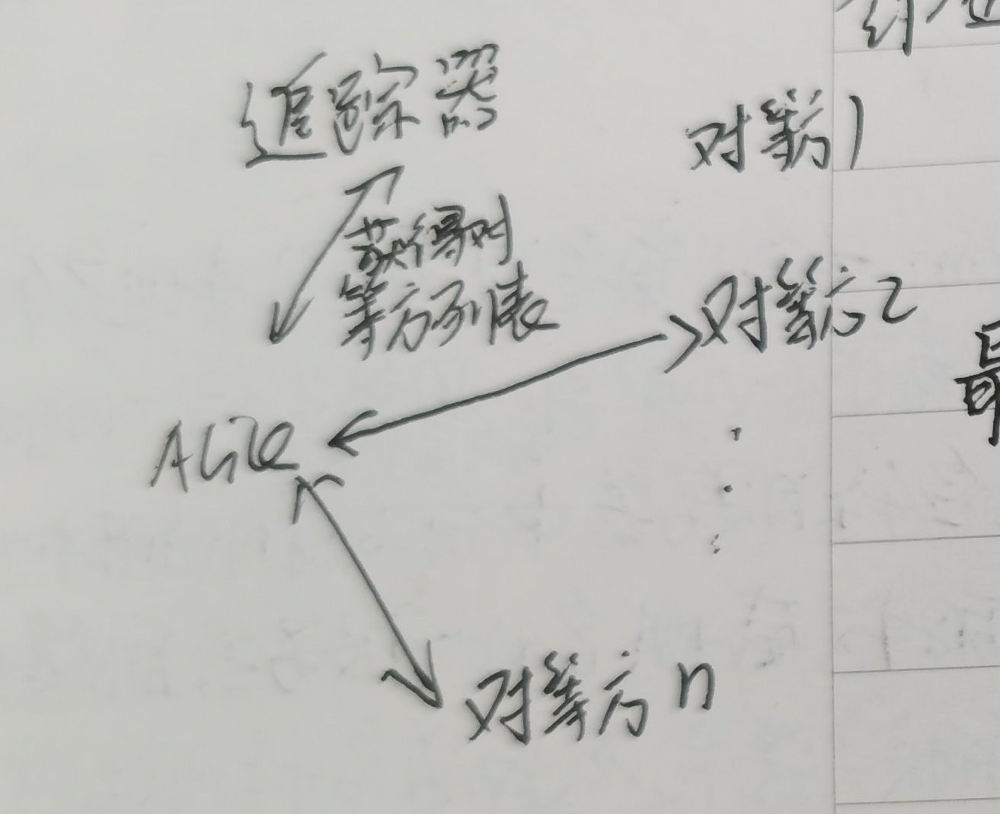
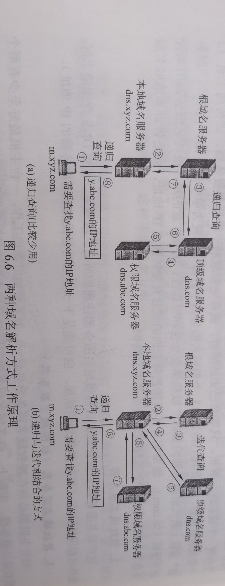
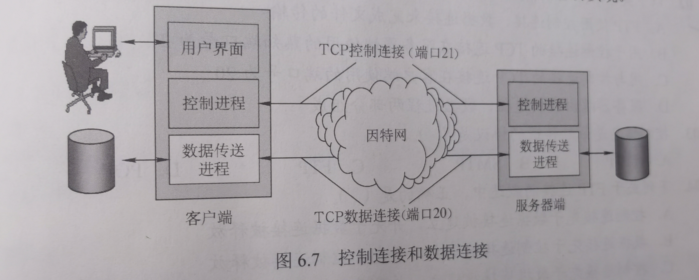
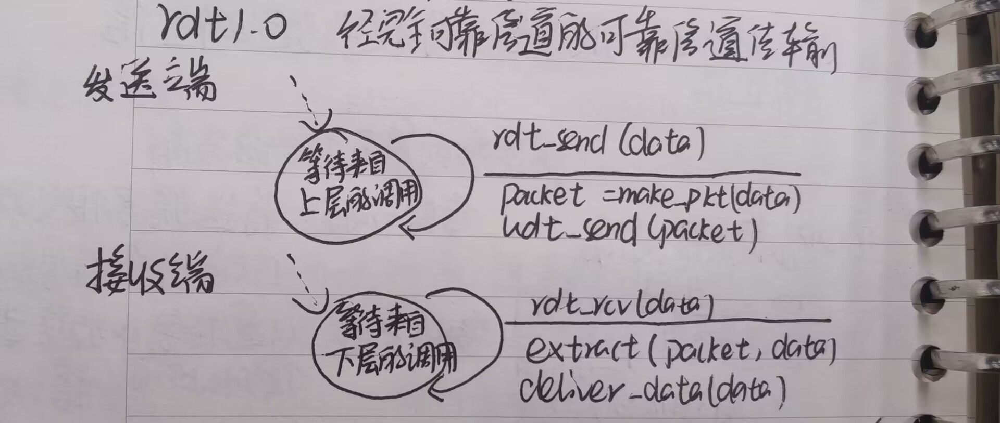
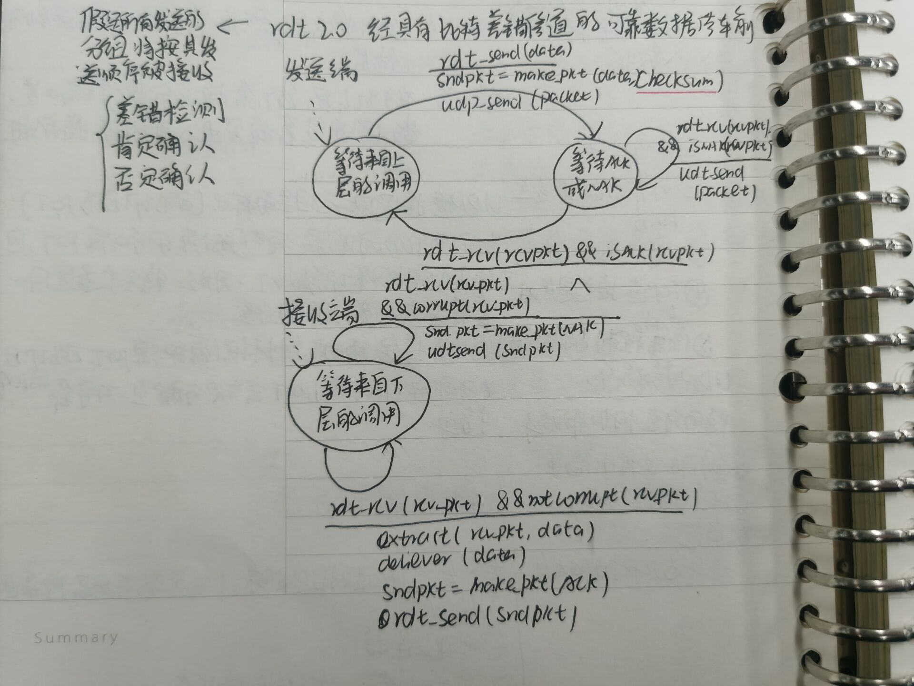
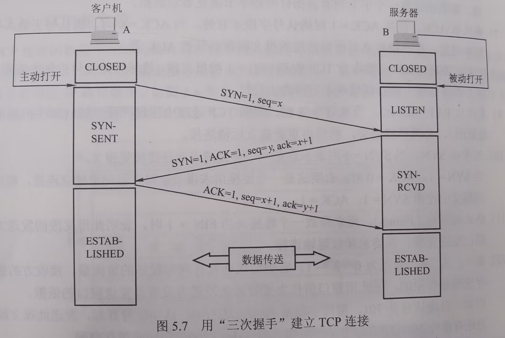
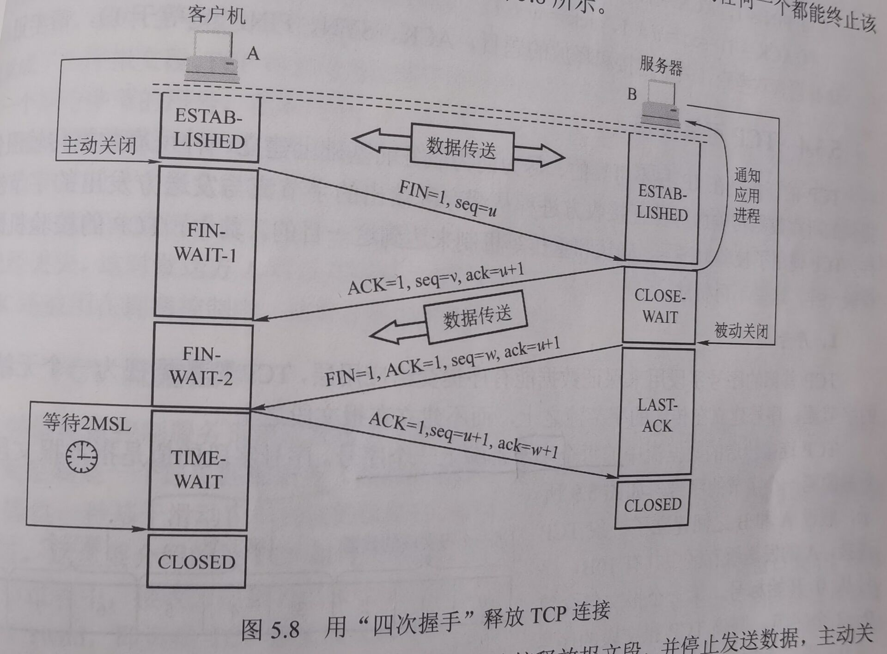
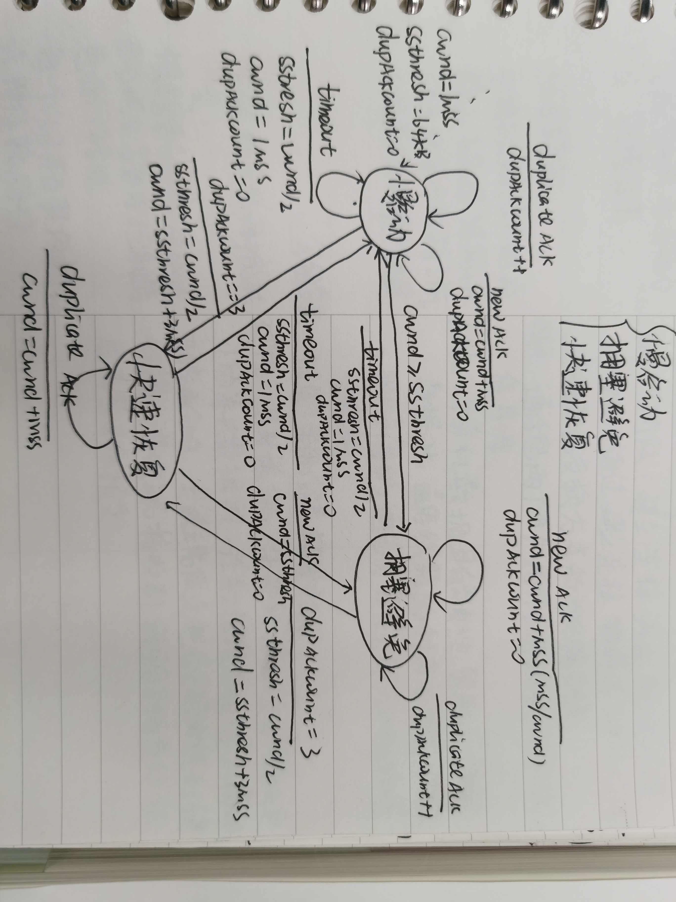
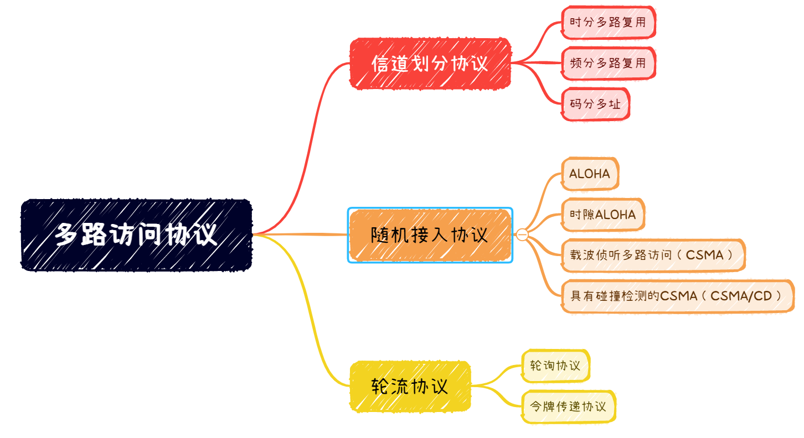

# 计算机网络知识点整理

[TOC]

# 一、计算机网络概述

## 1.什么是协议？

协议定义了在两个或多个通信实体之间交换的报文的格式和顺序，以及报文发送或接受一条报文或其他事件所采取的动作。

## 2.什么是计算机网络？

计算机网络主要由一些通用的，可编程的硬件互联而成，这些硬件并非专门用来实现某一特定目的，这些可编程的硬件能够用来传送多种不同类型的数据，并能支持广泛和日益增长的应用。

（408）计算机网络是一个将分散的、具有独立功能的计算机系统，通过通信设备与线路连接起来，由功能完善的软件实现资源共享和信息传递的系统。简而言之，计算机网络就是一些互联的、自治的计算机系统的集合。

## 3.计算机网络的性能指标

（1）带宽：表示网络的通信线路所能传送数据的能力。

（2）吞吐量：单位时间内通过某个网络的数据量。

（3）速率（数据传输速率、数据率、比特率）：连接到计算机网络上的主机在数字信道上传送数据的速率。

（4）时延：数据从网络的一端到另一端所需时间。

发送（传输）时延：节点将分组中的所有比特推向链路所需的时间，取决于数据块长度和信道带宽。

传播时延：一个比特从链路的一端传播到另一端所需要的时间，取决于信道长度和信号在信道中的传播速率。

处理时延：数据在交换节点为存储转发而进行的一些必要的处理所花费的时间。

排队时延：节点缓存队列中分组排队所经历的时间，取决于网络中的通信量。

（5）时延带宽积：指发送端发送的第一个比特即将到达终时，发送端已经发出了多少比特，时延带宽积=传播时延*信道带宽。

（6）往返时间：发送方发送完数据到发送方接收到来自接收方的确认总共经历的时间。

（7）信道利用率：某一信道有百分之几的时间是被利用的，完全空闲的信道利用率是0。

（8）网络利用率：全网络的信道利用率的加权平均值。

## 4.计算机网络的功能

数据通信、资源共享、分布式处理、提高可靠性、负载均衡

## 5.计算机网络的体系结构

计算机网络及其所应完成的功能的精确定义，是计算机网络中的层次、各层的协议及各层间接口的集合。

## 6.OSI(开放系统互连参考模型)

从下往上：物理层、数据链路层、网络层、传输层、会话层、表示层、应用层

应用层：网络应用程序及他们的应用层协议存留的地方（HTTP,SMTP,DNS(域名系统),FTP）

传输层：负责主机中两个进程间的通信，为端到端连接提供可靠的传输服务，为端到端连接提供流量控制、差错控制、服务质量、数据传输管理等服务。（UDP,TCP）

网络层（数据报）：将网络层分组从一台主机移动到另一台主机，关键是对分组进行路由选择，并实现流量控制、拥塞控制、差错控制等功能。(IP)

数据链路层（帧）：将分组从路径上的一个节点移动到下一个节点。(以太网)

物理层：将帧中的一个个比特从一个节点移动到下一个节点

## 7.为什么要分层？

各层之间相对独立，降低系统的复杂度

各层之间界面自然清晰，易于理解，灵活性好

结构上可分割开

易于实现和维护

能促进标准化工作

# 二、应用层

## 1.应用层协议的作用？

应用层协议定义了运行在不同端系统上的应用程序进程如何传递报文。

应用层协议定义了：交换的报文类型、各种报文类型的语法、字段的语义、确定一个进程何时以及如何发送报文，对报文加以相应的规则。

## 2.HTTP(超文本传输协议)

HTTP(HyperText Transfer Protocal)超文本传输协议，规定了浏览器与服务器之间的请求与响应的格式与规则，是万维网上能够可靠的交换文件的重要基础。

HTTP协议定义了Web客户向Web服务器请求Web页面的方式，以及服务器向客户传送Web页面的方式。

HTTP是一个无状态协议：HTTP服务器并不保存客户的任何信息

## 3.HTTP报文中浏览器字段的作用？

服务器可以有效地为不同类型的用户代理发送相同对象的不同版本。

## 4.什么是持续连接和非持续连接

持续连接：所有请求及响应经相同TCP连接发送

非持续连接：每个HTTP请求/响应对经一个单独的TCP连接发送

非持续连接的缺点：（1）必须为每一个对象建立和维护一个全新的连接。

（2）每个对象经受2RTT的时延（1RTT用于建立连接，另一个用于请求和接收对象）

## 5.cookie的作用

用于识别一个客户，服务器根据报文中的Cookie识别码就能从数据库中查询到该用户的活动记录，进而执行一些个性化的工作，比如根据用户的历史浏览记录向其推荐新产品。

## 6.条件GET方法

更新代理服务器（web缓存）中的对象。

[(4条消息) 条件GET方法(The conditional GET)_Chenglin_Yu的博客-CSDN博客](https://blog.csdn.net/ChenglinBen/article/details/90814424)

### 为什么使用web缓存？

web缓存：能够代表初始Web服务器来满足HTTP请求的网络实体。

（1）减小客户机请求的响应时间

（2）减小机构访问链路的流量

（3）因特网密集安装缓存，使得内容提供商能够有效的交付内容

## 7.SMTP(简单邮件传输协议)

SMTP协议从发送方的邮件服务器发送报文到接收方的邮件服务器。

因特网电子邮件系统由三部分组成：用户代理、邮件服务器和SMTP协议。

SMTP使用持续连接，如果发送邮件服务器有几个报文发往同一个接收邮件服务器，可以通过同一个TCP连接发送所有的报文。

## 8、SMTP协议和HTTP协议的区别

（1）HTTP是拉协议：用户从服务器拉取信息；而SMTP是推协议：从发送方邮件服务器推信息到接收方邮件服务器。

（2）HTTP把每个对象封装在自己的HTTP响应报文中；SMTP把所有报文对象放在同一个报文中。

（3）SMTP对报文格式有要求；HTTP没有。

## 9.SMTP工作步骤

（1）Alice调用UA(用户代理)并提供Bob的邮箱地址，撰写邮件，指示UA发送报文。

（2）Alice代理与Alice的邮件服务器建立TCP连接，将邮件发送至邮件服务器，邮件被放在邮件缓存队列中。

（3）运行在Alice邮件服务器的客户进程发现了邮件缓存队列中的邮件，创建一个到Bob的邮件服务器的TCP连接。

（4）经过一系列初始SMTP握手后，SMTP客户通过TCP连接发送邮件，当所有邮件发送完毕，SMTP就关闭所建立的TCP连接。

（5）在Bob 的邮件服务器上，SMTP服务器端接受该邮件，Bob的邮件服务器将该邮件放入Bob邮箱中。

（6）Bob通过UA阅读该邮件，通过HTTP/IMAP/POP3协议将邮件从邮箱中取回。

## 10.比特洪流（bittorrent）

Alice 加入洪流，追踪器选择对等方子集，将IP发送

临近对等方：Alice成功的建立TCP连接的对等方

### Alice从邻居请求哪些块？

最稀缺优先：针对他没有的块找出在邻居中最稀缺的块，并先请求这些块（均衡每个块在洪流中的副本数量）。

### Alice向哪些请求块的邻居发送块？

根据当前能够以最高速率向他提供数据的邻居给出优先权。

## 11.DASH和CDN

经HTTP的动态适应性流（Dynamic adaptive streaming over HTTP）：视频被编码为不同的版本，响应客户动态请求的视频段数据块。HTTP服务器里的告示文件为每个版本提供一个URL和比特率，客户通过速度决定算法来选择下次请求的块，DASH允许客户自由地切换不同的质量等级。

客户可以自由地在不同质量等级之间切换。

CDN，内容分发网 Content Distribution Network：CDN服务器存储副本，并将每个用户定向到最佳的CDN位置。服务器安置原则：（1）深入：靠近端用户，维护管理困难（2）邀请做客：大集群邀请ISP做客，维护管理开销小，较高时延，较低吞吐量。

## 12.描述通过手动查询层次DNS结构的方式获取IP www.baidu.com

(1)从13个根名称服务器中选择一个

(2)向根名称服务器查询能解析com顶级域的顶级域名称服务器

nslookup -qt=ns com 根名称服务器名字/IP

(3)向顶级域名称服务器查询能解析baidu.com的权威名称服务器

nslookup -qt=ns baidu.com 顶级域名称服务器

(4)向权威名称服务器查询www.baidu.com的IP

nslookup -qt=a www.baidu.com 权威名称服务器

### 递归查询和迭代查询

## 13.描述在本地DNS上如何通过手动查询www.baidu.com的解析过程

（1）主机首先向它的本地DNS服务器上发送一个DNS查询报文，该查询报文含有被转换的主机名www.baidu.com，本地名称服务器收到请求后，查询本地缓存

（2）若本地缓存没有该记录，本地DNS服务器将该报文转发到根名称服务器

（3）根名称服务器注意到其前缀com并向本地DNS服务器返回负责com的顶级域名称服务器的IP地址列表

（4）本地名称服务器选择这些IP之一发送查询报文

（5）顶级域名称服务器注意到baidu.com前缀，并用权威名称服务器的IP地址列表进行回应

（6）最后，本地DNS服务器向权威名称服务器之一发送查询报文，权威名称服务器用IP作为响应

（7）本地DNS服务器得到IP之后将其缓存，并发响应报文给主机告诉其IP

## 14.DNS查询过程（尽快查询）

（1）主机先向本地DNS服务器发送查询报文，如果本地名称服务器有该网址解析则直接回应对应IP

（2）否则查询该本地名称服务器中有无baidu.com权威名称服务器的缓存，如果有，将DNS查询报文转发到权威名称服务器，进行层次查询

（3）如果没有，查询该本地名称服务器中有无com顶级名称服务器的缓存，如果有，将DNS查询报文转发到顶级名称服务器，进行层次查询

（4）如果没有，则将DNS查询报文转发到DNS根名称服务器中，向下开始DNS的查询

## 15.DNS各层次的功能

为下一层提供名称服务器的域名和IP地址

根名称服务器：提供顶级域名称服务器的IP地址

顶级域名称服务器：提供权威名称服务器的IP地址

权威名称服务器：提供主机名到IP的映射

本地名称服务器：缓存，将请求转发至DNS服务器层次结构中

## 16.域名注册过程

首先向域名注册登记机构提供权威DNS服务器的名字和IP地址，将保证一个ns类型（baidu.com,权威名称服务器，ns）和一个a类型（权威DNS服务器，其IP，a）记录输入到顶级DNS服务器（com）中。

自身必须确保www.baidu.com的a类型输入到权威DNS服务器中。

## 17.用户点击鼠标后发生的事件

（1）浏览器分析超链接指向的URL

（2）浏览器向DNS请求解析对应域名的IP

（3）域名系统解析出IP并返回主机

（4）浏览器与服务器建立TCP连接

（5）浏览器发出取文件命令 GET……htm

（6）服务器做出响应，把文件发给浏览器

（7）浏览器显示文件中的所有对象

（8）关闭TCP连接

## 18.主机想下载文件ftp://ftp.abc.edu.cn/file，描述一下下载过程中主机和服务器的交互过程？

（1）建立一个TCP连接到服务器ftp.abc.edu.cn的21号端口，然后发送登陆账号和密码。

（2）服务器返回登陆成功信息后，主机A打开一个随机端口，并将该端口号发送给服务器。

（3）主机A发送读取文件命令，内容为get file，服务器使用20号端口建立一个TCP连接到主机A随机打开的端口。

（4）服务器把文件内容通过第二个连接发送给主机A，传输完毕后连接关闭。

## 19.IMAP和POP3

pop3(post office protocal)邮局协议，拉协议。

imap (internet mail access protocal)因特网报文存取协议，为用户提供了创建文件夹、在不同文件夹之间移动邮件及在远程文件夹中查询邮件等联机命令，IMAP允许用户代理只获取报文的某些部分，如只读取一个报文的首部。

## 20.SMTP邮件内容

信封：MAIL FROM:

​			RCPT To:

首部：DATA:

​			From:

​			to:

​			Date:

​			Subject:

主体： blablabla……

# 三、传输层

## 1.多路复用与多路分解

多路复用：从源主机上不同的套接字中收集数据块，并为每个数据块封装上首部信息，从而生成报文段，然后将报文段传递到网络层。

多路分解：将运输层报文段中的数据交付到正确的套接字的工作。

## 2.在TCP/IP协议族的传输层中，为什么设置TCP和UDP两种不同的协议？试对他们进行比较

根据使用环境和用途的不同设置了两种协议。

UDP：用户数据报协议，只有简单的检验功能，无需建立连接，不必维护连接状态；不提供可靠数据传输，也没有流量控制和拥塞控制，应用层能更好的控制要发送的数据以及发送的时间，分组首部开销小：TCP有20B的首部开销，而UDP仅有8B的首部开销。

TCP:传输控制协议，提供可靠数据传输，流量控制和拥塞控制，面向连接，采用累积确认机制，建立TCP连接需三次握手。保证传送的数据无差错、不丢失、不重复且有序。

对比

同：TCP和UDP都不提供定时和最小带宽保证

异：（1）TCP面向连接；UDP无连接运输。

（2）TCP提供可靠的数据传送服务和全双工服务；UDP提供最小服务。

（3）TCP具有流量控制和拥塞控制；UDP无拥塞控制，可以用发送方选定的任何速率向下方注入数据。

（4）TCP套接字由四元组标识（源IP，源PORT，目的IP，目的PORT），不同源IP或不同PORT会被分解至不同套接字；UDP套接字由二元组全面标识（目的IP，目的PORT）如果两个UDP报文段有不同的源IP和源PORT，但有相同的目的IP和PORT,那么将会通过同一套接字定向到同一进程。

## 3.可靠数据传输原理

### rdt1.0经完全可靠信道的可靠信道传输

### rdt2.0经具有比特差错信道的可靠数据传输（带有检验和）

假定所有发送的分组将按其发送顺序被接受

### rdt2.1 假定信道不丢失分组，考虑到了ACK和NAK分组受损的问题

### rdt2.2去掉了NAK

### rdt3.0 经具有比特差错的丢包信道的可靠数据传输

加了定时器

## 4.解决流水线的差错恢复：回退N步、选择重传

**GBN**

1）允许发送方发送多个分组而不需要等待确认

2）流水线中已发送但还未被确认的分组个数不能超过N(窗口长度)

3）采用累积确认机制

4）发送方仅用一个定时器，被当作最早的已发送但还未被确认的分组所使用的定时器

5）如果出现超时，发送方重传所有已发送但还未被确认的分组

6）发送方要维护窗口的上下边界以及nextseqnum在窗口中的位置，但接收方只需维护下一个按需接受分组的序号

7）接收方有期望序列号，如果收到的不是期望的分组，直接丢弃

**SR**

1）通过让发送方仅重传那些在接收方出错了的分组而避免了不必要的重传

2）接收方将确认一个正确接收的分组而不管其是否按序，接收方将接收到的乱序分组缓存起来，直到所有丢失的分组都被接收到，才将一批分组按序交付给上层

3）每一个分组使用一个定时器

4）为了让接收方区分是一次重传还是新的分组，其窗口长度必须小于等于序号空间大小的一半。

5）有发送方窗口和接收方窗口，而GBN只有发送方窗口

## 5.无连接服务与面向连接服务

面向连接服务就是在通信双方进行通信之前，必须先建立连接，在通信过程中，整个连接的情况一直被实时的监控和管理，通信结束后释放这个连接。

无连接服务是指两个实体间的通信不需要先建立好连接，需要通信时，直接将信息发送到网络中，让该信息的传递在网上尽力而为地往目的地传送。

## 6.TCP连接的三次握手

1）客户端的TCP首先向服务器端的TCP发送一个特殊的TCP报文段，SYN位置1，随机选择一个初始序号（client_isn）

2）一旦包含TCP syn报文段的IP数据包到达服务器主机，服务器从中提取出TCP SYN报文段，为该TCP连接分配TCP缓存和变量，并向该客户TCP发送允许连接的报文段（SYN比特被置1，首部ACK字段被置为client_isn+1），服务器选择自己的初始序号server_isn

3）客户端收到SYN ACK报文段后，给该连接分配缓存和变量，向服务器发送另外一个报文段（SYN置0,ack=server_isn+1,seq=client_isn+1）,可以携带客户到服务器的数据。

## 7.TCP连接断开的过程

1）客户进程发送一个关闭连接命令，会引起客户TCP向服务器进程发送一个FIN为1的TCP报文段。

2）当服务器接收到该报文段后，向客户端发送一个确认报文段。此时客户端到服务器端的连接就释放了。

3）服务器发送自己的终止报文段，FIN置1。

4）客户端接收到该报文段，发出确认，用于该连接的所有资源均被释放。

## 8.TCP流量控制

流量控制是一个速度匹配服务，即发送方的发送速率与接收方的应用程序的读取速率相匹配。

实现方法：利用接收窗口rwnd控制信息，接收方把自己rwnd尺寸告诉发送方，发送方限制自己已经发送但还没收到ACK的数据不超过rwnd的大小

## 9.TCP拥塞控制

让每一个发送方根据所感知到的网络拥塞程度来限制其能向连接发送数据的速率

**拥塞控制算法**：

ssthresh:慢启动阈值   cwnd:拥塞窗口

**MSS**:TCP报文段里应用数据的最大长度（不包括TCP/IP头部 40字节）

**MTU**:一个链路层数据报所能承载的最大数据量

1）慢启动阶段：cwnd的值以1MSS开始并且每当传输的报文段首次被确认就增加1MSS,cwnd以指数速度增长；若cwnd到达阈值，进入拥塞避免阶段。若出现了三个冗余ACK，执行快速重传，ssthresh=cwnd/2,cwnd=ssthresh+3mss;若出现超时现象，表示严重拥塞，将cwnd改为1MSS，并重新开始慢启动，ssthresh变成超时前窗口的一半。

2）拥塞避免阶段：每RTT时间拥塞窗口长度加1MSS；如果出现3次冗余ACK，进行快速恢复，ssthresh=cwnd/2,cwnd=ssthresh+3MSS；如果超时，cwnd变为1MSS并重新开始慢启动，ssthresh=cwnd/2。

3）快速恢复：对于引起TCP进入快速恢复的缺失报文段，对收到的每个冗余ACK，cwnd值加1MSS，当丢失报文段的一个ACK到达时，TCP在降低cwnd后进入拥塞避免状态；如果超时，cwnd变为1MSS，ssthresh=cwnd/2,重新开始慢启动。

## 10.快速重传

发送方收到对相同数据的3个冗余ACK，在定时器超时之前就进行重传

# 四、网络层

## 1.转发和路由选择的区别

转发（数据平面）：决定到达路由器输入链路之一的网络层的分组如何转发到该路由器的输出链路之一

1）根据转发表将用户的IP数据报从合适的端口转发出去

2）仅涉及到一个路由器

3）**路由表是根据路由选择算法得出的，转发表是从路由表中得出的**

4）转发表必须包含完成转发功能所必须的信息，每一行必须包含从要到达的目的网络到输出端口和某些MAC地址信息之间的映射

路由选择（控制平面）：控制网络层分组沿着从源主机到目的主机的端到端路径中路由器之间的路由方式

1）按照路由选择算法，根据网络拓朴的变化情况，动态的改变所选择的路由，并由此构造出路由表

2）涉及到很多路由器

3）路由表一般仅包含从目的网络到下一跳的映射

## 2.电路交换、报文交换和分组交换

**电路交换**

原理：直接利用可切换的物理通信链路，连接通信双方

特点：在发送数据前，必须建立点到点的物理通路，建立物理通路时间较长，数据传送延时较短，实时性强，信道利用率低。

**报文交换**

原理：信息以报文为单位进行存储转发

特点：信道利用率较高，要求中间节点缓存大，时延较长

**分组交换**

原理：信息以分组为单位进行存储转发，源节点把报文分成分组，在中间节点间存储转发，在目的节点把分组合成报文。

特点：时延小，信道利用率高，节点存储器利用率高，易于重传，可靠性高，可能出现乱序、丢失、重复的问题

**三种交换方式比较**

1）若要连续传送大量数据，且其传送时间远大于连接建立时间，则电路交换的传输速率较快。

2）分组交换和报文交换不需预先分配传输带宽，在传输突发数据时可提高信道利用率。

3）分组的长度往往远小于报文的长度，因此分组交换比报文交换的时延小，同时具有更好的灵活性。

## 3.什么是存储转发？

交换机能够开始向输出链路传输该分组的第一个比特之前必须接受到整个分组。

## 4.虚电路网络和数据报网络的概念和区别

虚电路网络：双方在通信之前先建立虚电路，以保证双方通信所需的一切网络资源，虚电路只是一条逻辑上的连接，分组都沿着这条逻辑连接按照存储转发方式传送，并不是真正建立了一条物理连接。

数据报网络：网络层设计的尽量简单，向其上层只提供简单灵活的、无连接的、尽最大努力交付的数据报服务。

·网络在发送分组时不需要建立连接

·每一个分组独立发送，与其前后的分组无关

·网络层不提供服务质量的保证，即所传送分组可能乱序、丢失和重复，也不保证分组传送的时限，由主机中的运输层负责可靠通信。

|            特点            |                   虚电路网络                   |                        数据报网络                        |
| :------------------------: | :--------------------------------------------: | :------------------------------------------------------: |
|          可靠通信          |                    网络保证                    |                        运输层保证                        |
|            连接            |                       有                       |                            无                            |
|          终点地址          | 只在建立连接阶段使用，每个分组使用短的虚电路号 |                     每个分组都有终点                     |
|         分组的转发         |    属于同一条虚电路的分组按同一路由进行转发    |               每个分组独立选择路由进行转发               |
|        当节点出故障        |       所有通过故障节点的虚电路都不能工作       | 出故障节点可能会丢失分组，剩余节点可选择其他路由进行转发 |
|        分组到达顺序        |                      按序                      |                         可能乱序                         |
| 端到端的差错处理和流量控制 |                   由网络负责                   |                      由用户主机负责                      |

## 5.IP地址特点及划分方式

（1）分类的IP地址   IP = {<网络号>,<主机号>}

IP地址分为A,B,C,D,E五类

优点：管理简单，使用方便；转发分组迅速；划分子网，灵活的使用

缺点：设计上不合理，大地址块浪费地址资源；即使采用划分子网的方式，也无法解决IP地址枯竭的问题

（2）子网划分   IP =  {<网络号>,<子网号>,<主机号>}

优点：相比IP分类方法，分配方式灵活性较高

缺点：还存在IP地址浪费

（3）无分类编址（CIDR）IP = {<网络前缀>,<主机号>}

优点：消除了传统的A类，B类，C类地址以及划分子网的概念，可以更加有效的分配IPV4的地址空间

缺点：无法解决IP地址枯竭的问题

## 6.网络中IP地址，MAC地址，PORT地址，他们在跨网段传递分组时发挥什么作用？

（1）IP地址是逻辑地址，用来寻找目的网段目的主机，将目的IP与源主机所在网络的网络掩码相与判断是否在同一网段，如果不是，将分组发至路由器上，路由器通过用自己的子网掩码和目的主机IP地址按位与判断是否在同一网段，并且利用IP地址进行路由选择

（2）MAC地址是用于链路层传输分组的，MAC地址是硬件地址

（3）PORT地址用于寻找目的主机的目的进程

## 7.对于IP网络，说明子网掩码的作用/怎样判断两个主机IP地址是否属于同一子网？

将IP地址与子网掩码按位与，如果结果相同说明在同一子网

## 8.在传输层分段之后，为什么还要在网络层分段？

在发送方和接收方的路径上的每段链路可能使用不同的链路层协议，不同的链路层协议能承载的网络层分组的长度可能不同，所以要将IP分组，当IP数据报的总长度大于链路MTU（一个链路层数据报所能承载的最大数据量）时，就需要将IP数据报中的数据分装在多个较小的IP数据报中，这些较小的数据报称为**片**。

## 9.DHCP协议的工作过程？

DHCP（Dynamic Host Configuration Protocol，动态主机配置协议）

（1）客户在UDP分组中向端口67发送DHCP发现报文，该UDP分组封装在一个IP数据报中，其中源IP地址为0.0.0.0，目的IP地址为广播地址255.255.255.255，DHCP客户将该IP数据报传递给链路层，链路层将该帧广播到所有与该子网连接的节点。

（2）DHCP服务器收到DHCP发现报文，用DHCP提供报文作出响应，该报文向该子网所有节点广播，报文中包含向客户推荐的IP地址，网络掩码及IP地址租用期

（3）客户从服务器提供中选择一个，并向被选中的服务器发出DHCP请求报文

（4）服务器发出DHCP ACK报文进行响应，DHCP客户可以开始使用得到的临时IP地址了

## 10.详细描述NAT协议如何将10.0.0.1主机上的分组发送到目的主机128.119.40.186上并收到目的主机的信息的？

（1）主机10.0.0.1为其指派了任意源端口号3345并将分组发送到LAN中

（2）NAT路由器收到该数据报，为该分组生成一个新的源端口号5001，将源IP替换为其广域网一侧接口的IP地址138.76.29.7，且将源端口号3345替换为新的端口号5001，路由器中的NAT也在它的NAT转换表中增加一表项

（3）web服务器128.119.40.186发回一个响应报文，其目的地址是NAT的IP地址，目的端口是5001

（4）该分组到达NAT路由器后，路由器使用目的IP地址与目的端口号从NAT转换表中检索出对应的IP地址和端口号，路由器重写该分组的目的IP和端口号，向10.0.0.1发送该分组

## 11.什么是专用网络地址？

这一概念产生于NAT场景中，NAT路由器位于因特网与子网之间，子网内的端系统重新获得一个IP地址，这个网络地址对于一个端系统来说就是专用地址

## 12.IPV6的变化

更大的地址空间，将地址从IPV4的32位扩展到128位

扩展的地址层次结构，可以划分为更多层次

灵活的首部格式，改进的选项

允许协议继续扩充

支持即插即用，支持资源的预分配

首部改为8字节对齐

## 13.路由选择算法

**链路状态路由算法（LS）**

节点收集信息及扩散控制过程

1）拓扑生成过程

（1）发送HELLO包发现邻居节点并学习他们的网络地址

（2）测量到每个邻居节点的延时或开销（发送一个要对方立即响应的ECHO包，来回时间除以2即为延迟）

（3）所有的节点需要将链路状态信息传递到其他所有节点，链路信息包括到邻居节点的连通性以及链路代价，从而每个节点都拥有整个网络的拓扑结构和链路代价值

2）在扩散过程中需要洪泛控制

（1）在每个分组的首部添加TTL值，每经过一个路由减1，减为0后路由器将其丢弃

（2）分组序号依次加1，在每个路由器中记一个最大序号，若到来的分组比序号小，则说明已经转发过，丢弃，若比最大序号大，则转发并修改最大序号的值

**距离-向量算法（DV）**

步骤：

（1）从邻接节点收到距离向量表

（2）计算出自己的距离向量表

（3）由自己的距离向量表计算出路由表

（4）广播自己的距离向量表

**LS算法与DV算法比较**

LS算法需要与所有节点交换信息，获得全局拓扑结构

DV算法每个节点只与他直接相连的节点交换信息，为邻居节点提供自己到网络中其他节点的最小开销

## 14.因特网采用层次路由的原因？AS是如何划分的？各包含什么常用选路协议，协议的特点分别是什么？

**原因**

规模：越来越多的路由器和主机使得路由器的计算、存储和转发工作越来越艰难

管理自治：管理者希望对自己范围内的路由器进行管理，但还要能将其网络和外部网络连接起来

**AS（Automatic System）划分**：每个AS由一组在相同管理下的路由器组成，分为自治系统内部和自治系统外部

**自治系统内路由选择协议**

**RIP(Routing Information Protocal 路径信息协议)**:采用DV算法，只与自治系统内相邻路由器交换信息（按固定的时间间隔交换自身的路由表）。

优点：实现简单、开销小、收敛过程较快

缺点：RIP限制了网络的规模，它能使用的最大距离为15（即经过15个路由器（15跳）16表示不可达），健壮性不好

路由器之间交换的信息是路由器的完整路由表，因此网络规模越大，开销也越大

网络出现故障时，会出现慢收敛现象，使更新过程的收敛时间长

**OSPF（开放最短路径优先）**:采用洪泛法向本自治系统内的所有路由器发送信息并利用Dijkstra最低开销路径算法，安全，支持单个AS中的层次结构，收敛速度快

**自治系统间路由选择协议**

**BGP(边界网关协议)**：一种分布式和异步的协议，承载了路径的属性，并提供受控制的选路信息分布；采用DV算法，规定从相邻AS处获得子网的可达性信息，向AS内部所有的路由器传播这些可达性信息

BGP的路由选择：

选择本地偏好值最高的路由，若多于一个

选AS跳数最少的路由，若多于一个

使用热土豆路由选择算法，若多于一个

路由器BGP ID数值最小的路由

## 15.OSPF层次中各个路由的作用？

区域内路由器：为分组在区域内的转发提供路由选择

区域边界路由器：为传递到区域以外的分组提供路由选择

主干路由器：为AS间的转发提供路由选择

边界路由器：连接到其他AS 

## 16.主机A欲向本局域网内的某台主机B发送IP数据报时，ARP协议工作原理

A先在其ARP缓存中查找主机B对应的IP地址，如果有，就可以查出其对应的MAC地址，通过局域网把封装好的帧发送到该硬件地址；如果没有，就使用目的MAC地址FF-FF-FF-FF-FF-FF的帧来封装并广播ARP请求分组，主机B收到该广播帧后，向主机A发送ARP响应分组（单播分组），分组中包含主机B的IP和MAC地址的映射，主机A收到后就将此映射写入ARP缓存，然后按查询到的硬件地址发送帧。

##  17.ARP高速缓存的作用？

（1）存放最近获得的IP地址到MAC地址的映射

（2）减少ARP广播的通信量

## 18.交换机和路由器的区别？

交换机可在单个网络中与若干计算机相连，并且可以将一台计算机发送过来的帧转发给另一台计算机

路由器连接两个或多个同构或异构的网络，在网络之间转发分组（即IP数据报）

交换机处理链路层的帧，路由器处理网络层的数据报

**交换机**

过滤：决定一个帧应该转发到某个接口还是应当丢弃的功能

转发：决定一个帧应当被导向哪个接口，并把帧移动到这个接口的交换机功能

自学习：交换表是自动、动态和自治的建立的

（1）交换表初始为空

（2）对于在每个接口接收到的每个帧，交换机在交换表中存储该帧源MAC地址，到达接口和当前时间

（3）如果一段时间后，交换机没有接收到以该地址作为源地址的帧，就在表中删除此地址

转发过滤不同情况（从接口x到达）

（1）假如目的地址没有在交换表中，则交换机广播该帧

（2）假入目的MAC对应发送接口X，则丢弃

（3）假入目的MAC对应发送接口Y != X，则转发到接口Y

# 五、数据链路层

## 1.什么是多路访问问题？多路访问协议有哪些？

多路访问问题：如何协调多个发送和接收节点对一个共享广播信道的访问

## 2.信道划分协议

### 2.1时分多路复用（Time-division multiplexing，TDM）

将时间划分为时间帧，并进一步划分每个时间帧为N个时隙，然后把每个时隙分配给N个结点，某个节点在有分组要发送时，它在循环的TDM帧中指派给他的时隙内传输分组比特

优点：消除了碰撞而且非常公平

缺点：（1）节点被限制于R/Nbps的平均速率，即使当它是唯一有分组要发送的节点时

（2）节点必须等待他在传输序列中的轮次，即使他是唯一有分组要发送的节点

### 2.2频分多路复用（Frequency-division multiplexing，FDM）

将Rbps信道划分为不同的频段，并把这些频段分配给N个节点

优点：避免了碰撞公平的划分了带宽

缺点：限制一个节点只能使用R/N的带宽

### 2.3码分多址（Code Division Multiple Access，CDMA）

对每一个节点分配一种不同的编码，每个节点利用它唯一的编码来对他发送的数据进行编码

优点：不同节点能够同时传输，并且他们的接收方仍能正确接收发送方编码的数据比特，在不在乎其他节点的干扰传输

## 3.随机接入协议

当节点要发送数据时，利用信道全部速率发送分组，当有碰撞时，涉及碰撞的每个节点在经过一个随机时延后反复重发它的帧，直至该帧无碰撞通过。

### 3.1时隙ALOHA

工作过程：

（1）当节点有一个新帧要发送时，他等到下一个时隙开始并在该时隙传输整个帧

（2）若无碰撞，该节点成功传送它的帧

（3）若有碰撞，该节点在时隙结束之前检测到这次碰撞，该节点以概率p在后续中的每个时隙中重传它的帧，直到该帧无碰撞的传输出去

特点：

- 所有帧大小相等
- 时间被划分为等长的时隙
- 节点只能在开始时刻发送帧
- 如果冲突则以概率p重传
- 节点是同步的，每个节点都知道时隙何时开始

### 3.2纯ALOHA

同时隙ALOHA，不同的是有新的帧生成时立即发送，并不等待下一个时隙开始

特点：冲突可能性增大，但更加简单无需同步

### 3.3载波侦听多路访问（Carrier Sense Multiple Access/CSMA）

#### 3.3.1 I-坚持型CSMA

原理：

（1）若节点有数据发送，先监听信道

（2）若节点发现信道空闲，则发送

（3）若信道忙，则继续监听直至信道空闲然后完成发送

（4）若产生冲突，等待一随机时间，重新开始发送过程

优点：减少了信道空闲时间

缺点：增加了发生冲突的概率

#### 3.3.2 非坚持型CSMA

原理

（1）若节点有数据要发送，先监听信道

（2）若信道空闲，则发送

（3）若信道忙，则等待一随机时间，重新开始发送过程

（4）若产生冲突，则等待一随机时间，重新开始发送过程

#### 3.3.3 p坚持型CSMA

原理

（1）若节点有数据要发送，先监听信道

（2）若信道空闲，则以概率p发送数据，以概率1-p延迟至下一个时槽发送。若下一时槽仍空闲，重复此过程，直至数据被发出或时槽被占用

（3）若信道忙，等待下一时槽重新发送

（4）若产生冲突，等待一随机时间，重新发送

#### 3.3.4 具有碰撞检测的CSMA(CSMA/CD)

工作步骤

（1）适配器从网络层接收数据报并封装成帧

（2）如果适配器感知信道空闲，则开始传输帧，如果感知信道忙，则等待信道空闲再传输帧

（3）在传输过程中，该适配器检测其他使用该广播信道的适配器的信号能量的存在

（4）如果适配器传输整个帧而未检测到来自其他适配器的信号能量，该适配器就完成了该帧的传输，否则，终止传输并发送一个拥塞信号，以让所有用户都知道

（5）终止后，适配器进入指数回退：在m次碰撞后适配器随机从{0，1，2……2^m-1}中选择K值，适配器选取K*512比特时间的等待，并返回步骤二

## 4.轮流协议

### 3.1轮询协议

主节点以循环的方式轮询每个节点，主节点首先向节点1发送一个报文，告诉它能够传输的帧的最多数量，在节点1传输完成后，主节点告诉节点2能传输的帧的最多数量。

优点：清除了困扰随机接入协议的碰撞和空时隙问题

缺点：引入了轮询时延，如果主节点有故障，那么信道都不可操作

### 3.2令牌传递协议

令牌在节点之间以某种固定的次序进行交换，当一个节点收到令牌时，仅当他有一些帧要发送时才持有令牌，发送最大数目的帧后把令牌转发给下一个节点；否则他立即向下一个节点转发该令牌

优点：令牌传递分散并有很高的效率

缺点

（1）一个结点的故障可能会使整个信道崩溃

（2）如果有一个节点忘记释放令牌，则必须调用某些恢复步骤使令牌返回到循环中来

## 5.为什么进行了载波侦听还要进行碰撞检测？

因为信号从一个节点传播到另一个节点具有传播时延，该传播时延可能会导致载波侦听节点不能侦听到网络中另一个节点已经开始传输

## 6.局域网、广域网和互联网

局域网（Local Area Network/LAN）：指在一个较小的地理范围（如一所学校）内，将各种计算机、外部设备和数据库系统等通过双绞线、同轴电缆等连接介质互相连接起来，组成资源和信息共享的计算机互联网络。

广域网（Wide Area Network/WAN）:指覆盖范围很广（远超一个城市的范围）的长距离网络

互联网：使用路由器来连接不同类型的网络（既可以连接广域网，又可以连接局域网）形成的网络

|                 |                            广域网                            |          局域网          |
| :-------------: | :----------------------------------------------------------: | :----------------------: |
|    覆盖范围     |                       很广，通常跨区域                       |  较小，通常在一个区域内  |
|    连接方式     | 结点之间都是点到点连接，但为了提高网络的可靠性，一个结点交换机往往与多个结点交换机相连 |   普遍采用多点接入技术   |
| OSI参考模型层次 |               三层：物理层、数据链路层、网络层               | 两层：物理层、数据链路层 |
|     着重点      |                         强调资源共享                         |       强调数据传输       |

联系与相似点

（1）广域网和局域网都是互联网的重要组成构件，从互联网的角度上看，二者平等（不是包含关系）

（2）连接到一个广域网或一个局域网上的主机在该网内进行通信时，只需要使用其网络的物理地址

# 六、访问Google的全过程

1.通过DHCP获取主机地址，Bob主机生成一个DHCP发现报文，并将该报文封装入UDP报文段，再封装入IP数据报，进而封装到以太网帧中，以源IP地址0.0.0.0，目的IP地址255.255.255.255，源MAC地址（Bob主机地址），目的MAC地址FF:FF:FF:FF:FF:FF进行广播（该帧发送到以太网交换机，交换机自学习Bob的Mac和到达端口，向所有出端口广播入帧），路由器的DHCP服务器接收到该广播帧，分离出DHCP发现报文，然后以CIDR给其分配IP，产生一个包含IP地址，dns服务器IP，子网掩码、默认网关IP的DHCP提供报文，以目的IP255.255.255.255广播。Bob收到报文后，选择其中一个服务器提供，向其发送回显配置的参数、DHCP请求报文对选中服务器响应，服务器收到后用DHCP ACK报文进行响应，bob收到后获得IP并配置参数。

2.Bob输入谷歌的URL到其浏览器，通过DNS查询谷歌的IP地址。此时将Bob的子网掩码和DNS服务器IP与Bob IP分别按位与，得到的结果不相同，说明不在一个网段。此时Bob进行ARP查询，将生成一个目的IP为目的网关的IP的ARP查询报文，将其封装在目的地址为全F的帧中，发送该帧，网关路由器收到该帧后，将返回一个包含自身MAC地址的ARP响应报文，将其放在帧中通过交换机（已学习Bob的信息）转发给Bob，Bob收到ARP响应报文后更新ARP表。

3.Bob封装DNS查询报文（使用UDP,目的IP为DNS服务器IP,目的MAC为网关MAC）发送给网关路由器。路由器通过NAT将Bob的IP改为广域网一侧的接口IP，为其分配新的端口号，并在NAT转换表中记录信息。路由器查询其路由表（路由表由OSPF或RIP，BGP协议以及系统管理员共同配置），根据最大前缀匹配规则，利用它的装发表将其送到DNS服务器上，DNS服务器从DNS缓存中查找域名www.google.com到IP地址的映射，若没有则首先查找本地DNS服务器中是否有com顶级域名称服务器对应IP地址的记录，若还没有则将该DNS请求报文转发到跟名称服务器，向下开始DNS的层次查询，查询结束后本地DNS服务器通过DNS响应报文将查询结果封装发回，DNS回答报文到达Bob所在网关，根据NAT转换表中记录将该报文的目的IP与端口号转换，转发给Bob。

4.Bob开始进行TCP连接，生成TCP SYN报文段（目的IP为googleIP,目的MAC为网关MAC），封装后利用路由器转发表将该分组发送到www.google.com的WEB服务器（不同AS间的转发表由BGP协议决定），Web服务器收到SYN报文后，向Bob发送Tcp SYN ACK报文，之后Bob主机上的浏览器生成包含要获取的URL的HTTP GET报文，封装在TCP ACK报文中并交付到Web服务器，Web服务器收到后，发送一个包含请求的Web页内容的HTTP响应报文，Bob主机上的浏览器程序从HTTP响应中抽取Web页面的HTML，最后显示网页，并关闭TCP连接。

